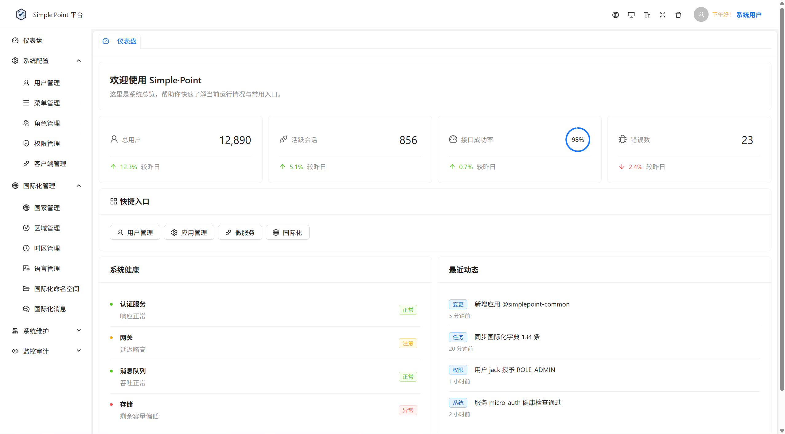
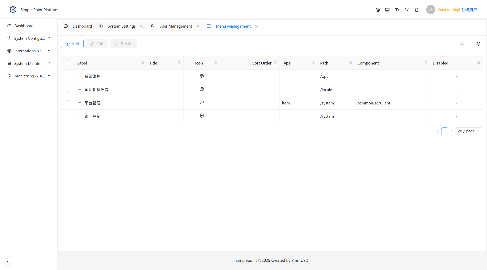
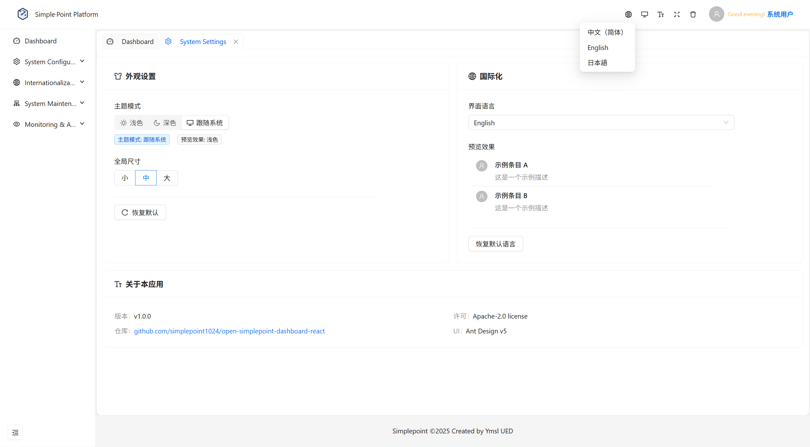
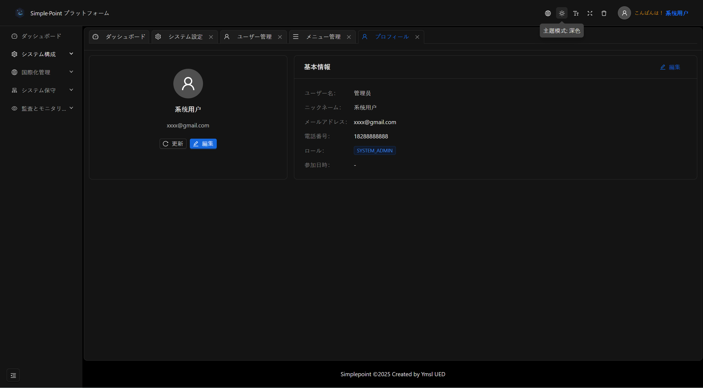

Here's a concise and relevant `README.md` tailored specifically to your project's characteristics:

# simplepoint-main

A modern web application built with Java, Kotlin, Spring Boot, Gradle, JavaScript, and TypeScript.

## Tech Stack

- **Backend**: Java, Kotlin, Spring Boot
- **Frontend**: JavaScript, TypeScript
- **Build Tool**: Gradle

## Images









## Prerequisites

- Java (JDK 17 or later)
- Kotlin
- Gradle
- Node.js (for JavaScript/TypeScript)

## Getting Started

Clone the repository and navigate to the project directory:

```shell
git clone git@github.com:simplepoint1024/open-simplepoint-dashboard.git
cd simplepoint-main
```

```angular2html
https://github.com/simplepoint1024/open-simplepoint-dashboard-react
cd open-simplepoint-dashboard-react
```

Build the project:

```shell
./gradlew build
```

Run the Spring Boot application:

```shell
./gradlew bootRun
```

## Testing

Run tests using Gradle:

```shell
./gradlew test
```

## Contributing

Please see [`CONTRIBUTING.md`](CONTRIBUTING.md) for guidelines on contributing to this project.

## License

See [`NOTICE.md`](NOTICE.md) for third-party licenses and attributions.
