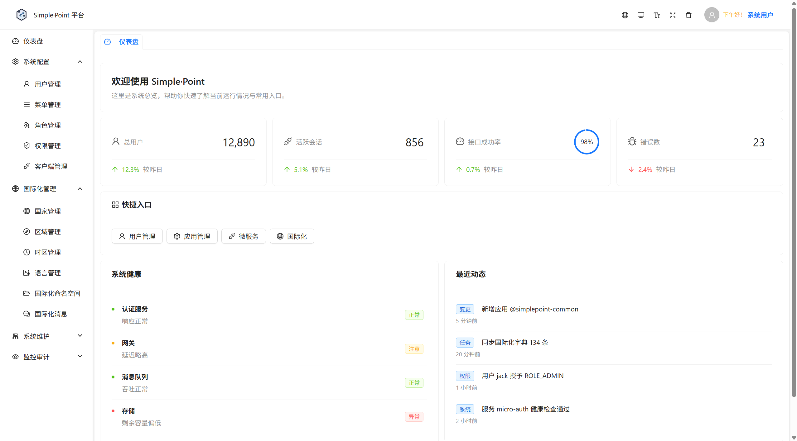
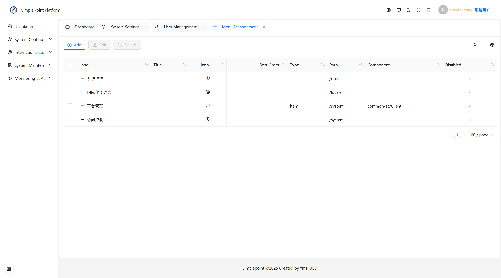
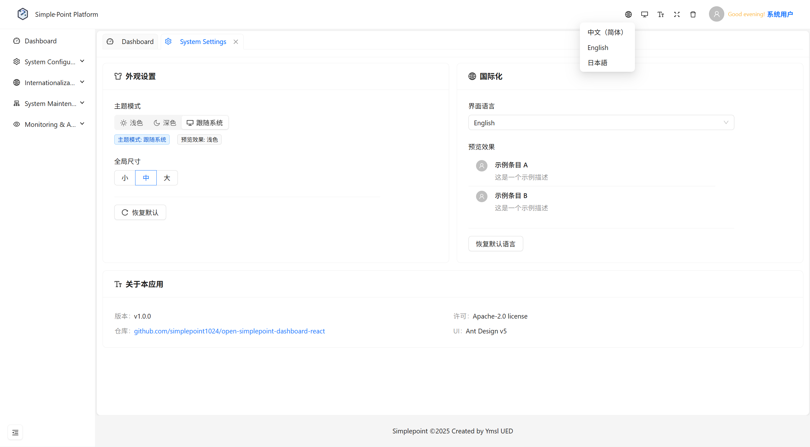
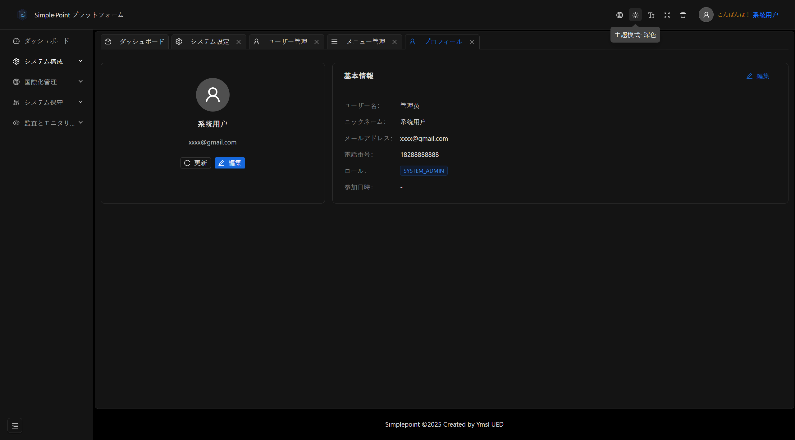
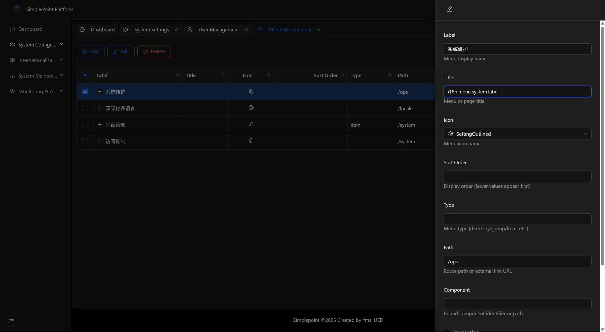

# SimplePoint - Enterprise Application Framework

SimplePoint is a modern, modular, and pluggable enterprise application framework built with **Java**, **Kotlin**, and **Spring Boot**. It provides a robust foundation for building scalable, secure, and multi-tenant applications.

## Key Features

*   **Pluggable Architecture**: A dynamic plugin system allows for modular development, hot-swapping, and independent deployment of business features (see `simplepoint-plugin`).
*   **Enterprise Security**: Comprehensive security implementation including OAuth2/OIDC server and resource server, Role-Based Access Control (RBAC), and multi-tenancy support.
*   **Internationalization (i18n)**: Built-in localization framework for managing languages, regions, and translations globally (see `simplepoint-plugins/simplepoint-plugins-i18n`).
*   **Flexible Data Layer**: Abstraction over various data sources including JPA, JDBC, MongoDB, and Calcite, with support for dynamic data source routing (see `simplepoint-data`).
*   **Cloud Native Ready**: Integrations with service discovery (Consul) and message brokering (AMQP/RabbitMQ).

## Tech Stack

*   **Languages**: Java, Kotlin, TypeScript
*   **Framework**: Spring Boot (Gradle build system)
*   **Security**: Spring Security (OAuth2, OIDC)
*   **Database**: JPA / Hibernate, R2DBC, MongoDB
*   **Message Queue**: RabbitMQ (AMQP)

## Project Structure

The project is organized into a multi-module Gradle structure:

*   **`simplepoint-api`**: Core interfaces and base definitions (Entities, Repositories, Services).
*   **`simplepoint-boot`**: Spring Boot starters and auto-configuration modules.
*   **`simplepoint-core`**: Core utilities, base implementations, annotations, and common domain logic.
*   **`simplepoint-data`**: Data access modules (AMQP, JPA, JDBC, JSON Schema).
*   **`simplepoint-plugins`**: Core business plugins:
    *   `i18n`: Internationalization management.
    *   `oidc`: OpenID Connect client management.
    *   `rbac`: Role-Based Access Control, Menu, and Permission management.
*   **`simplepoint-security`**: Authentication and authorization infrastructure (OAuth2 Server, Resource Server).
*   **`simplepoint-examples`**: Example applications demonstrating AMQP RPC and Plugin usage.
*   **`doc/`**: Comprehensive architectural and design documentation.

## Images










## Getting Started

### Prerequisites

*   Java Development Kit (JDK) 17 or later
*   Node.js (optional, if developing the frontend separately)
*   Git

### Clone and Build

Clone the backend repository:

```bash
git clone git@github.com:simplepoint1024/open-simplepoint-dashboard.git
cd open-simplepoint-dashboard
```

Validate the backend workspace using the bundled Gradle wrapper:

```bash
./gradlew test
```

### Running the Application

This repository contains multiple runnable application modules. Common entry points are:

```bash
./gradlew :simplepoint-services:simplepoint-service-host:run
./gradlew :simplepoint-services:simplepoint-service-authorization:run
./gradlew :simplepoint-services:simplepoint-service-common:run
```

Example applications can also be launched directly:

```bash
./gradlew :simplepoint-examples:simplepoint-amqprpc-examples:simplepoint-amqprpc-example-provider:run
./gradlew :simplepoint-examples:simplepoint-amqprpc-examples:simplepoint-amqprpc-example-consumer:run
./gradlew :simplepoint-examples:simplepoint-plugin-examples:simplepoint-plugin-example-app:run
```

### Frontend Setup

This repository contains the backend API. For the frontend dashboard, please refer to the dedicated frontend repository:

```bash
# Clone the React frontend
git clone https://github.com/simplepoint1024/open-simplepoint-dashboard-react.git
cd open-simplepoint-dashboard-react
# Follow the root README for installation, type-check, and build instructions
```

## Documentation

Extensive documentation is available in the `doc/` directory. It covers:

*   **System Overview**: Goals and core capabilities.
*   **Architecture**: Component design, deployment diagrams, and module responsibilities.
*   **Development Guide**: Environment setup, code conventions, and contribution guidelines.
*   **API Documentation**: Guidelines for API development and OpenAPI generation.

## Docker Swarm

If you want a one-command local Swarm deployment that brings up Consul, Vault, PostgreSQL, Redis, RabbitMQ, and the main SimplePoint services (`host`, `common`, `authorization`), use:

```bash
./scripts/shell/start_swarm.sh
```

The script will:

*   initialize Docker Swarm if needed,
*   build the required application/bootstrap images locally,
*   deploy `docker/swarm/stack.yml`,
*   seed Consul KV config and the Vault transit key automatically.

The current implementation is designed for a local or single-node Swarm manager. If you want to spread services across multiple nodes, push the built images to a registry first and point the stack to those image tags.

By default it detects the current node address and publishes the project on:

*   `http://<node-ip>:8080` for the host UI,
*   `http://<node-ip>:9000` for the authorization server,
*   `http://<node-ip>:8500` for Consul,
*   `http://<node-ip>:8200/ui` for Vault.

You can override the externally reachable address before deployment:

```bash
SIMPLEPOINT_PUBLIC_HOST=192.168.1.10 ./scripts/shell/start_swarm.sh
```

For the complete step-by-step guide, see [`doc/deployment/docker_swarm_deployment.md`](doc/deployment/docker_swarm_deployment.md).

## Contributing

We welcome contributions! Please see [`CONTRIBUTING.md`](CONTRIBUTING.md) for detailed guidelines on how to report issues, submit feature requests, or open pull requests.

## License

This project is licensed under the terms provided in [`NOTICE.md`](NOTICE.md) and [`LICENSE`](LICENSE). It acknowledges the use of third-party libraries such as Spring Cloud, Spring Boot, Gradle, Kotlin, and TypeScript.
