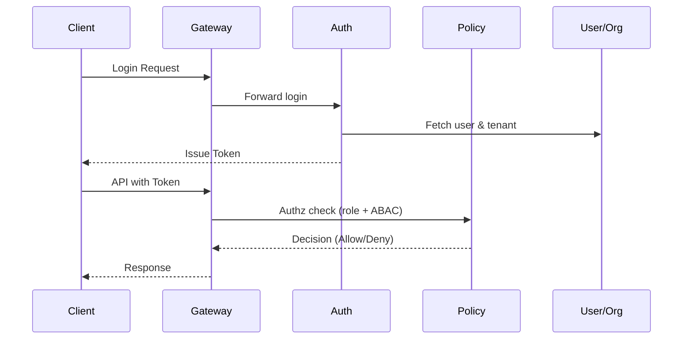
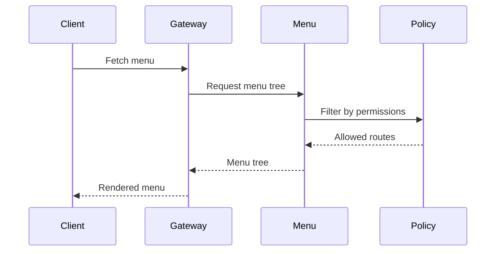

# 组件设计（Component Design）

## 1. 组件划分
- API Gateway / Edge：统一接入、鉴权前置、路由、限流、CORS、协议转换。
- Auth Service：登录、Token/Session、外部 IdP/OIDC 对接、二次验证、会话管理。
- User & Org Service：用户、组织、岗位、租户生命周期，账号状态管理。
- Policy/Permission Service：角色、权限点、资源绑定、ABAC 策略、权限评估引擎。
- Menu & Routing Service：菜单树、路由配置、菜单与权限映射、前端渲染数据。
- Audit Service：操作审计、鉴权审计、日志落地与检索。
- Notification Service：站内信/邮件/短信/Webhook，模板与发送策略，异步投递。
- Plugin/Integration Service：SPI 扩展点、外部系统同步（目录/工单/CMDB）。
- Supporting Components：配置中心/注册中心（如 Consul）、缓存（Redis）、队列/流（MQ）、对象存储、任务调度。

## 2. 模块职责与交互
- Gateway 负责：请求入口、鉴权前置校验、灰度/AB 测试、流量治理，转发至内部服务。
- Auth：提供认证 API，签发/校验 Token，维护会话与刷新；对接外部 IdP；向 Policy 提供用户身份上下文。
- Policy：维护角色/权限/资源/ABAC 策略，提供决策 API；与 Menu 联动进行菜单过滤；向 Audit 输出鉴权结果。
- User & Org：维护用户、组织、岗位数据，对 Policy 提供主体属性，对 Menu 提供组织/岗位维度的路由配置。
- Menu：根据主体权限输出菜单与路由；支持多终端（Web/SPA）。
- Audit：监听业务与鉴权事件，异步落库/冷存，提供查询接口，支持合规导出。
- Notification：消费业务事件，按模板与策略发送；可复用 MQ 与重试机制。
- Plugin/Integration：注册插件、暴露 SPI；与外部目录/工单系统对接。

## 3. 数据存储与缓存
- RDBMS：租户、用户、组织、角色、权限点、资源、菜单、审计元数据。
- Redis：会话/Token、权限决策缓存、菜单缓存、热点配置、幂等/限流标记。
- MQ/Stream：审计异步落地、通知事件、跨服务事件驱动。
- 对象存储：附件、导入导出文件、审计归档。

## 4. 接口与契约
- 外部接口：统一通过 Gateway 暴露 REST API / OpenAPI；支持 Webhook 回调。
- 内部接口：服务间 REST/HTTP + 消息事件；鉴权上下文通过 Token/内部调用凭证传递。
- Schema/IDL：OpenAPI 用于外部契约；内部事件约定 topic/schema（可选 JSON/Avro）。

## 5. 关键时序示例
### 登录与鉴权（示例）

### 菜单渲染（示例）

## 6. 扩展性设计
- 插件机制：通过 SPI 扩展鉴权策略、外部目录同步、通知通道、审计落地适配器。
- 特性开关：支持灰度/AB 的配置中心；菜单/路由可按租户/组织/角色动态调整。
- 多租户隔离：逻辑库/Schema/租户列隔离策略；缓存加租户前缀；MQ 主题按租户或全局分流。

## 7. 非功能设计
- 性能：鉴权/菜单强缓存 + 失效通知，热点路径无状态扩缩容，审计与通知异步化。
- 可用性：服务多副本，配置中心/注册中心高可用，数据库主从或多 AZ 部署。
- 安全：统一入口鉴权、防重放与签名、敏感字段脱敏、操作审计；最小权限原则。
- 可观测性：日志、指标、Tracing，关键链路埋点；异常与超时告警。

## 8. 关联文档
- 系统概览：`doc/architecture/system_overview.md`
- 部署视图：`doc/architecture/deployment_diagram.md`
- 权限与资源：`doc/permission/`、`doc/resource_model/`、`doc/menu_structure/`
- 数据库设计：`doc/database/`
- API 契约：`doc/api/`

