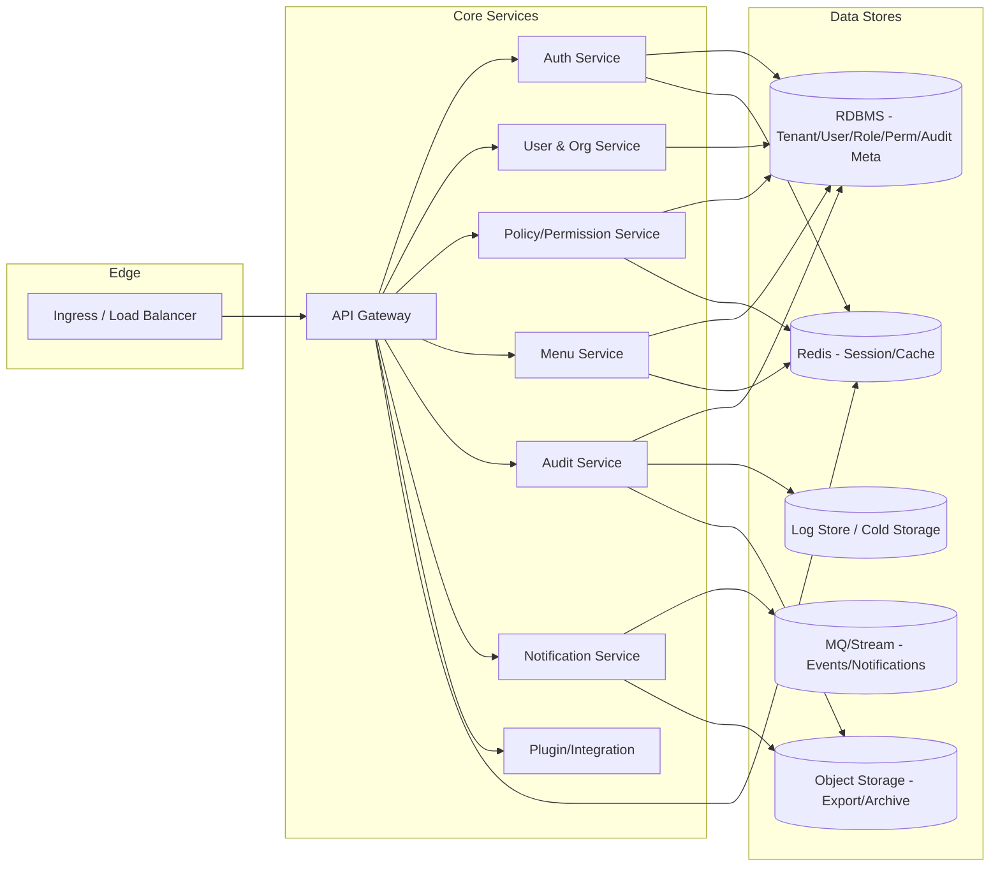

# 部署架构（Deployment Diagram）

## 1. 环境划分
- Dev / Test：功能验证、联调，低规格，开放调试与日志细节。
- Staging / Pre-Prod：准生产配置，尽量与生产一致的拓扑与容量；压测/回归。
- Production：多 AZ/多节点高可用，观测与告警完备，变更受控。

## 2. 拓扑示意（Mermaid）

## 3. 部署要点
- 入口：使用 Ingress/Load Balancer，将公网/内网流量引入 Gateway；开启 TLS 与 WAF/ACL。
- 鉴权前置：Gateway 统一鉴权、限流、熔断；必要时启用 IP 白名单/签名。
- 服务层：核心服务无状态，可水平扩缩；按业务重要性分组部署与弹性策略。
- 数据层：RDBMS 主从或集群，高可用；Redis 高可用/哨兵；MQ/Stream 多副本；对象存储跨可用区冗余。
- 观测：集中日志、指标、Tracing；关键操作与鉴权事件写入审计并落冷存储。
- 配置与注册：使用配置中心/注册中心（如 Consul）；变更需灰度/发布窗口。
- 多租户：数据库 Schema/租户列隔离；缓存与 MQ 按租户打标签；管理面与租户面访问隔离。

## 4. 容量与弹性（示例）
- Gateway：按 QPS 及连接数横向扩展；启用连接池与限流。
- Policy/Auth：CPU/内存敏感，配置自动扩缩容；权限决策与 Token 校验需短延迟。
- Redis：关注内存与连接数，开启持久化策略与监控告警。
- MQ：按审计/通知吞吐配置分区/副本，启用重试与死信队列。

## 5. 灰度与发布
- 使用特性开关/灰度路由；金丝雀发布；回滚预案。
- 数据变更需 DDL 审核与前置评估；跨版本兼容（优先向后兼容）。

## 6. 关联文档
- 系统概览：`doc/architecture/system_overview.md`
- 组件设计：`doc/architecture/component_design.md`
- 部署指南：`doc/deployment/`
- 权限模型：`doc/permission/`
- 数据库：`doc/database/`
- API：`doc/api/`

