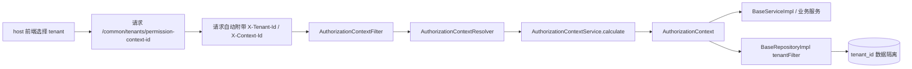

# 多租户模型（Multi-tenant Model）

## 1. 背景与范围

当前仓库的多租户实现不是“每租户一个独立服务实例”，也不是默认“一租户一数据源”。  
它更接近下面这条链路：

**前端选择租户 -> 请求头携带租户与上下文 -> 后端解析授权上下文 -> 实体与仓储按 `tenant_id` 过滤**

这是一个以请求上下文和实体基类为中心的实现。

## 2. 端到端链路



## 3. 前端如何传递租户

### 3.1 tenantId 和 contextId 的持久化

前端共享库把租户和上下文都保存在浏览器本地：

- `sp.tenantId`
- `sp.contextId`
- `sp.contextId:{tenantId}`

其中 `contextId` 是按租户维度缓存的。

### 3.2 contextId 的获取

前端会调用：

- `/common/tenants/permission-context-id`

来获取当前租户的权限上下文标识。  
`ensureContextId(...)` 允许 `tenantId` 为空，这表示某些场景下后端可以根据当前 session 直接推导上下文。

### 3.3 请求头自动补齐

共享请求客户端会自动把下面两个头带上：

- `X-Tenant-Id`
- `X-Context-Id`

如果当前请求还没有可用的 `contextId`，前端会先做一次 best-effort 的 `ensureContextId(...)`，再发送真实业务请求。

## 4. 后端如何解析租户上下文

### 4.1 `AuthorizationContextFilter`

资源服务里的 `AuthorizationContextFilter` 会读取请求头中的：

- `X-Tenant-Id`
- `X-Context-Id`
- `Authorization`

然后把解析出的 `AuthorizationContext` 放进 `RequestContextHolder.AUTHORIZATION_CONTEXT_KEY`。

### 4.2 `AuthorizationContextResolver`

`AuthorizationContextResolver` 的职责有两层：

1. 先按 `contextId` 从缓存读取授权上下文。
2. 缓存未命中时，调用 `AuthorizationContextService.calculate(...)` 计算新的上下文。

这里传入的关键参数包括：

- `tenantId`
- `userId`
- `contextId`
- 所有 `X-*` 请求头

并且计算结果会按 `contextId` 缓存 2 小时。

### 4.3 授权上下文不是只有用户权限

`AuthorizationContext` 当前至少包含：

- `contextId`
- `userId`
- `isAdministrator`
- `roles`
- `permissions`
- `attributes`

其中多租户最关键的是 `attributes["X-Tenant-Id"]`。  
后续服务层和仓储层都通过这个字段拿当前租户。

## 5. 租户感知实体

### 5.1 基类

租户实体通常继承 `TenantBaseEntityImpl<I>`，这个基类提供了：

- `tenant_id` 列
- Hibernate `tenantFilter`
- `prePersist()` 默认填充逻辑

`tenantFilter` 的条件是：

```sql
tenant_id = :tenantId
```

### 5.2 当前仓库中的例子

已经使用租户基类的实体包括：

- `Role`
- `Organization`
- `UserRoleRelevance`
- `RolePermissionsRelevance`
- `ObjectStorageObject`

而不是所有实体都租户化，例如 `MicroModule` 仍然继承 `BaseEntityImpl<String>`，更像平台级全局配置。

## 6. 读写隔离是怎么落地的

### 6.1 写入：服务层自动补 tenantId

`BaseServiceImpl.create(...)` 会在保存前调用 `applyCurrentTenantIdIfNecessary(...)`：

- 如果实体实现了 `TenantBaseEntity`
- 且实体本身还没有 `tenantId`
- 就从当前 `AuthorizationContext` 里读取 `X-Tenant-Id` 并写入

这让大多数租户实体在创建时不需要每个 Service 再手工赋值。

### 6.2 读取：仓储层启用 Hibernate Filter

`BaseRepositoryImpl` 在构造查询条件和执行 `count(...)` 时，会调用 `enableTenantFilter()`：

1. 判断当前实体是否继承 `TenantBaseEntityImpl`
2. 从 `AuthorizationContextHolder` 读取 `X-Tenant-Id`
3. 调用 Hibernate `session.enableFilter("tenantFilter")`

所以对租户实体的通用查询，会自动只看到当前租户的数据。

### 6.3 显式 tenant 条件仍然存在

除了通用过滤，部分仓储还会显式声明按租户查询的方法，例如：

- `findByIdAndTenantId(...)`
- `existsByTenantIdAndCode(...)`

这通常用于：

- 唯一性校验
- 父子层级校验
- 更明确的业务约束

## 7. 业务层的租户约束

租户上下文虽然大部分是隐式透传的，但对严格的租户域，业务服务仍然会做显式校验。

例如 `OrganizationServiceImpl`：

- 会要求当前必须选中租户，否则直接报错“请先选择租户”
- 校验父组织是否属于同一租户
- 校验 `(tenant_id, code)` 组合唯一

这说明本项目的多租户不是“只有 ORM 过滤就结束”，而是**基础过滤 + 业务约束**共同生效。

## 8. 当前实现的几个边界

### 8.1 默认是 `tenant_id` 列隔离

当前仓库里最明确、最通用的机制是：

- 实体带 `tenant_id`
- Hibernate Filter 按 `tenant_id` 过滤

并没有看到默认启用的“一租户一 schema”或“一租户一数据源”总装逻辑。

### 8.2 `tenantId` 缺失时存在 `default` 回退

`TenantBaseEntityImpl.prePersist()` 在 `tenantId == null` 时会写入 `"default"`。  
因此如果某个租户域接口没有做显式校验，又没有可用的授权上下文，数据可能落入默认租户。

这也是为什么严格的租户业务应像 `OrganizationServiceImpl` 一样在业务层明确要求租户已选定。

### 8.3 有些平台级能力是全局的

并不是所有配置都应该跟租户绑定。  
像 `MicroModule` 这类全局实体，本来就用于描述平台级远程模块，而不是租户私有数据。

## 9. 阅读建议

如果你要追某个租户字段为什么生效，建议按下面顺序看：

1. 前端 `contextId.ts` 和共享 `request(...)`
2. `AuthorizationContextFilter`
3. `AuthorizationContextResolver` / `AuthorizationContextService`
4. `TenantBaseEntityImpl`
5. `BaseServiceImpl.applyCurrentTenantIdIfNecessary(...)`
6. `BaseRepositoryImpl.enableTenantFilter()`

## 10. 关联文档

- 权限模型：`doc/permission/`
- 服务拓扑：`doc/architecture/service_topology.md`
- Schema 驱动 UI：`doc/architecture/schema_driven_ui.md`
