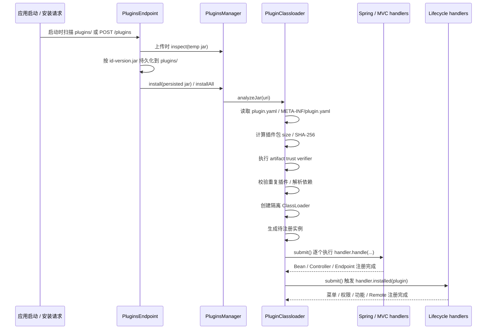

# 插件运行时架构（Plugin Architecture）

## 1. 背景与范围

本仓库里“插件”有两种含义，必须先分清：

1. **内置插件模块**：`simplepoint-plugins/` 下的源码模块，通过 Gradle 依赖被编译进服务。
2. **运行时外置插件**：打成独立 JAR，放入 `plugins/` 目录或通过 `/plugins` 接口上传，在应用启动后动态装载。

本文讲的是第二种：**运行时插件系统本身如何工作**，以及它和第一种“内置插件模块”之间的关系。

## 2. 核心组成

| 模块 | 作用 |
| --- | --- |
| `simplepoint-plugin-api` | 定义 `Plugin`、`PluginsManager`、`PluginInstanceHandler`、`PluginLifecycleHandler` 和 `/plugins` 管理端点 |
| `simplepoint-plugin-core` | 提供 `AbstractPluginsManager`、`PluginClassloader`、依赖感知类加载器、lifecycle 分发和存储实现 |
| `simplepoint-plugin-spring` | 把插件实例接入 Spring 容器，注册 `PluginsManager` 和 Spring Bean handler |
| `simplepoint-plugin-webmvc` | 在 Spring MVC 环境下动态注册 / 卸载 Controller、Endpoint 路由 |
| `simplepoint-plugins/` | 内置业务能力模块，通常是编译期组合，不走运行时 JAR 装载流程 |
| 根目录 `plugins/` | 运行时外置插件 JAR 的默认扫描目录 |

## 3. 插件 Manifest 约定

运行时插件 JAR 必须包含 `plugin.yaml`、`plugin.yml`、`plugin.json` 或 `META-INF/plugin.yaml`。`PluginClassloader` 会在安装时读取这个文件，并反序列化为 `PluginManifest`。

当前 Manifest 结构至少包含这些字段：

- `id`、`name`、`version`、`author`
- `coreVersion`、`frontendSdkVersion`
- `backend.instances`
- `backend.packageScan`
- `frontend.remotes`
- `menus`
- `permissions`
- `features`
- `dependencies`

其中最关键的是下面三个：

| 字段 | 含义 |
| --- | --- |
| `instances` | 显式声明要注册的插件实例，按分组组织 |
| `packageScan` | 按“分组 -> 包路径”声明需要自动扫描注册的类 |
| `frontend.remotes` | 声明微前端 remote name 与 entry |
| `menus` / `permissions` / `features` | 声明插件要注册到 RBAC 的导航、权限点和功能点 |
| `dependencies` | 当前插件依赖的其他插件，可声明 `id`、可选版本约束和是否可选 |
| `coreVersion` / `frontendSdkVersion` | 声明插件需要的后端插件运行时版本和前端 SDK 版本约束 |

这里的“分组”必须和系统里已经注册的 `PluginInstanceHandler.groups()` 对应。当前默认可见的分组有：

- `service`
- `controller`
- `endpoint`

如果 `backend.instances` 或 `backend.packageScan` 声明了未注册的分组，安装会直接失败。这样可以避免插件显示为已安装但对应 Bean、Controller 或 Endpoint 实际没有注册的半失效状态。

同一个插件内所有 backend instance `name` 必须唯一，即使它们属于不同 group。安装阶段会先合并显式 `instances`
和 `packageScan` 扫描结果，再做唯一性校验，避免同名 Bean 或路由在 submit 阶段相互覆盖。

## 4. 装载流程



对应到代码中的关键节点：

1. `PluginsEndpoint` 同时是 REST Controller 和 `ApplicationRunner`。
2. `POST /plugins/plan` 会把上传 JAR 放到临时文件，并通过 `PluginsManager.planInstall(tempUri)` 返回安装顺序、依赖解析和阻断原因；它会覆盖 manifest、兼容性、artifact trust、依赖、backend group 和实例唯一性校验，但不会持久化 JAR、创建类加载器或写入 storage。
3. 上传安装时会先预读 manifest，按 `id-version.jar` 写入 `plugin.autoloader.path`，再从持久化后的 JAR 安装。
4. 启动时，如果 `plugin.autoloader.enable=true`（默认开启），会扫描 `plugin.autoloader.path`（默认 `plugins/`）。
   扫描到多个 JAR 时会先读取 manifest，并按必需依赖和候选可选依赖做拓扑排序；缺失必需依赖、依赖版本不满足、循环依赖、重复插件 ID 会在安装前失败。
5. `AbstractPluginsManager` 把安装、卸载、提交、manifest 预读等动作委托给 `PluginClassloader`。
6. `PluginClassloader.analyzeJar()` 会：
   - 读取 `plugin.yaml` / `META-INF/plugin.yaml`
   - 计算插件 JAR 的 `size` 和 `sha256`，写入 `PluginArtifact`
   - 校验 `coreVersion` / `frontendSdkVersion` 与当前运行时版本是否匹配
   - 执行 `PluginArtifactVerifier`，可按插件 ID 校验可信 SHA-256 或接入自定义验签逻辑
   - 校验插件是否已存在
   - 校验已安装或本次候选依赖插件是否满足 `dependencies.version`
   - 解析依赖插件的类加载器
   - 为当前插件创建隔离的 `DependencyAwareUrlClassLoader`
   - 根据 `instances` 和 `packageScan` 生成待注册实例
7. 真正的实例注册和 manifest 贡献注册不是立刻执行，而是先进入 `handleQueue`，再由 `submit()` 顺序执行；单个任务失败时会先原地重试，最多 10 次，不会越过失败任务执行后续 lifecycle。
8. 插件状态会从 `RESOLVED` 进入 `INSTALLED`，`submit()` 成功后进入 `ENABLED`；失败会标记 `FAILED` 并触发局部回滚。
9. `PluginLifecycleHandler` 会在实例注册后处理声明式贡献，例如 RBAC 的 `frontend.remotes`、`menus`、`permissions`、`features`。
10. 如果运行时插件注册的 Spring Bean 自身实现了 `PluginLifecycleHandler`，`SpringBeanPluginInstanceHandler` 会在 Bean 注册后把它加入 manager，并在卸载回滚时移除。

## 5. 当前默认处理器

### 5.1 `service` 分组

`SpringBeanPluginInstanceHandler` 负责：

- 用 Spring `AutowireCapableBeanFactory` 创建实例
- 让 Bean 走完整初始化流程（包括 AOP 后处理）
- 以 singleton 方式注册进容器

这意味着运行时插件里的 service 类，不只是“反射 new 一个对象”，而是能拿到正常的 Spring 注入能力。

### 5.2 `controller` / `endpoint` 分组

`ServletMappingPluginInstanceHandler` 负责：

- 先把实例作为 Spring Bean 注册
- 再调用 `processCandidateBean(...)` 动态注册 MVC `RequestMapping`
- 卸载时先取消路由，再回滚 Bean

所以只要服务应用引入了 `simplepoint-plugin-webmvc`，运行时插件就不只能加服务 Bean，还能加 HTTP Controller / Endpoint。

## 6. 类加载与依赖隔离

当前插件系统不是所有插件共用一个 URLClassLoader，而是**每个插件一个隔离类加载器**：

- `PluginClassloader` 为每个插件维护独立的 `URLClassLoader`
- 如果插件声明了 `dependencies`，会把依赖插件的类加载器作为上游依赖传入
- `dependencies.version` 使用与 `coreVersion` 相同的版本表达式语法；可选依赖不存在时允许安装，但只要依赖已安装或出现在同一批候选 JAR 中，就必须满足版本约束
- 卸载时会关闭对应类加载器，并清理 Bean、映射和存储记录

这带来两个直接效果：

1. 插件之间可以显式声明依赖顺序。
2. 插件可以声明依赖插件的可接受版本范围，避免装到不兼容的上游实现。
3. 已被其他插件依赖的插件不能直接卸载，否则会抛出阻断异常。

## 7. 插件包指纹与可信校验

安装、升级、启动自动扫描和 `inspect` 都会先计算插件包 `PluginArtifact`，当前包含：

- `uri`：插件 JAR 位置
- `size`：插件 JAR 字节数
- `sha256`：插件 JAR SHA-256 十六进制摘要

Spring 环境默认注册 `TrustedSha256PluginArtifactVerifier`。默认不配置时只记录指纹、不拦截安装；配置插件 ID 对应的 digest 后，会拒绝摘要不匹配的包；开启严格模式后，未配置 digest 的插件也会被拒绝：

```yaml
plugin:
  trust:
    require-known-sha256: true
    sha256:
      "org.example.analytics":
        - "0123456789abcdef0123456789abcdef0123456789abcdef0123456789abcdef"
```

如果需要证书签名、远端信任中心或企业内置审批策略，可以声明额外的 `PluginArtifactVerifier` Bean。系统会按 Spring order 组合执行这些 verifier。

## 8. Manifest 贡献注册

`PluginLifecycleHandler` 是插件级生命周期扩展点，用于处理不属于 Java class 注册的声明式资源。当前 RBAC 集成由 `PluginRbacContributionHandler` 完成：

- `frontend.remotes` 写入 `MicroModule`，`/menus/service-routes` 会返回真实 remote entry。
- 插件 remote 的数据库 entry 保持 manifest 中的 canonical URL；`/menus/service-routes` 输出时会追加
  `_sp_plugin` 和 `_sp_v` query，用插件版本、remote 版本和 artifact SHA-256 做浏览器缓存隔离。
- `permissions` 写入 `Permissions`，按 `authority` 查重。
- `features` 写入 `Feature`，并建立 feature -> permission 关系。
- `menus` 写入 `Menu`，`parent` 按 menu `authority` 或 `path` 解析为数据库 ID，并建立 menu -> feature 关系。
- 所有由插件创建的 RBAC 资源都会写入 `pluginId`，卸载时按 `pluginId` 回收。

RBAC 贡献注册使用事务包裹，并且在 `installed(plugin)` 中有显式补偿：如果 remote、权限、功能或菜单任一步失败，
handler 会按 `pluginId` 反向清理本次已经写入的声明式资源，再把原始异常抛回。这样即使运行在非事务 repository
或测试替身上，也不会留下只注册了一半的插件资源。

## 9. 软启停

软禁用入口是 `PluginsManager.disable(id)` 和 `/plugins/disable`。它会撤销插件运行时贡献，但保留插件包、存储记录、依赖图和类加载器：

1. 如果有其他非 `DISABLED` / `FAILED` 插件依赖当前插件，则拒绝禁用。
2. 插件状态切到 `DISABLED`。
3. 触发 `PluginLifecycleHandler.uninstalling(plugin)`，撤销菜单、权限、功能、Remote 等声明式贡献。
4. 回滚 Bean / MVC 映射等实例注册，并清掉运行时实例对象，但保留已加载 class，便于后续启用。

重新启用入口是 `PluginsManager.enable(id)` 和 `/plugins/enable`。启用时会要求必需依赖均为 `ENABLED`，然后重新注册实例并触发 `PluginLifecycleHandler.installed(plugin)`；成功后状态回到 `ENABLED`。

## 10. 卸载与回滚

卸载时系统会做三层清理：

1. 检查是否有其他插件依赖当前插件，有则拒绝卸载。
2. 触发 `PluginLifecycleHandler.uninstalling(plugin)`，回收菜单、权限、功能、Remote 等声明式资源。
3. 按分组回滚已注册实例：
   - Bean 注销
   - MVC 映射注销
4. 关闭插件类加载器并从存储中删除记录。

安装或 `submit()` 失败时会触发局部清理：回滚已注册实例、调用 manifest contribution 的卸载钩子、清掉待执行任务、关闭插件类加载器、移除依赖图和 storage 记录，避免留下半注册状态。

## 11. 升级

升级入口是 `PluginsManager.upgrade(uri)` 和 `/plugins/upgrade`。升级策略是保守的单插件热升级：

1. 读取新包 manifest，并确认新包 `id` 对应的插件已安装。
2. 如果当前插件被其他已安装插件依赖，则拒绝升级，避免依赖插件继续持有旧类加载器里的类型。
3. 卸载旧插件，安装并 `submit()` 新插件。
4. 如果新插件安装或 `submit()` 失败，会尝试从旧插件原始 JAR 恢复旧版本。
5. REST 上传升级成功后会删除旧 JAR；失败时会删除本次上传的新 JAR。

## 12. 管理查询

`POST /plugins/plan` 返回 `PluginInstallPlan`。它用于安装前预检查，包含：

- `installable`：当前上传是否可以安装。
- `plugins`：计划中的插件、安装顺序、artifact 指纹和每条依赖的 resolved version。
- `issues`：无效 manifest、artifact trust 失败、依赖缺失、版本不满足、重复插件 ID、已安装重复、未注册 backend group、实例重名等阻断原因。

`GET /plugins` 返回 `PluginRegistryView`，不是裸 `Plugin` 列表。这个 read model 用于插件管理页直接渲染：

- `plugins`：每个插件的 `id`、版本、路径、产物 `size` / `sha256`、状态、失败原因、依赖、被依赖列表、注册实例数量。
- `dependencies`：依赖边，包含 source、target、是否 optional、是否 resolved、声明版本约束、实际解析版本和版本是否满足。
- `uninstallable` / `upgradeable`：由完整依赖图计算；如果有其他插件依赖当前插件，则为 `false`。
- `disableable` / `enableable`：由当前运行状态和活跃依赖关系计算，用于管理页控制启停操作。

`GET /plugins/operations` 返回最近的插件操作审计记录。默认实现是有界内存队列，Spring 环境可额外声明
`PluginOperationAuditRecorder` Bean，把审计写入数据库、消息队列或集中日志。每条记录包含：

- `operation` / `outcome`：安装、提交、升级、启用、禁用、卸载以及成功或失败结果。
- `pluginId` / `pluginVersion`：能从 manifest 或 storage 解析到的插件身份。
- `path` / `artifact`：插件包位置、大小和 SHA-256。
- `startedAt` / `completedAt` / `durationMillis`：操作时间和耗时。
- `failure`：失败原因。

`GET /plugins/tasks` 返回运行时注册任务快照。它用于观察 `submit()` 阶段的实例注册和 lifecycle 分发状态，
每条任务包含 `id`、`pluginId`、`operation`、`status`、`attempts`、`createdAt`、`updatedAt` 和 `failure`。
任务状态通过 `PluginTaskStore` 写入；默认实现是有界内存存储。生产环境可以声明自己的 `PluginTaskStore`
Bean，把任务快照写入数据库、Redis 或消息系统，从而支持进程重启后的查询、死信排查和人工重试入口。

Spring 环境内置 JDBC 任务存储实现，默认关闭，开启后会在存在 `DataSource` 时注册 `JdbcPluginTaskStore`：

```yaml
plugin:
  task-store:
    jdbc:
      enabled: true
      initialize-schema: true
      table-name: sp_plugin_task
```

`initialize-schema=false` 时系统不会自动建表，适合由 Flyway、Liquibase 或企业 DDL 流程统一管理 schema。
`table-name` 只允许普通标识符或 `schema.table` 形式，避免把任意 SQL 片段带入运行时。

插件运行时还提供 `PluginRuntimeCoordinator` SPI，用于把变更类操作纳入统一协调边界：

- `coordinate(context, callback)`：可在这里实现分布式锁、操作 fencing 或主节点调度。
- `publish(event)`：可在这里把安装、提交、升级、启停、卸载结果广播到 MQ、Redis Stream、SSE 或集群控制面。
- Spring 自动配置会组合所有 `PluginRuntimeCoordinator` Bean；默认会把完成事件发布到 Spring application event bus。
  没有任何 coordinator 时使用 no-op 单机实现。

Spring 环境内置 JDBC 租约锁 coordinator，默认关闭。开启后，安装、提交、升级、启停和卸载会在同一个逻辑锁下串行执行：

```yaml
plugin:
  runtime-coordinator:
    jdbc:
      enabled: true
      initialize-schema: true
      table-name: sp_plugin_runtime_lock
      lock-name: plugin-runtime
      owner-id: ${HOSTNAME:${spring.application.name:default-node}}
      lease-duration: 5m
      acquire-timeout: 30s
      retry-interval: 200ms
```

`owner-id` 建议在每个应用节点上保持稳定且唯一。`lease-duration` 应覆盖一次插件变更操作的正常执行时间；
如果某节点异常退出，其他节点会在租约过期后接管。`initialize-schema=false` 时，锁表也可以交给外部 DDL 流程管理。

Spring 环境还内置 JDBC 运行时事件日志，默认关闭。它负责把本节点完成的插件操作写入事件表，并由 relay
轮询其他节点写入的事件，再发布到本节点 Spring application event bus：

```yaml
plugin:
  runtime-events:
    jdbc:
      enabled: true
      relay-enabled: true
      replay-existing: false
      initialize-schema: true
      table-name: sp_plugin_runtime_event
      origin-id: ${HOSTNAME:${spring.application.name:default-node}}
      poll-interval: 2s
      batch-size: 100
```

`origin-id` 用于避免本节点重复消费自己写入的事件，建议与节点身份保持稳定且唯一。`relay-enabled=false`
时只记录事件、不做跨节点本地广播。`replay-existing=false` 是默认值，表示 relay 启动时只消费之后出现的
远端事件；历史状态一致性应由插件注册表、任务存储或外部控制面重新对账。如果需要把事件表当作完整事件流，
可以显式开启 `replay-existing=true`。

这意味着单机模式保持零配置，多节点部署时可以只新增一个 coordinator 实现，而不需要改 `PluginClassloader`、
RBAC 贡献处理器或 REST endpoint。

## 13. 内置插件和运行时插件的边界

| 类型 | 位置 | 装载方式 | 生命周期 |
| --- | --- | --- | --- |
| 内置插件 | `simplepoint-plugins/` | Gradle 编译期依赖 | 随服务发布 |
| 运行时插件 | JAR + `plugins/` / `/plugins` | `PluginsManager` 动态装载 | 可在运行中安装/卸载 |

当前仓库里的绝大多数业务能力，例如 RBAC、OIDC、i18n、tenant、storage，都是以内置插件模块的形式被 `common`、`auditing`、`dna` 等服务直接依赖。  
这说明“插件化”在本项目里既是**源码组织方式**，也是**运行时扩展机制**，两者并存。

## 14. 什么时候应该用运行时插件

更适合用运行时插件的场景：

- 给已有服务增加少量独立扩展点
- 需要动态安装 / 卸载
- 需要和现有 Spring 容器、MVC 路由无缝集成

不太适合强行做成运行时插件的场景：

- 核心领域模型
- 大量跨模块编译期依赖
- 必须参与主应用构建和版本编排的能力

这类能力通常更适合直接放进 `simplepoint-plugins/` 或其他业务模块。

## 15. 关联文档

- 项目结构：`doc/architecture/project_structure_diagram.md`
- 服务拓扑：`doc/architecture/service_topology.md`
- 系统概览：`doc/architecture/system_overview.md`
