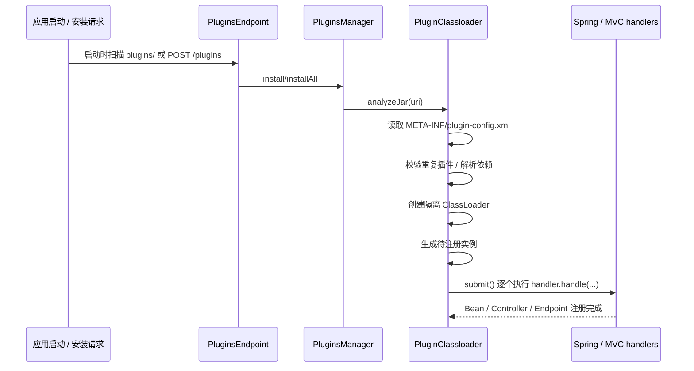

# 插件运行时架构（Plugin Architecture）

## 1. 背景与范围

本仓库里“插件”有两种含义，必须先分清：

1. **内置插件模块**：`simplepoint-plugins/` 下的源码模块，通过 Gradle 依赖被编译进服务。
2. **运行时外置插件**：打成独立 JAR，放入 `plugins/` 目录或通过 `/plugins` 接口上传，在应用启动后动态装载。

本文讲的是第二种：**运行时插件系统本身如何工作**，以及它和第一种“内置插件模块”之间的关系。

## 2. 核心组成

| 模块 | 作用 |
| --- | --- |
| `simplepoint-plugin-api` | 定义 `Plugin`、`PluginsManager`、`PluginInstanceHandler` 和 `/plugins` 管理端点 |
| `simplepoint-plugin-core` | 提供 `AbstractPluginsManager`、`PluginClassloader`、依赖感知类加载器和存储实现 |
| `simplepoint-plugin-spring` | 把插件实例接入 Spring 容器，注册 `PluginsManager` 和 Spring Bean handler |
| `simplepoint-plugin-webmvc` | 在 Spring MVC 环境下动态注册 / 卸载 Controller、Endpoint 路由 |
| `simplepoint-plugins/` | 内置业务能力模块，通常是编译期组合，不走运行时 JAR 装载流程 |
| 根目录 `plugins/` | 运行时外置插件 JAR 的默认扫描目录 |

## 3. 插件元数据约定

运行时插件 JAR 必须包含 `META-INF/plugin-config.xml`。`PluginClassloader` 会在安装时读取这个文件，并反序列化为 `Plugin.PluginMetadata`。

当前元数据结构至少包含这些字段：

- `pid`、`name`、`version`、`author`
- `packageName`
- `instances`
- `packageScan`
- `dependencies`

其中最关键的是下面三个：

| 字段 | 含义 |
| --- | --- |
| `instances` | 显式声明要注册的插件实例，按分组组织 |
| `packageScan` | 按“分组 -> 包路径”声明需要自动扫描注册的类 |
| `dependencies` | 当前插件依赖的其他插件 `packageName` 列表 |

这里的“分组”必须和系统里已经注册的 `PluginInstanceHandler.groups()` 对应。当前默认可见的分组有：

- `service`
- `controller`
- `endpoint`

## 4. 装载流程

对应到代码中的关键节点：

1. `PluginsEndpoint` 同时是 REST Controller 和 `ApplicationRunner`。
2. 启动时，如果 `plugin.autoloader.enable=true`（默认开启），会扫描 `plugin.autoloader.path`（默认 `plugins/`）。
3. `AbstractPluginsManager` 把安装、卸载、提交等动作委托给 `PluginClassloader`。
4. `PluginClassloader.analyzeJar()` 会：
   - 读取 `META-INF/plugin-config.xml`
   - 校验插件是否已存在
   - 解析依赖插件的类加载器
   - 为当前插件创建隔离的 `DependencyAwareUrlClassLoader`
   - 根据 `instances` 和 `packageScan` 生成待注册实例
5. 真正的实例注册不是立刻执行，而是先进入 `handleQueue`，再由 `submit()` 顺序执行；失败时最多重试 10 次。

## 5. 当前默认处理器

### 5.1 `service` 分组

`SpringBeanPluginInstanceHandler` 负责：

- 用 Spring `AutowireCapableBeanFactory` 创建实例
- 让 Bean 走完整初始化流程（包括 AOP 后处理）
- 以 singleton 方式注册进容器

这意味着运行时插件里的 service 类，不只是“反射 new 一个对象”，而是能拿到正常的 Spring 注入能力。

### 5.2 `controller` / `endpoint` 分组

`ServletMappingPluginInstanceHandler` 负责：

- 先把实例作为 Spring Bean 注册
- 再调用 `processCandidateBean(...)` 动态注册 MVC `RequestMapping`
- 卸载时先取消路由，再回滚 Bean

所以只要服务应用引入了 `simplepoint-plugin-webmvc`，运行时插件就不只能加服务 Bean，还能加 HTTP Controller / Endpoint。

## 6. 类加载与依赖隔离

当前插件系统不是所有插件共用一个 URLClassLoader，而是**每个插件一个隔离类加载器**：

- `PluginClassloader` 为每个插件维护独立的 `URLClassLoader`
- 如果插件声明了 `dependencies`，会把依赖插件的类加载器作为上游依赖传入
- 卸载时会关闭对应类加载器，并清理 Bean、映射和存储记录

这带来两个直接效果：

1. 插件之间可以显式声明依赖顺序。
2. 已被其他插件依赖的插件不能直接卸载，否则会抛出阻断异常。

## 7. 卸载与回滚

卸载时系统会做三层清理：

1. 检查是否有其他插件依赖当前插件，有则拒绝卸载。
2. 按分组回滚已注册实例：
   - Bean 注销
   - MVC 映射注销
3. 关闭插件类加载器并从存储中删除记录。

安装失败时也会触发局部清理，避免留下半注册状态。

## 8. 内置插件和运行时插件的边界

| 类型 | 位置 | 装载方式 | 生命周期 |
| --- | --- | --- | --- |
| 内置插件 | `simplepoint-plugins/` | Gradle 编译期依赖 | 随服务发布 |
| 运行时插件 | JAR + `plugins/` / `/plugins` | `PluginsManager` 动态装载 | 可在运行中安装/卸载 |

当前仓库里的绝大多数业务能力，例如 RBAC、OIDC、i18n、tenant、storage，都是以内置插件模块的形式被 `common`、`auditing`、`dna` 等服务直接依赖。  
这说明“插件化”在本项目里既是**源码组织方式**，也是**运行时扩展机制**，两者并存。

## 9. 什么时候应该用运行时插件

更适合用运行时插件的场景：

- 给已有服务增加少量独立扩展点
- 需要动态安装 / 卸载
- 需要和现有 Spring 容器、MVC 路由无缝集成

不太适合强行做成运行时插件的场景：

- 核心领域模型
- 大量跨模块编译期依赖
- 必须参与主应用构建和版本编排的能力

这类能力通常更适合直接放进 `simplepoint-plugins/` 或其他业务模块。

## 10. 关联文档

- 项目结构：`doc/architecture/project_structure_diagram.md`
- 服务拓扑：`doc/architecture/service_topology.md`
- 系统概览：`doc/architecture/system_overview.md`
