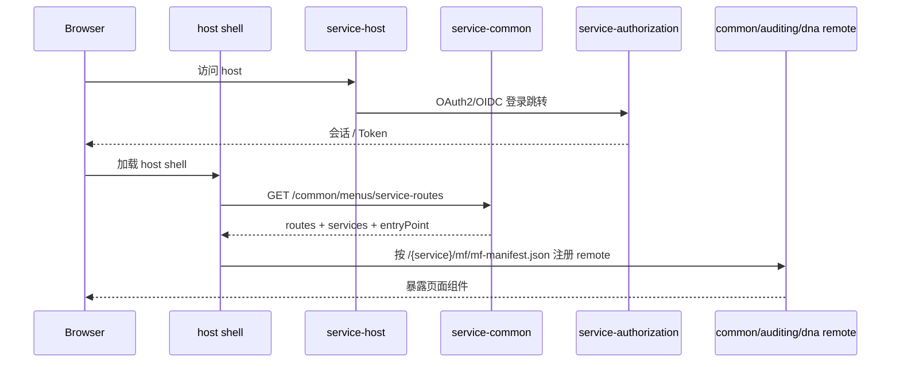

# 服务拓扑（Service Topology）

## 1. 背景与目标

本仓库的代码结构是“分层能力 + 组合式服务”，真正运行时并不是所有模块都独立启动，而是由少数几个服务应用把底层能力组装起来。本文只描述**当前仓库已经落地的运行时拓扑**，帮助读者回答两个问题：

1. 哪些服务需要启动，它们各自负责什么。
2. 前端微前端是如何和这些服务边界对齐的。

## 2. 后端服务一览

| 服务 | 入口类 | 技术栈 | 主要职责 | 关键依赖特征 |
| --- | --- | --- | --- | --- |
| `simplepoint-service-host` | `org.simplepoint.gateway.server.Host` | WebFlux + Spring Cloud Gateway + OAuth2 Client + Redis WebSession | 统一入口、登录跳转、会话承载、前端壳应用静态资源出口 | `spring-cloud-gateway-server-webflux`、`spring-session-data-redis`、`simplepoint-data-amqp-rpc` |
| `simplepoint-service-common` | `org.simplepoint.common.server.Common` | Servlet MVC + JPA + Resource Server | 默认业务聚合服务，承载 RBAC、菜单路由、OIDC 客户端管理、租户、字典、i18n、对象存储等平台能力 | `simplepoint-plugin-webmvc`、`simplepoint-security-oauth2-resource`、RBAC/OIDC/i18n/tenant/storage 插件模块 |
| `simplepoint-service-authorization` | `org.simplepoint.authorization.server.Authorization` | Servlet MVC + Spring Authorization Server + Thymeleaf | OAuth2/OIDC 授权服务器、登录与 Token/OIDC 端点 | `simplepoint-security-oauth2-server`、Redis、Vault、Thymeleaf |
| `simplepoint-service-auditing` | `org.simplepoint.auditing.server.Auditing` | Servlet MVC + JPA + Resource Server | 审计日志、限流规则、Redis 监控等运维/审计能力 | auditing logging/rate-limit/redis 插件模块 |
| `simplepoint-service-dna` | `org.simplepoint.dna.server.DnaApplication` | Servlet MVC + JPA + Resource Server | JDBC 驱动、方言、数据源等 DNA 能力 | `simplepoint-plugin-dna` 系列模块 |

### 共同点

- 五个服务入口都使用 `@Boot`，而不是原生 `@SpringBootApplication`。
- 五个服务都开启了 `@EnableAmqpRemoteClients(basePackages = "org.simplepoint")`，说明跨服务协作不只依赖 HTTP，也依赖 AMQP RPC。
- `common`、`auditing`、`dna` 都是 Servlet 资源服务；`host` 是 WebFlux 边缘服务；`authorization` 是 OAuth2/OIDC 授权服务器。

## 3. 前端应用与后端映射

如果工作区中存在 `open-simplepoint-dashboard-react/`，当前前端按“一个后端服务对应一个前端子应用”的方式组织：

| 前端应用 | 构建名 | 开发基路径 | 发布位置 | 角色 |
| --- | --- | --- | --- | --- |
| `apps/simplepoint-host` | host shell | 由 host 服务静态资源承载 | `simplepoint-service-host/src/main/resources/static/` | 主壳应用，负责菜单、路由、租户切换和远程模块注册 |
| `apps/simplepoint-common` | `common` | `/common/mf` | `simplepoint-service-common/src/main/resources/static/{mf,esm,cjs}` | 平台主业务 remote |
| `apps/simplepoint-audit` | `auditing` | `/auditing/mf` | `simplepoint-service-auditing/src/main/resources/static/{mf,esm,cjs}` | 审计与监控 remote |
| `apps/simplepoint-dna` | `dna` | `/dna/mf` | `simplepoint-service-dna/src/main/resources/static/{mf,esm,cjs}` | DNA remote |

当前仓库里已经能看到这些静态资源目录：`common`、`auditing`、`dna` 服务下存在 `mf/`、`esm/`、`cjs/`，而 `host` 服务下存在 `index.html` 和壳应用静态资源。

## 4. 菜单、服务名与远程模块装配链路

当前前端运行时并不是硬编码 remote 列表，而是由 `common` 服务把“可访问菜单 + 需要加载的服务名”一起返回给 host。

这条链路里的几个关键约定：

1. `MenusController` 暴露 `/menus/service-routes`，`simplepoint-host` 前端实际请求的是 `/common/menus/service-routes`。
2. `MenuServiceImpl.routes()` 会从菜单的 `component` 字段提取首段作为服务名，例如 `common/platform/Tenant` 会提取出 `common`。
3. `ServiceMenuResult.of(...)` 默认把远程入口约定为 `/mf/mf-manifest.json`。
4. host 前端的 `formatMfEntry()` 会把服务名解析为 `/{name}/mf/mf-manifest.json`；如果后端显式返回 `entry`，则以显式值为准。

这意味着：

- 菜单配置里的 `component` 命名必须和 remote 名称保持一致。
- remote 构建产物的公开路径必须和后端服务暴露路径保持一致。

## 5. 服务边界怎么划

### `host`

- 负责 WebFlux 网关、OAuth2 Client、Redis WebSession。
- 负责壳应用静态资源和登录页。
- 不承载主要业务 CRUD。

### `common`

- 是当前默认的平台业务聚合服务。
- 菜单、权限、角色、用户、租户、字典、i18n、对象存储等常见后台能力都在这里组合。
- host 前端依赖它返回菜单树和服务路由。

### `authorization`

- 负责认证、令牌、OIDC/OAuth2 服务器能力。
- 是整套系统的身份入口，而不是普通资源服务。

### `auditing`

- 聚合审计日志、限流规则、Redis 监控等能力。
- 既有独立后端服务，也有对应的审计 remote 页面。

### `dna`

- 聚合 JDBC 驱动、方言、数据源等数据接入能力。
- 有独立后端服务和独立 remote 页面。

## 6. 当前实现里的两个重要事实

### 6.1 远程模块运行时以菜单结果为准

仓库里虽然存在 `MicroModule` 实体和 `/ops/microapps` 管理接口，但 host 壳应用当前实际使用的是 `/common/menus/service-routes` 的结果来注册 remote，而不是直接读取 `microapps` 列表。

### 6.2 服务组合主要靠 Gradle 依赖，不靠单独“业务框架层”

例如 `simplepoint-service-common` 的 `build.gradle.kts` 直接引入了 RBAC、OIDC、i18n、tenant、storage 等插件模块；这说明运行时服务边界更多体现在“哪些模块被组装到哪个服务”上，而不是每个能力都单独拆成一个可运行服务。

## 7. 阅读建议

如果你要追某个页面是怎么显示出来的，推荐按下面顺序看：

1. `simplepoint-host` 前端的 `fetchServiceRoutes()`、`useRegisterRemotes()`、`RouteRenderer`
2. `common` 服务的 `MenusController`、`MenuServiceImpl.routes()`
3. 对应 remote 的 `module.exposes.ts` 和 `rslib.config.ts`
4. 对应后端服务的 `src/main/resources/static/` 产物目录

## 8. 关联文档

- 系统概览：`doc/architecture/system_overview.md`
- 项目结构：`doc/architecture/project_structure_diagram.md`
- DNA 联邦查询平台设计：`doc/design/dna_federated_query_platform.md`
- 前端微前端：`doc/architecture/frontend_microfrontend.md`
- 插件运行时：`doc/architecture/plugin_architecture.md`
- Schema 驱动 UI：`doc/architecture/schema_driven_ui.md`
