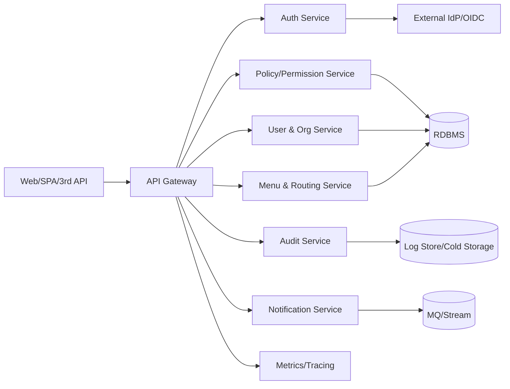

# 系统概览（System Overview）

## 1. 目标与范围
- 支撑多租户 SaaS / IAM 后台的统一认证、授权、审计、配置与可观测能力。
- 主要用户：平台管理员、租户管理员、业务管理员、普通用户、第三方集成方。
- 范围：身份认证、租户与组织管理、用户与角色管理、权限策略（RBAC/ABAC）、资源目录、菜单路由、审计日志、通知/消息、插件扩展。

## 2. 核心域与能力
- 身份与认证：OAuth2/OpenID Connect、会话/Token 管理、登录流程与风控扩展。
- 授权与策略：角色/权限点、资源与菜单绑定、ABAC 策略、数据权限表达式、权限矩阵。
- 组织与租户：租户生命周期（创建/冻结/回收）、组织架构（部门/岗位）、用户生命周期(未来计划支持,当前暂未实现)。
- 资源与菜单：资源模型（API/页面/实体/字段）、菜单层级与路由、资源审计。
- 审计与合规：操作审计、鉴权审计、合规留存、可追溯性。
- 运维与可观测：配置管理、日志、指标、告警、限流与熔断。
- 插件与扩展：插件 SPI、动态扩展点、灰度/特性开关。

## 3. 角色与关键用例
- 平台管理员：管理平台级配置、租户、全局策略、插件与集成。
- 租户管理员：配置本租户组织、用户、角色、权限点绑定、菜单与路由(暂未支持)。
- 业务管理员：定义业务资源、数据权限规则、审批与流程配置。
- 普通用户：登录、访问授权的页面/API、触发流程。
- 第三方集成方：通过开放 API/SDK 进行单点登录、资源授权、审计对接。

## 4. 高层架构视图
- 入口层：API Gateway / Edge（接入层，统一鉴权、路由、限流、CORS、协议转换）。
- 服务层(服务层可根据需要自行组建微服务)：
  - 认证服务：登录、Token、会话、二次校验、第三方 IdP 对接。
  - 用户与组织服务：用户、组织、岗位、租户生命周期。
  - 权限与策略服务：角色、权限点、资源目录、ABAC 策略、权限评估。
  - 菜单与路由服务：菜单树、前端路由、菜单-权限映射。
  - 审计与日志服务：操作审计、鉴权审计、留存与查询。
  - 通知/消息服务：站内信/邮件/短信/Webhook，异步投递。
  - 插件与集成服务：SPI 扩展、外部系统同步（如企业目录、工单）。
- 基础设施层：关系型数据库（租户/权限/审计）、Redis（会话/缓存）、消息中间件（事件/通知）、配置中心 & 注册中心（如 Consul）、对象存储（附件/导入导出）。

## 5. 上下文与交互（示意）

## 6. 关键链路
- 登录链路：Gateway → Auth → 外部 IdP（可选）→ Token/Session 下发 → 权限缓存预热。
- 鉴权链路：Gateway Pre-Auth → Policy 服务评估（角色 + ABAC 规则 + 资源绑定）→ 决策缓存 → 审计。
- 菜单渲染：Gateway → Menu → 返回菜单树与路由，基于权限过滤。
- 审计链路：业务请求 → Audit 记录（异步/批量）→ 冷存储 → 检索查询。
- 多租户：租户隔离策略（逻辑库/逻辑 Schema/租户列），跨租户操作仅限平台管理员。

## 7. 非功能性要求
- 可用性：核心链路多副本、无状态服务水平扩缩容，关键存储主从或多副本。
- 性能：读多写少链路缓存化（权限、菜单、配置），热点路由前置缓存，异步化审计与通知。
- 安全：统一鉴权、请求签名/限流、敏感字段脱敏、审计留痕、数据权限隔离。
- 可观察性：日志/指标/链路追踪统一采集；重要操作具备审计与回放能力。
- 可扩展性：插件机制、配置中心、灰度开关、限流策略可配置。

## 8. 相关文档
- 详细设计：`doc/design/`
- 权限模型：`doc/permission/`
- 资源与菜单：`doc/resource_model/`、`doc/menu_structure/`
- 数据库：`doc/database/`
- API：`doc/api/`
- 部署：`doc/deployment/`
- 故障排查：`doc/troubleshooting/`
- 开发环境与规范：`doc/architecture/dev_environment.md`
