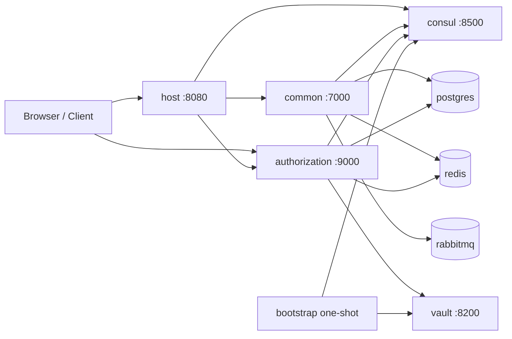

# Docker Swarm 部署指南

本文档说明如何使用仓库内新增的 Swarm 资产，在本地或单机 Docker Swarm Manager 上一键启动 SimplePoint 所需的基础设施与核心服务，并在启动后直接访问系统。

---

## 1. 背景与目标

当前仓库原有的 `scripts/shell/start_developer.sh` 主要负责启动开发态的 Consul、Vault，并通过 `init_profile.sh` 初始化配置；它并不会把 `host`、`common`、`authorization` 这些应用服务一起拉起。

新增的 Swarm 方案目标是：

- 把 PostgreSQL、Redis、RabbitMQ、Consul、Vault 与核心业务服务统一编排；
- 自动完成 Consul KV 初始化与 Vault Transit Key 初始化；
- 在一次命令执行后，直接通过浏览器访问 Host UI 和 Authorization 服务；
- 尽量复用现有 Gradle 模块、Spring Profile 和仓库中的配置约定。

这套方案当前定位为：

- 本地开发环境；
- 单机或单 Manager 节点的快速验证环境；
- 不面向生产环境直接上线。

---

## 2. 整体架构说明

Swarm 部署会拉起以下两类组件：

- 基础设施：`postgres`、`redis`、`rabbitmq`、`consul`、`vault`
- 应用服务：`bootstrap`、`authorization`、`common`、`host`

其中：

- `bootstrap` 是一次性初始化任务，用来写入 Consul KV 配置并在 Vault 中创建 `transit/sas-jwt`；
- `authorization` 提供 OAuth2/OIDC 授权、登录页与 JWKS；
- `common` 提供主业务 API、AMQP RPC 服务与微前端 Remote 资源；
- `host` 对外提供网关、前端 Shell 静态资源与登录入口。



---

## 3. 服务清单与职责

| 服务 | 是否对外暴露 | 默认端口 | 主要职责 |
| --- | --- | --- | --- |
| `postgres` | 否 | `5432` | 业务数据存储 |
| `redis` | 否 | `6379` | Session / Cache |
| `rabbitmq` | 管理界面对外 | `15672` | AMQP RPC 与消息通信 |
| `consul` | 是 | `8500` | 配置中心与服务发现 |
| `vault` | 是 | `8200` | Transit 签名密钥管理 |
| `bootstrap` | 否 | - | 初始化 Consul KV 与 Vault Transit Key |
| `authorization` | 是 | `9000` | OAuth2/OIDC 授权服务 |
| `common` | 否 | `7000` | 业务 API、Remote 资源、AMQP RPC |
| `host` | 是 | `8080` | 网关、前端 Shell、登录入口 |

补充说明：

- `host` 已经内置主前端壳子，不需要再额外部署单独的 Nginx/Node 前端；
- `common` 不对外发布端口，但仍然是系统正常工作的关键服务；
- `authorization` 对外暴露是为了满足浏览器登录链路与 OIDC issuer 的可访问性。

---

## 4. 前置条件与环境要求

在执行 Swarm 部署前，请确保：

### 4.1 必备条件

- 已安装 Docker，且本机可正常执行 `docker build`、`docker stack deploy`；
- 当前节点是 Docker Swarm Manager，或者尚未初始化 Swarm；
- 可以访问镜像仓库，以便首次拉取基础镜像；
- 主机防火墙允许访问本文档列出的对外端口；
- 在仓库根目录执行脚本：

```bash
cd open-simplepoint-dashboard
```

### 4.2 推荐版本

- Docker 29+；
- Linux 主机优先；
- 可用网络出口，用于首次构建时拉取 `gradle`、`eclipse-temurin`、`alpine` 等基础镜像。

### 4.3 当前实现的边界

当前实现假设：

- 更偏向本地或单机 Manager 节点；
- 构建出的镜像默认只存在本机 Docker Engine；
- 若要扩展到多节点 Swarm，需要先把镜像推送到可被所有节点访问的镜像仓库。

---

## 5. 一键部署步骤

### 5.1 最简单的启动方式

```bash
./scripts/shell/start_swarm.sh
```

脚本会自动：

1. 检查当前节点是否已加入 Swarm；
2. 如未初始化，则自动执行 `docker swarm init`；
3. 检测当前节点地址并作为对外访问地址；
4. 构建 `bootstrap`、`authorization`、`common`、`host` 镜像；
5. 部署 `docker/swarm/stack.yml`；
6. 等待 bootstrap 服务初始化 Consul 与 Vault；
7. 启动应用服务。

### 5.2 指定对外访问地址

如果自动探测到的地址不是浏览器真正可访问的地址，请手动指定：

```bash
SIMPLEPOINT_PUBLIC_HOST=192.168.1.10 ./scripts/shell/start_swarm.sh
```

这个地址会被写入：

- OIDC issuer；
- OAuth2 redirect URI；
- 对外访问说明。

### 5.3 指定 Stack 名称

```bash
STACK_NAME=simplepoint-dev ./scripts/shell/start_swarm.sh
```

未指定时默认使用：

```bash
simplepoint
```

---

## 6. 启动脚本做了什么

`scripts/shell/start_swarm.sh` 的核心流程如下：

### 6.1 Swarm 初始化

- 如果本机尚未加入 Swarm，则自动执行初始化；
- 如果本机已经在 Swarm 中，但不是 Manager，则脚本会直接失败，避免在 Worker 节点误部署。

### 6.2 构建本地镜像

脚本会依次构建：

- `simplepoint/bootstrap:swarm`
- `simplepoint/authorization:swarm`
- `simplepoint/common:swarm`
- `simplepoint/host:swarm`

其中应用镜像通过 `docker/swarm/app/Dockerfile` 统一构建，内部执行：

```bash
./gradlew <module>:installDist
```

再把 Gradle 生成的可执行分发目录拷贝到运行时镜像中。

### 6.3 部署 Stack

脚本会执行：

```bash
docker stack deploy -c docker/swarm/stack.yml <stack-name>
```

### 6.4 执行一次性 Bootstrap

`bootstrap` 容器基于 `docker/swarm/bootstrap/init-swarm.sh` 完成两件事：

1. 把 `docker/swarm/bootstrap/consul-config/` 下的配置写入 Consul；
2. 在 Vault 中确保存在 `transit` mount 和 `sas-jwt` RSA Key。

初始化完成后，会在 Consul 中写入：

```text
simplepoint/bootstrap/status = ready
```

### 6.5 应用容器等待依赖就绪

应用服务的 entrypoint 会等待以下依赖就绪后再启动：

- PostgreSQL
- Redis
- RabbitMQ
- Consul
- Vault
- `simplepoint/bootstrap/status`

这样可以减少“服务先启动但配置尚未写入”的竞态问题。

---

## 7. 配置项说明

### 7.1 启动脚本支持的环境变量

| 变量名 | 默认值 | 作用 |
| --- | --- | --- |
| `SIMPLEPOINT_PUBLIC_HOST` | 自动探测 | 浏览器实际访问的主机 IP 或域名 |
| `STACK_NAME` | `simplepoint` | Docker Stack 名称 |
| `SIMPLEPOINT_BOOTSTRAP_IMAGE` | `simplepoint/bootstrap:swarm` | Bootstrap 镜像名 |
| `SIMPLEPOINT_AUTH_IMAGE` | `simplepoint/authorization:swarm` | Authorization 镜像名 |
| `SIMPLEPOINT_COMMON_IMAGE` | `simplepoint/common:swarm` | Common 镜像名 |
| `SIMPLEPOINT_HOST_IMAGE` | `simplepoint/host:swarm` | Host 镜像名 |

### 7.2 Swarm Profile 相关配置

新增的 Profile 入口包括：

- `simplepoint-boot/simplepoint-boot-config-consul-starter/src/main/resources/application-consul-swarm.properties`
- `simplepoint-boot/simplepoint-boot-config-vault-starter/src/main/resources/application-vault-swarm.properties`

它们会把服务默认访问地址切换为：

- Consul：`consul:8500`
- Vault：`vault:8200`

### 7.3 Consul 中初始化的配置

Bootstrap 会把以下目录下的 `.properties` 文件上传到 Consul：

```text
docker/swarm/bootstrap/consul-config/simplepoint/config/
```

其中包含：

- `application/application.properties`
- `application-swarm/application.properties`
- `host/application.properties`
- `host-swarm/application.properties`
- `common-swarm/application.properties`
- `authorization-swarm/application.properties`

其中 `__PUBLIC_HOST__` 占位符会在上传时替换为 `SIMPLEPOINT_PUBLIC_HOST`。

---

## 8. 访问入口与默认端口

部署完成后，默认可访问以下入口：

| 功能 | 地址 |
| --- | --- |
| Host UI / Gateway | `http://<public-host>:8080` |
| Authorization Server | `http://<public-host>:9000` |
| Consul UI | `http://<public-host>:8500` |
| Vault UI | `http://<public-host>:8200/ui` |
| RabbitMQ Management | `http://<public-host>:15672` |

说明：

- `common` 当前不对外发布端口，按设计通过网关、服务发现和内部网络访问；
- 如果浏览器登录跳转地址不正确，优先检查 `SIMPLEPOINT_PUBLIC_HOST`。

---

## 9. 部署后验证方法

### 9.1 查看 Stack 服务状态

```bash
docker stack services simplepoint
docker stack ps simplepoint
```

如果使用了自定义 `STACK_NAME`，请替换为对应名字。

### 9.2 查看 Bootstrap 日志

```bash
docker service logs simplepoint_bootstrap -f
```

成功时应能看到类似含义的日志：

- 等待 Consul / Vault 可用；
- 上传 Consul KV 配置；
- 创建或确认 Vault Transit Key；
- 输出 `SimplePoint bootstrap completed.`

### 9.3 检查 Consul 初始化状态

```bash
curl http://<public-host>:8500/v1/kv/simplepoint/bootstrap/status?raw
```

期望返回：

```text
ready
```

### 9.4 验证 OIDC 元数据

```bash
curl http://<public-host>:9000/.well-known/openid-configuration
```

如果能拿到 OpenID Provider 元数据，说明 `authorization` 已经能够对外提供 OIDC 能力。

### 9.5 验证 Host UI

在浏览器中打开：

```text
http://<public-host>:8080
```

如果页面能够打开，并且登录跳转指向 `http://<public-host>:9000`，说明外部地址配置基本正确。

---

## 10. 常见问题排查

### 10.1 脚本提示当前节点不是 Swarm Manager

原因：

- 当前 Docker 节点已经加入某个 Swarm，但不是 Manager。

处理方式：

- 在 Manager 节点执行脚本；
- 或退出当前 Swarm 后重新在本机初始化（如确有必要）。

### 10.2 应用服务一直等待启动

可先看日志：

```bash
docker service logs simplepoint_host -f
docker service logs simplepoint_common -f
docker service logs simplepoint_authorization -f
```

常见原因：

- `bootstrap` 尚未完成；
- PostgreSQL / Redis / RabbitMQ 尚未 ready；
- Consul 或 Vault 未成功启动。

### 10.3 浏览器跳转到了错误的登录地址

典型现象：

- 登录时跳到 `127.0.0.1:9000`；
- 或跳到一个宿主机不可访问的地址。

处理方式：

- 明确设置 `SIMPLEPOINT_PUBLIC_HOST`；
- 重新执行 `./scripts/shell/start_swarm.sh` 触发新一轮部署。

### 10.4 多节点模式下服务起不来

原因：

- 本方案默认构建本地镜像；
- 多节点 Swarm 上其他节点无法获取本机镜像。

处理方式：

- 先把镜像推到共享 Registry；
- 再通过 `SIMPLEPOINT_*_IMAGE` 指向可拉取的镜像地址。

### 10.5 Bootstrap 失败

请检查：

- `docker service logs simplepoint_bootstrap -f`
- `docker service logs simplepoint_consul -f`
- `docker service logs simplepoint_vault -f`

重点确认：

- Consul `8500` 端口是否正常；
- Vault `8200` 端口是否正常；
- `PUBLIC_HOST` 是否传入；
- 网络是否允许 Bootstrap 容器访问 Consul / Vault。

---

## 11. 升级、重部署与清理

### 11.1 重新部署

当 Swarm 配置、应用代码或镜像构建逻辑发生变化时，可直接重新执行：

```bash
./scripts/shell/start_swarm.sh
```

脚本会重新 build 镜像并再次执行 `docker stack deploy`。

### 11.2 移除 Stack

```bash
docker stack rm simplepoint
```

如果使用了自定义 `STACK_NAME`，请替换为对应值。

### 11.3 清理数据卷

Stack 删除后，如需彻底清理数据，请先查看相关卷：

```bash
docker volume ls | grep simplepoint
```

确认无误后再删除对应卷。

### 11.4 退出 Swarm

如果该 Swarm 只用于本地验证，且确认不再需要，可在清理完 Stack 后执行：

```bash
docker swarm leave --force
```

该操作会改变本机 Docker 的 Swarm 状态，请谨慎执行。

---

## 12. 安全性与已知限制

当前实现主要面向开发与验证场景，存在以下已知限制：

### 12.1 非生产级安全设置

- Vault 运行在 `dev` 模式；
- Vault Root Token 默认是 `root`；
- PostgreSQL 默认用户名密码为 `postgres/postgres`；
- RabbitMQ 默认用户名密码为 `simplepoint/simplepoint`；
- OAuth2 Client Secret 当前为 `secret`。

这些默认值都不适合生产环境。

### 12.2 对外端口默认开放

以下服务当前会直接发布到宿主机：

- `8080`
- `9000`
- `8500`
- `8200`
- `15672`

如果部署在共享网络环境中，请自行补充：

- 防火墙策略；
- 反向代理；
- TLS 终止；
- 访问控制。

### 12.3 单机 / 单 Manager 优先

当前脚本更偏向单机或单 Manager 节点使用。若扩展到多节点：

- 需要统一镜像分发方案；
- 需要更稳定的 Vault 持久化方案；
- 需要更严格的服务约束、资源限制和调度策略；
- 需要进一步梳理域名、TLS 与 OIDC 外部地址。

### 12.4 生产化建议

如果后续要走正式环境，建议至少补齐：

- 私有镜像仓库；
- 非默认凭据与 Secret 管理；
- 持久化 Vault 与备份策略；
- 域名、HTTPS 与证书管理；
- 反向代理与统一入口；
- 更严格的健康检查与监控告警；
- 数据库与消息队列备份恢复方案。

---

## 附录：关键文件位置

| 文件 | 作用 |
| --- | --- |
| `scripts/shell/start_swarm.sh` | 一键启动 Swarm 的入口脚本 |
| `docker/swarm/stack.yml` | Swarm Stack 编排文件 |
| `docker/swarm/app/Dockerfile` | 通用应用镜像构建模板 |
| `docker/swarm/app/docker-entrypoint.sh` | 应用启动前等待依赖 |
| `docker/swarm/bootstrap/Dockerfile` | Bootstrap 镜像定义 |
| `docker/swarm/bootstrap/init-swarm.sh` | Consul / Vault 初始化脚本 |
| `docker/swarm/bootstrap/consul-config/` | Bootstrap 上传到 Consul 的配置 |
| `application-consul-swarm.properties` | Swarm 下 Consul 地址覆盖 |
| `application-vault-swarm.properties` | Swarm 下 Vault 地址覆盖 |

