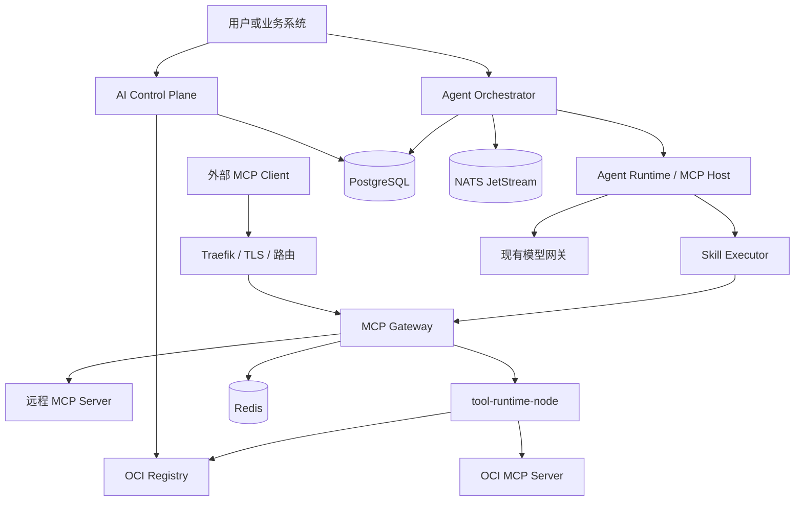

# AI 工作台 MCP、Skill、Agent 平台设计

## 1. 文档状态

| 项目 | 内容 |
| --- | --- |
| 状态 | 设计已确认，Phase 1 主链、Phase 2 本地生产化闭环、Phase 3 Skill 执行已完成；Phase 4 Agent Runtime 已完成记忆、人工介入和持久化可观测执行面 |
| 最后更新 | 2026-07-30 |
| MCP 基线 | 2025-11-25 稳定规范 |
| 部署约束 | 不依赖 Kubernetes |
| 运行时约束 | `tool-runtime` 保持独立进程 |
| 多租户约束 | 页面和接口根据当前平台/租户上下文自动确定作用域 |

本文档是 AI 工作台 MCP、Skill、Agent 和工作流能力的目标设计基线。后续实现如果需要偏离本文档，必须先补充设计决策和迁移影响，不能在实现过程中隐式改变边界。

## 2. 背景与目标

AI 工作台后续需要具备以下能力：

1. 提供标准 MCP Gateway。
2. 接入本地、平台托管和远程 MCP Server。
3. 将平台能力按标准 MCP Server 对外开放。
4. 提供标准 MCP Tool、Resource、Prompt 能力。
5. 建立平台自己的 Skill、Agent 和 Workflow 资源模型。
6. 强制形成 `Agent -> Skill -> Tool` 调用链。
7. 新增 Tool 和 Skill 时不修改平台代码。
8. Tool、Skill 和 Agent 可以独立开发、独立发布、独立维护。
9. 工具运行资源可以跨节点调度和水平扩展。
10. 第三方代码不能进入平台主服务进程。
11. 支持平台级和租户级资源隔离、授权、审计和计费。
12. 在不依赖 Kubernetes 的前提下完成 OCI 运行、节点调度、进程级沙箱和弹性伸缩。

## 3. 设计原则

### 3.1 标准优先

MCP 连接、生命周期、传输和能力必须遵循官方协议，不使用平台私有协议替代以下标准能力：

- `initialize`、版本协商和能力协商。
- `tools/list`、`tools/call`。
- `resources/list`、`resources/read`、资源模板和订阅。
- `prompts/list`、`prompts/get`。
- Sampling、Elicitation。
- Progress、Cancellation、Pagination、Logging、Ping。
- stdio 和 Streamable HTTP。

平台私有扩展只能用于 MCP 没有定义的管理和编排领域，并且必须使用明确的命名空间和版本。

### 3.2 控制面与执行面分离

- AI 主服务负责配置、目录、版本、授权、发布和展示。
- MCP Gateway 负责协议终止、能力聚合、OAuth 和路由。
- Agent Runtime 负责 Agent 推理循环和 Skill 执行。
- `tool-runtime` 负责 OCI 工作负载、节点资源和沙箱。
- 第三方 Tool 代码不得运行在 AI 主服务、Gateway 或 Agent Runtime 进程中。

### 3.3 不通过修改平台代码扩展

- Tool 通过独立 MCP Server 和 OCI 镜像扩展。
- Skill 通过声明式 OCI Artifact 扩展。
- Agent 通过声明式版本资源扩展。
- 自定义副作用代码必须实现为 Tool，不能嵌入 Skill。
- 平台只实现通用协议、注册、调度和执行能力。

### 3.4 不伪造 MCP 标准

MCP 原生标准对象和平台对象必须明确区分：

| 概念 | MCP 原生 | 平台设计 |
| --- | --- | --- |
| MCP Server | 是 | 标准 MCP 服务端 |
| Tool | 是 | `tools/list`、`tools/call` |
| Resource | 是 | `resources/list/read/subscribe` |
| Prompt | 是 | `prompts/list/get` |
| Sampling | 是 | MCP Server 请求宿主执行模型推理 |
| Elicitation | 是 | MCP Server 请求用户补充或确认信息 |
| Skill | 否 | 平台声明式能力和 Skill Workflow |
| Agent | 否 | 平台执行主体和 MCP Host |
| Workflow | 否 | 平台持久化工作流 |
| MCP Tasks | 实验性 | 对外兼容能力，不作为内部工作流基础 |

Skill 和 Agent 可以投影为对外 MCP Tool 或 MCP Server，但不能宣称它们是 MCP 原生资源。

## 4. 总体架构



现有模型兼容网关和 MCP Gateway 保持独立：

- 模型网关负责模型选择、推理、Token、模型路由和模型计费。
- MCP Gateway 负责 MCP 生命周期、会话、能力、OAuth、工具路由和协议治理。
- Agent Runtime 同时调用模型网关和 MCP Gateway。

## 5. 服务与职责

### 5.1 AI Control Plane

AI Control Plane 保留在现有 AI 服务中，负责：

- MCP Server 注册、导入、探测、审核和下线。
- Tool、Resource、Prompt 能力快照。
- Skill、Agent、Workflow 定义及版本。
- OCI 包元数据、签名、发布和部署策略。
- 平台级和租户级资源作用域。
- 权限、审批、配额、限流和计费规则。
- OAuth Connection 和 Secret 引用管理。
- Runtime 节点、实例、执行和健康状态展示。
- 对外 MCP Endpoint 发布管理。

Control Plane 不承担：

- 第三方工具执行。
- MCP 长连接和会话转发。
- Agent 推理循环。
- 容器启动和停止。
- Docker Socket 或 containerd Socket 访问。

### 5.2 MCP Gateway

目标部署单元：

```text
simplepoint-service-mcp-gateway
somesimpled/open-simplepoint-mcp-gateway
```

MCP Gateway 同时承担：

1. 北向 MCP Server：向外部 MCP Client 发布平台或租户能力。
2. 南向 MCP Client：连接平台托管或远程 MCP Server。

主要职责：

- MCP 初始化、协议版本和能力协商。
- Streamable HTTP 会话和 `MCP-Session-Id` 管理。
- stdio/HTTP Server 的统一能力视图。
- Tools、Resources、Prompts 的发现和调用。
- List Changed、Resource Subscription。
- Progress、Cancellation、Pagination 和 Logging。
- JSON Schema 输入、输出验证。
- 多 Server 聚合和稳定命名空间。
- 平台、租户、用户、Agent、Skill 级能力过滤。
- OAuth 发现、授权和 Token Broker。
- 超时、限流、熔断、重试、幂等和审计。
- MCP Tasks 实验能力的兼容适配。
- Tool 调用结果脱敏、大小限制和来源标记。

Gateway 不是简单的 HTTP 反向代理。它必须终止和重新建立 MCP 会话，执行能力协商、身份转换和策略检查。

### 5.3 Agent Orchestrator

目标部署单元：

```text
simplepoint-service-agent-orchestrator
somesimpled/open-simplepoint-agent-orchestrator
```

职责：

- 固定 Agent、Skill、Workflow 和 Tool Schema 版本。
- 创建和持久化 Execution。
- Skill 和 Agent Workflow 状态机。
- 调度、重试、补偿、超时、暂停、恢复。
- 人工审批、条件、分支、并行和循环限制。
- 分配 Agent Runtime Worker。
- 发放短期、最小权限的 Capability Token。
- 管理调用预算、Token 预算和费用预算。
- 通过事务 Outbox 发布执行事件。

长流程状态不能只保存在 JVM 内存中。

### 5.4 Agent Runtime

目标部署单元：

```text
simplepoint-agent-runtime
somesimpled/open-simplepoint-agent-runtime
```

职责：

- 作为 MCP Host 运行。
- 执行模型推理循环。
- 根据 Agent 定义选择已授权 Skill。
- 调用通用 Skill Executor。
- 通过 MCP Gateway 调用 Tool。
- 管理单次执行上下文、短期记忆和模型消息。
- 执行深度、并发、Token、时间和费用限制。
- 上报执行步骤、模型调用和 Tool 调用指标。

Agent Runtime 不直接连接 Docker Engine，也不直接持有远程系统明文凭证。

### 5.5 tool-runtime

目标部署单元：

```text
simplepoint-tool-runtime
somesimpled/open-simplepoint-tool-runtime
```

`tool-runtime` 继续保持独立进程，并作为节点级运行时部署：

- 每个执行节点运行一个 `tool-runtime-node`。
- 拉取和校验 OCI MCP Server 镜像。
- 启动、停止和回收 MCP Server 容器。
- 管理 stdio 子进程或内部 Streamable HTTP Server。
- 上报节点资源、镜像缓存、实例和健康状态。
- 执行沙箱、网络、挂载和资源限制。
- 支持常驻、预热、租户独占、单次执行和 scale-to-zero。

当前节点执行切片位于
`simplepoint-services/simplepoint-service-tool-runtime-node`。它是独立 Go 进程，
通过仅开放必要 Engine API 的 Docker Socket Proxy 管理工作负载，不直接挂载
root-equivalent Docker Socket。节点已提供状态、镜像准备、创建、查询、停止和删除私有 API，
并强制 digest、Registry Allowlist、OCI/MCP 标签、非 root、只读根文件系统、
`cap-drop ALL`、`no-new-privileges`、CPU/内存/PID、受限 tmpfs 和默认断网。

AI 服务内已按 `api/repository/service/rest` 四层增加独立 Runtime 控制面模块，完成
Runtime Node、Workload、Lease 数据模型，以及节点主动注册、容量/标签心跳、优雅离线、
心跳超时离线和自动重新注册。稳定节点业务 ID 与内部 UUID 分离；节点进程实例变化会
递增 generation，旧进程继续心跳时返回冲突，从而阻止节点身份被旧进程重新占用。

控制面现已使用数据库行锁和 `SKIP LOCKED` 领取待处理 Workload，按节点实例状态、
心跳、单任务上限和聚合 CPU/内存/并发容量选点。每次分配创建独立 Lease 并递增
Workload fencing token；节点上的创建、查询、停止和删除都必须同时匹配 Lease ID
与 token。租约过期或节点实例变化时会释放旧租约并重新调度，更高 token 会强制替换
旧容器，旧请求返回 409。调度器还负责状态观测、租约续期、截止时间停止、容器删除和
最终状态落库。

AI 控制面与节点使用独立 TLS 1.3 双向认证通道。AI 证书 URI SAN 固定为
`spiffe://open-simplepoint/ai-control-plane`；节点证书 URI SAN 必须精确等于
`spiffe://open-simplepoint/runtime-node/{nodeId}`。节点注册、心跳和离线接口会同时
校验请求路径中的 `nodeId` 与证书身份，AI 下发私有生命周期请求时节点只接受 AI
控制面身份。mTLS 模式不再发送或接受原共享 Token。

Secret Broker 在控制面按平台/租户作用域保存 AES-GCM 密文，只在调度前解析引用并经
mTLS 发送；节点将其写成有数量、单文件和总大小限制的 `0400` 文件，以只读 volume
subpath 挂载，并随 Workload 删除。敏感值不进入镜像、数据库明文字段或环境变量。

需要联网的 Workload 只连接内部 egress 网络，通过独立、无状态
`tool-egress-proxy` 使用 HTTP/HTTPS。Runtime 为 Workload 签发绑定 ID、有效期和 DNS
allowlist 的短期 HMAC capability；Proxy 自行解析 DNS、直连选定公网地址，并拒绝私网、
回环、链路本地、云元数据及其他非公网地址。Workload 不拥有 Proxy 签名密钥，也没有
直接 Internet 路由。

独立 `tool-image-verifier` 作为镜像拉取前的 fail-closed 准入边界，使用节点 mTLS
身份，只接受 digest 固定的引用。它校验 Cosign 公钥或 keyless 身份签名、同一 digest
上的签名 SPDX/CycloneDX SBOM，并用 Trivy 执行阻断级漏洞扫描；决策按镜像 digest 和
策略摘要短时缓存，可水平扩展。生产 Runtime 默认启用该准入，预热、弹性副本和
scale-to-zero 使用同一准入边界，不会绕过签名、SBOM 或漏洞策略。

Runtime 节点心跳会上报有界、去重的本地镜像 digest 快照，调度器在满足 CPU、
内存、PID 和网络能力后优先选择已有目标 digest 的节点。控制面新增 Runtime Pool
声明式资源，支持 `min/max/desired`、激活副本数、预热节点数、空闲超时和副本寿命；
Pool 只创建普通 Workload，继续复用同一 Lease、fencing、观测和回收状态机。
`min=0` 时空闲超时会回收到零，下一次激活再恢复指定容量。

Runtime 在节点启动时读取并规范化环境 seccomp JSON，校验 Docker Engine 安全能力，
计算不可变策略摘要并随节点注册上报。生产配置要求 seccomp 与 AppArmor 都可用，
否则节点 fail-closed 退出；Compose 可以针对没有 AppArmor LSM 的开发内核显式关闭
AppArmor，但不能静默关闭必需的 seccomp。每个 Workload 都注入
`no-new-privileges`、自定义 seccomp 和可用时的命名 AppArmor Profile。

托管 MCP Server 使用 `deploymentType=MANAGED_OCI`、`transportType=STDIO`，
管理端不保存伪造的 HTTP Endpoint。Control Plane 根据当前平台/租户作用域找到唯一
Runtime Pool，必要时从 scale-to-zero 激活，并从 READY 节点上的 RUNNING Workload
解析短期端点、Lease ID 和 fencing token。Gateway 使用独立的
`spiffe://open-simplepoint/mcp-gateway` TLS 1.3 身份访问 Runtime；Runtime 对外呈现
标准 Streamable HTTP `POST/GET/DELETE` 会话，并把 JSON-RPC 消息关联到持久
Docker attach stdio 通道。Tool 代码始终只存在于独立 OCI 容器内。

Runtime 同时跟踪每个 stdio 会话的 Gateway 事件流。正常活动事件流和存在 Pending
JSON-RPC 请求的会话不能被替换；Gateway 进程退出或连接永久断开后，事件流消费者
归零，且 Pending 请求清空时，新的 Gateway 才能用相同 Workload Lease 与 fencing
token 接管。这样既避免两个健康 Gateway 抢占同一 attach，也不会让异常退出遗留的
会话阻塞首次恢复调用。

协议边界：

- 调度控制通道可以使用内部 gRPC。
- stdio MCP Server 由 runtime-node 作为 MCP Client 管理。
- Streamable HTTP Server 保持标准 MCP 传输。
- gRPC 不承载对外 MCP 协议，也不能替代 MCP。

## 6. MCP Gateway 设计

### 6.1 对外发布

建议为每个发布创建稳定地址：

```text
https://mcp.example.com/mcp/{publicationId}
```

每个发布拥有独立的：

- Canonical resource URI。
- OAuth audience。
- 平台或租户归属。
- Tool、Resource、Prompt 发布清单。
- 客户端范围和 Scope。
- 限流、并发和费用策略。
- 审计和数据留存策略。

推荐支持三类发布：

| 发布类型 | 用途 |
| --- | --- |
| 聚合发布 | 将多个 MCP Server 的能力聚合成一个入口 |
| 独立发布 | 将单个 MCP Server 原样治理后对外发布 |
| Agent 发布 | 将 Agent 执行能力投影为一个 MCP Tool |

### 6.2 工具命名

聚合后使用稳定命名空间：

```text
github.search_code
database.query
knowledge.search
```

内部保存以下映射：

```text
publishedToolName
serverVersionId
originalToolName
inputSchemaHash
outputSchemaHash
```

远程 Server 工具名称或 Schema 变化后必须生成新能力快照。破坏性变化不能自动覆盖已被 Agent 或 Skill 固定的版本。

### 6.3 传输策略

- 对外默认只提供 Streamable HTTP。
- stdio 仅允许在 runtime-node 管理的本地容器或进程内使用。
- 旧 HTTP+SSE 仅作为显式开启的兼容能力。
- Gateway 必须实现 Origin 校验、HTTPS、会话安全和请求大小限制。
- 每个上游 MCP Server/Session 使用独立逻辑 MCP Client 连接。
- Gateway 实例故障后重新执行初始化和能力协商。

### 6.4 能力协商

Gateway 必须：

- 以 MCP `2025-11-25` 作为当前首选版本。
- 通过 `initialize` 完成协议版本协商。
- 只使用双方成功协商的能力。
- 保存 Server 能力快照和协议版本。
- 对不支持的新能力执行降级或明确拒绝。
- 将实验能力放入独立兼容开关。

MCP Tasks 不作为平台内部持久化工作流。对外协商成功时，可以把平台 Execution 状态投影成 MCP Task。

## 7. Agent、Skill、Tool 模型

### 7.1 强制调用链

平台必须强制：

```text
Agent -> Skill -> Tool
```

执行流程：

1. 用户或外部系统调用 Agent。
2. Orchestrator 固定本次 Agent Version。
3. Agent 只能从已绑定的 Skill Version 中选择。
4. Skill 解析出允许使用的 Tool 和资源。
5. Orchestrator 发放短期 Capability Token。
6. Agent Runtime 通过 MCP Gateway 调用 `tools/call`。
7. Gateway 再次执行租户、Skill、Tool、参数和审批校验。
8. `tool-runtime` 调度 OCI MCP Server。
9. 输出经过 Schema 校验、脱敏和来源标记。
10. 结果返回 Skill，再返回 Agent。
11. 所有步骤写入统一 Trace、Audit 和 Billing Ledger。

Capability Token 至少绑定：

```text
issuer
audience
scopeType
tenantId
subjectId
executionId
stepId
agentVersionId
skillId
skillVersionId
serverId
capabilitySnapshotId
toolName
allowedOperations
maximumCalls
maximumRequestBytes
maximumResultBytes
issuedAt
expiresAt
nonce
```

当前 Skill Workflow 使用内部 HMAC-SHA256 紧凑令牌。这不是替代北向/远程 MCP OAuth
Access Token 的新认证协议，而是控制面发给 Gateway 的短期最小权限能力证明：

- AI 与 Gateway 使用同一独立签名密钥，密钥至少 32 bytes，并同时校验固定
  issuer、audience 和最长 TTL；
- 每个未完成步骤只发放一次 `tools/call` 能力，精确绑定作用域、Skill/版本、
  Execution/Step、Server、不可变能力快照和 Tool；
- Skill 调用只能进入 `/internal/mcp/workflows/tools/call`，普通管理测试和
  Publication 调用不能冒充 Workflow 能力；
- Gateway 在调用上游前校验请求绑定和参数上限，并以 Redis `SET NX + TTL`
  原子消费 nonce 的 SHA-256；任一 Gateway 副本均拒绝再次使用；
- 原始令牌不写数据库、不写调用审计、也不传给 MCP Server，只在步骤记录中保留
  nonce SHA-256 作为不可逆审计指纹；
- Gateway 在返回控制面前再次校验结果大小。校验、Redis 或配置异常均 fail-closed。

Agent 不允许绕过 Skill 直接调用 Tool。直接工具能力由平台生成内部单工具 Skill，审计链仍保持完整。

### 7.2 Skill

Skill 是声明式能力包，不是任意代码插件。

一个 Skill Version 包含：

- 输入、输出 JSON Schema。
- Prompt 模板。
- MCP Resource 和 Prompt 引用。
- Tool 能力选择器。
- Skill Workflow DAG。
- 条件、并行、重试、超时和失败策略。
- 人工审批规则。
- Token、费用、调用次数和执行时间预算。
- 测试用例、示例和兼容范围。
- 依赖的 Tool Schema Hash 或版本约束。

Skill 默认禁止嵌入任意代码。需要自定义代码时，必须把代码实现为独立 MCP Server/Tool，再由 Skill 引用。

Skill 以 OCI Artifact 发布：

```text
skill.yaml
prompts/
schemas/
workflows/
resources/
tests/
```

`skill.yaml` 是 SimplePoint 平台扩展格式，不是 MCP 原生标准。它引用和执行的 Tool、Resource、Prompt 必须使用标准 MCP。

当前已落地的首版 Manifest 使用 `simplepoint.io/v1alpha1`：

```json
{
  "apiVersion": "simplepoint.io/v1alpha1",
  "kind": "Skill",
  "metadata": {
    "name": "document-summary",
    "version": "1.0.0"
  },
  "spec": {
    "inputSchema": {
      "type": "object",
      "required": ["text"],
      "additionalProperties": false,
      "properties": {
        "text": {
          "type": "string",
          "minLength": 1
        }
      }
    },
    "outputSchema": {
      "type": "object",
      "required": ["summary"],
      "additionalProperties": false,
      "properties": {
        "summary": {
          "type": "string"
        }
      }
    },
    "tools": [
      {
        "alias": "summary",
        "serverId": "mcp-server-id",
        "snapshotId": "capability-snapshot-id",
        "name": "summarize"
      }
    ],
    "approvals": {
      "execution": {
        "required": true,
        "allowSelfApproval": false,
        "instructions": "由当前作用域内的另一名授权用户审批"
      }
    },
    "workflow": {
      "steps": [
        {
          "id": "summarize",
          "type": "tool",
          "tool": "summary",
          "arguments": {
            "text": {
              "$ref": "input.text"
            }
          }
        }
      ],
      "output": {
        "summary": {
          "$ref": "steps.summarize.structuredContent.summary"
        }
      }
    }
  }
}
```

Registry 在版本创建时读取指定 MCP 能力快照，确认 Tool、Prompt 和 Resource 或
Resource Template 存在，并固定 `serverId + snapshotId + capabilityName/URI +
descriptorHash`；Tool 额外固定输入/输出 Schema Hash，Resource Template 额外固定
模板。版本内容、OCI Artifact Reference、Digest 和 Manifest Content Hash 创建后不可
更新；发布只改变活动版本指针和发布状态。Manifest 会递归拒绝 `script`、`command`、
`image`、`container`、`entrypoint` 等任意代码执行字段，Workflow 的能力步骤只能引用
本版本已绑定的 alias。

Skill Artifact 使用 OCI Distribution API 和固定媒体类型：

```text
OCI Manifest:
  mediaType:    application/vnd.oci.image.manifest.v1+json
  artifactType: application/vnd.simplepoint.skill.v1+json
Config:
  mediaType:    application/vnd.simplepoint.skill.config.v1+json
Layer[0]:
  mediaType:    application/vnd.simplepoint.skill.manifest.v1+json
```

Config 只包含 `schemaVersion=1.0`、`manifestMediaType` 和
`manifestDigest`。版本创建时，AI 控制面以 Registry Allowlist、HTTPS 默认策略、
响应大小上限和禁止重定向的有界客户端拉取 OCI Manifest、Config 与唯一 Skill
Manifest Layer；逐层验证 descriptor size、原始字节 SHA-256、HTTP/descriptor
媒体类型和 Config 到 Layer 的引用。Tag 只用于定位，最终保存和签名准入始终使用
`repository@sha256:...`。

Registry 中的 Skill Manifest 是权威内容。管理请求附带的 Manifest 仅作为显式预期值，
其 canonical JSON 必须与 Artifact Layer 完全相同；MCP 能力快照固定和声明式安全校验
都针对已拉取的内容执行。Cosign 校验继续由独立 `tool-image-verifier` 执行：
AI 控制面使用 `spiffe://open-simplepoint/ai-control-plane` mTLS 身份调用
`POST /internal/v1/artifacts/verify`，Runtime Node 身份不能调用该接口。Artifact
策略只做签名准入，不执行针对可运行镜像的 Trivy/SBOM 策略；Artifact 内容验证由
AI 控制面的 OCI 客户端完成。版本保存 Config Digest、Manifest Layer Digest、
签名是否强制/通过、策略 Hash 和校验时间，强制签名未通过的版本不能创建或发布。

首版管理 API 固定为：

```text
GET/POST                 /ai/workbench/skills
GET/PUT/DELETE           /ai/workbench/skills/{skillId}
GET/POST                 /ai/workbench/skills/{skillId}/versions
GET                      /ai/workbench/skills/{skillId}/versions/{versionId}
POST                     /ai/workbench/skills/{skillId}/versions/{versionId}/publish
POST                     /ai/workbench/skills/{skillId}/versions/{versionId}/deprecate
POST                     /ai/workbench/skills/{skillId}/executions
GET                      /ai/workbench/skills/{skillId}/executions
GET                      /ai/workbench/skills/{skillId}/executions/{executionId}
POST                     /ai/workbench/skills/{skillId}/executions/{executionId}/approve
POST                     /ai/workbench/skills/{skillId}/executions/{executionId}/reject
POST                     /ai/workbench/skills/{skillId}/executions/{executionId}/pause
POST                     /ai/workbench/skills/{skillId}/executions/{executionId}/resume
```

定义、版本和绑定都继承当前平台/租户授权上下文。已存在不可变版本的 Skill 不允许删除。
当前切片已经实现 Tool、Prompt、Resource、条件和并行节点的持久化 Workflow 执行：

- 只有启用 Skill 的活动已发布版本可以提交执行；提交使用当前平台/租户上下文。
- 幂等键只保存 SHA-256，重复键和相同输入返回原执行，不同输入被拒绝。
- 执行和步骤均持久化；Worker 使用 PostgreSQL `SKIP LOCKED`、租约和单调 fencing
  token 横向领取任务，MCP 网络调用不持有数据库事务。
- 每个 MCP 叶步骤固定 `serverId + snapshotId + capabilityName/URI + descriptorHash`；
  Tool 同时固定输入 Schema Hash，Resource Template 同时固定模板。调用时重新校验
  Server、不可变快照、能力描述符和模板约束，不读取“当前最新”能力。
- 步骤开始、成功和失败均独立检查点；Worker 崩溃后从已成功步骤继续。MCP 调用使用
  稳定的 `executionId:stepId` operation ID 关联 Gateway 会话、取消和调用审计。
- 参数和输出模板只允许精确的 `input.*` 或已完成 `steps.*` `$ref`，不执行表达式或代码。
- 输入和输出使用 fail-closed 的有界 JSON Schema 子集并限制深度和 Payload 大小；
  不支持的 Schema 关键字在版本创建时即被拒绝。
- `spec.budgets` 支持 `maximumToolCalls`、`maximumDurationSeconds` 和
  `maximumPayloadBytes`。版本创建时按 Workflow 步骤数补默认值并校验平台上限，
  随不可变版本保存；Execution 提交时快照预算和绝对截止时间。
- 调度器在网络调用前原子预留请求 bytes，在步骤结果与 Workflow 输出检查点分别累计
  载荷；只有 Tool 步骤消耗 `maximumToolCalls`。累计范围包含执行输入、MCP 请求、
  MCP 结果和最终输出；时间、调用次数或载荷任一耗尽均以稳定错误码终止，不继续调用
  MCP Server。
- AI 工作台版本详情显示版本预算；执行详情显示调用/载荷消耗、时长、截止时间和
  每一步 Capability Token nonce Hash，不显示任何可复用凭证。
- `spec.approvals.execution` 是不可变版本策略；`required=true` 时新执行进入
  `WAITING_APPROVAL`，审批后进入 `PENDING`，拒绝后以 `REJECTED` 终止且 Worker
  不会领取。默认禁止申请人自批，只有版本显式声明 `allowSelfApproval=true` 才允许。
- 审批、拒绝、暂停和恢复均受当前平台/租户作用域与独立权限约束，并记录操作者、
  时间、意见或原因。审批与暂停等待时间通过 `inactiveSince` 从执行时长预算中扣除，
  恢复时平移 Deadline，不消耗有效执行时间。
- `PENDING` 和 `WAITING_APPROVAL` 可立即暂停；`RUNNING` 使用协作式暂停，在当前
  MCP 调用完成后的步骤检查点进入 `PAUSED`，不对进行中的远程请求做不安全硬终止。
  恢复时，尚未获批的执行回到 `WAITING_APPROVAL`，已获批执行回到 `PENDING`。
- 顶层和控制分支叶节点接受 `tool`、`prompt`、`resource`；顶层同时接受
  `condition` 和 `parallel`。Prompt 参数与 Resource URI 支持有界模板引用，
  Resource Template 解析后的 URI 必须仍匹配已固定模板。条件节点只支持有界声明式
  `equals`、`notEquals`、`isTrue`、`all`、`any`、`not`，不接受脚本或表达式；
  最大嵌套深度为 8，布尔组最多 16 个条件。
- `condition` 的 `then`/`else` 只执行被选分支，未选分支的 MCP 能力叶节点持久化为
  `SKIPPED`，因此执行历史、恢复和审计结果确定。条件虚拟节点输出
  `matched + selectedBranch`，可供后续精确 `$ref` 使用。
- `parallel` 包含 2 至 16 个命名分支；分支之间并发执行，单个分支内部保持顺序。
  每个分支只能读取外层先前步骤和本分支先前步骤，跨并行分支引用在版本创建时拒绝。
  首版不允许在条件或并行分支内部继续嵌套控制节点，避免未定义的恢复和预算语义。
- 提交执行时快照完整 Workflow Plan，并持久化所有 MCP 能力叶节点。Tool 调用次数
  预算按条件分支最大值和并行分支总和计算最坏路径；暂停请求会等待当前 fork/join
  组内已开始的 MCP 调用全部形成检查点，再安全进入 `PAUSED`。恢复只复用
  `SUCCEEDED`/`SKIPPED` 检查点，不重复产生 MCP I/O。

`simplepoint.io/v1alpha1` 尚未开放重试和循环节点；这些类型在对应执行、恢复、预算和
审计语义落地前仍不能写入可发布 Manifest。外部 MCP Server 已接收请求但检查点尚未
提交时发生进程故障，恢复调用具有 at-least-once 语义；有副作用 Tool 必须按稳定
operation ID 自身实现幂等。

### 7.3 Agent

Agent 是平台声明式资源，不是 MCP 原生对象。控制面采用“可变定义 + 不可变版本”
模型：定义只承载作用域内唯一 Code、名称、说明、启用状态和当前活动版本指针；
所有影响执行结果的内容都进入不可变 Agent Version。

当前 `simplepoint.io/v1alpha1` Agent Manifest 包含：

- 精确的主模型 ID 和回退模型 ID 列表。
- System Prompt 和行为约束。
- 允许使用的精确 Skill ID、Skill Version ID 和作用域内唯一别名。
- 短期/长期记忆策略。
- 最大步骤数、循环深度和并发。
- 输入/输出 Token 和费用预算。
- 审批策略。
- 人工介入启用状态、最大次数、等待超时和超时动作。
- 输入、输出 Schema。
- 是否允许对外发布。
- 可选的 Workflow 逻辑引用；实际可执行编排由独立 Workflow Version 精确固定
  Agent/Skill Version，不能在 Agent 运行中解析可变别名。

首批 Registry 必须满足以下约束：

- 平台上下文只创建 `SYSTEM` Agent；租户上下文只创建当前租户的 `TENANT` Agent，
  页面不提供手工切换作用域的字段。
- Agent Code 在作用域内不可变且唯一；名称、说明和启用状态可以修改。
- Agent Version 创建后 Manifest、模型、Skill 绑定和 Content Hash 均不可修改；
  同一 Agent 的语义版本号不可重复。
- 模型必须存在、对当前作用域可见、处于启用且可用状态，并且属于 LLM 或
  MULTIMODAL 类型。平台 Agent 不能引用租户模型。
- Skill 必须引用精确的已发布版本。平台 Agent 只能引用平台 Skill；租户 Agent
  可以引用共享平台 Skill 或同租户 Skill。
- Skill 绑定同时固定 Skill Code、版本号和版本 Content Hash，发布时重新校验
  版本状态、可见性和 Hash，防止依赖在草稿期被替换。
- Manifest 不接受脚本、命令、类名、任意执行器等可执行字段；Agent 只能声明
  Skill 绑定，不能直接声明或绕过 Skill 调用 MCP Tool。
- 生命周期为 `DRAFT -> PUBLISHED -> DEPRECATED`。发布版本会原子更新定义的活动
  版本指针和 `ACTIVE` 状态；废弃活动版本时清空活动指针。
- 已存在版本的 Agent 定义不能直接删除，避免破坏版本和执行追溯。

Agent Version 是不可变版本。每次执行必须固定版本，运行过程中不能自动切换到新版本。
当前已完成 Registry、生命周期、独立 Agent Runtime、数据库执行队列和工作台执行面：

- 控制面提交 `Agent Execution` 时固定活动 Agent Version、Content Hash、主/回退模型、
  Skill Version、预算和审批策略，并按作用域保存幂等键与输入 Hash。
- 独立 `agent-runtime` 进程使用数据库 `SKIP LOCKED`、租约和 fencing 横向领取任务；
  AI 服务不运行 Agent Worker，Runtime 不装配 Skill Registry/OCI 发布校验器。
- Runtime 通过现有 provider-neutral 模型网关推理，只向模型暴露当前版本绑定的
  Skill 别名，不暴露原始 MCP Tool。
- 每个 Skill 调用固定 Skill ID、Version ID 和 Content Hash，通过内部执行命令创建
  Skill 子执行；平台在模型轮次与 Skill 子执行边界持久化 Trace 和对话检查点。
- Runtime 从固定 Skill Manifest 中提取 Workflow 对 `input.*` 的直接 MCP Resource
  URI Template 约束，将约束说明和合法示例增强到模型可见的 Skill 输入 Schema。
  模型参数在创建子 Skill 前执行与 Gateway 相同语义的模板预校验；不合法参数不会
  创建子执行或产生 MCP I/O，而是记录无子执行 ID 的失败 Skill Trace，并作为
  `AGENT_SKILL_ARGUMENTS_INVALID` 可重试 Tool Result 回传模型。只有通过预校验的
  参数才能进入持久化 Skill Workflow，避免后置校验造成部分步骤已执行。
- 执行面强制最大步骤、循环深度、并发、输入/输出 Token 和费用预算，并支持执行前
  审批、拒绝和取消。
- 短期记忆在执行提交时固定启用状态、最大消息数和摘要字符上限；Runtime 在模型
  与 Skill 检查点进行确定性有界压缩，保持 Assistant Tool Call 与对应 Tool Result
  的完整顺序，并持久化压缩数量、修订号、摘要 SHA-256 和最近压缩时间。
- 长期记忆是独立的 Agent 跨执行 episodic memory，不复用管理员文档知识库。
  当前版本只支持 `SUBJECT` 作用域，每条记忆精确绑定 Agent、Agent Version、
  平台/租户作用域、租户 ID、认证主体和来源 Execution；查询、写入、列表、裁剪
  和删除均复用同一边界，平台管理员也不能通过管理接口读取其他主体的记忆。
- Runtime 在第一次模型调用前使用 PostgreSQL FTS/trigram 执行有界 Top K 检索，
  固定相关度阈值、最大注入字符数并排除当前 Execution。命中结果序列化为不可变
  快照，持久化命中数、注入字符数、检索时间和 SHA-256；执行重试只恢复该快照，
  不重新检索正在变化的历史数据。
- 长期记忆作为明确标记的“不可信历史数据”追加到模型 instructions，禁止其中内容
  覆盖 System Prompt、行为约束或当前请求。只有成功执行才将有界输入/输出 episode
  写入记忆；来源 Execution 唯一，写入与 Execution 成功状态在同一事务中提交。
  过期记录和超出主体配额的旧记录自动硬删除，工作台删除同样是隐私语义的永久删除。
- 暂停采用协作式安全检查点，不中断结果未知的模型或 Skill 外部调用。排队状态可
  立即暂停；运行中请求在下一模型调用前、模型失败后、待 Skill 调用的模型结果后，
  以及 Skill 等待/结果检查点进入 `PAUSED`。恢复时复用已存在的 Skill Execution
  和 Trace，不重复创建子执行。
- 人工介入是独立持久化任务，不建模为 MCP Tool。每次 Execution 固定版本中的启用
  状态、最大请求数、等待秒数和 `FAIL|CANCEL` 超时动作；任务精确绑定 Agent、
  Execution、平台/租户作用域和租户 ID，状态为
  `REQUESTED -> WAITING -> COMPLETED|EXPIRED|CANCELLED`。
- 排队执行可立即进入 `WAITING_HUMAN`；运行中请求只在模型或 Skill 的安全检查点
  进入等待，不强制中断结果未知的外部调用。结构化人工输入以明确标记的
  `human_intervention_response` 用户消息追加到持久化对话，清除当前等待指针后由
  任意 Runtime 副本恢复执行；运行时或 AI 服务重启不会丢失等待任务。
- 人工选择取消或等待超时会直接进入终态。已经成功完成的模型、Skill 或 Tool 外部
  效果不会被平台隐式回滚；需要撤销业务副作用时，后续由 Agent Workflow 声明显式
  补偿节点，并保留原调用与补偿调用两条审计链。
- 工作台提供执行提交、轮询、历史、详情、预算消耗、短期/长期记忆状态、当前主体
  记忆查询与永久删除、审批、暂停、恢复、人工介入策略/历史/结构化输入，以及
  模型/Skill Trace。
- 每次执行将状态机、审批、暂停、模型、Skill、记忆和人工介入生命周期写入追加式
  持久事件；事件序列在单个 Execution 内单调递增，查询使用排他 `after` 游标和
  有界页大小，AI 服务或 Runtime 重启后可以从已确认游标继续。
- Execution 列表只返回轻量摘要，完整输入、输出、人工任务、事件和 Trace 在打开
  详情后按需查询。Trace 支持类型/状态筛选和服务端分页，不为列表中的每次执行
  N+1 加载完整调用链。
- Agent 指标按当前平台/租户作用域和时间窗直接从持久化 Execution/Trace 聚合，
  覆盖状态、Token、费用、步骤、人工介入和 Trace 分组；生命周期事件同时写入
  仅含 `type,status` 标签的低基数 Micrometer Counter。

Agent Workflow 已由独立控制面和 Workflow Runtime 承载。跨主体共享记忆在隐私、
授权和审计模型明确前不开放，当前只允许登录主体读取和管理自己的 Agent 长期记忆。

控制面管理 API 为：

```text
GET|POST              /workbench/agents
GET|PUT|DELETE        /workbench/agents/{agentId}
GET|POST              /workbench/agents/{agentId}/versions
GET                   /workbench/agents/{agentId}/versions/{versionId}
POST                  /workbench/agents/{agentId}/versions/{versionId}/publish
POST                  /workbench/agents/{agentId}/versions/{versionId}/deprecate
GET|POST              /workbench/agents/{agentId}/executions
GET                   /workbench/agents/{agentId}/executions/{executionId}
GET                   /workbench/agents/{agentId}/executions/{executionId}/events?after={sequence}&limit={size}
GET                   /workbench/agents/{agentId}/executions/{executionId}/traces?type={type}&status={status}
GET                   /workbench/agents/{agentId}/metrics?from={instant}&to={instant}
POST                  /workbench/agents/{agentId}/executions/{executionId}/approve
POST                  /workbench/agents/{agentId}/executions/{executionId}/reject
POST                  /workbench/agents/{agentId}/executions/{executionId}/pause
POST                  /workbench/agents/{agentId}/executions/{executionId}/resume
POST                  /workbench/agents/{agentId}/executions/{executionId}/interventions
POST                  /workbench/agents/{agentId}/executions/{executionId}/interventions/{interventionId}/respond
POST                  /workbench/agents/{agentId}/executions/{executionId}/cancel
GET                   /workbench/agents/{agentId}/memories
DELETE                /workbench/agents/{agentId}/memories/{memoryId}
```

### 7.4 Workflow

平台支持两类工作流：

| 类型 | 说明 |
| --- | --- |
| Skill Workflow | 以确定性步骤组合 Tool、Prompt 和 Resource |
| Agent Workflow | 组合 Agent、Skill、审批、条件、等待和人工任务 |

Workflow 使用平台持久化状态机，不依赖单个进程存活，也不依赖实验性的 MCP Tasks。

Agent Workflow 采用“可变定义 + 不可变版本 + 版本固定执行”模型。Manifest 是有界
声明式 DAG，最多 128 个节点和 512 条边，不允许 `script`、`command`、`container`
等任意执行字段。当前节点类型为：

- `agent`：固定已发布 Agent ID、Version ID 和 Content Hash；
- `skill`：固定已发布 Skill ID、Version ID 和 Content Hash；
- `condition`：使用有界表达式选择后继分支；
- `parallel`：启动相互隔离的就绪分支，并在依赖边界汇合；
- `wait`：将下一轮调度时间持久化，不占用工作线程；
- `human`：创建结构化人工任务，支持 `FAIL|CONTINUE|CANCEL` 超时动作；
- `end`：生成版本声明的最终输出。

Agent/Skill 节点可以声明精确补偿 Skill。正向执行失败后，Runtime 按已经成功产生
副作用的节点逆序创建固定版本的补偿子执行；正向调用与补偿调用分别保留节点检查点、
子执行 ID、事件和结果 Hash，不伪装成数据库回滚。

每次 Workflow Execution 固定 Version、Content Hash、展开后的计划、输入 Hash、
最大持续时间、最大节点执行数和最大并行度。独立 `workflow-runtime` 副本通过
PostgreSQL `SKIP LOCKED`、租约和 fencing token 横向领取任务，所有状态转换、
Node Execution、Human Task 和追加事件都在数据库中持久化。租约过期、Runtime
重启或 AI 服务重启后，其他副本从已提交检查点继续；已提交的 Agent/Skill 子执行
按稳定幂等键复用。

暂停是协作式安全检查点，不会切断结果未知的外部调用；恢复、人工响应和取消均检查
当前平台/租户作用域。事件读取采用排他 `after` 序列游标，可供工作台增量恢复。
管理 API 为：

```text
GET|POST              /workbench/workflows
GET|PUT|DELETE        /workbench/workflows/{workflowId}
GET|POST              /workbench/workflows/{workflowId}/versions
GET                   /workbench/workflows/{workflowId}/versions/{versionId}
POST                  /workbench/workflows/{workflowId}/versions/{versionId}/publish
POST                  /workbench/workflows/{workflowId}/versions/{versionId}/deprecate
GET|POST              /workbench/workflows/{workflowId}/executions
GET                   /workbench/workflows/{workflowId}/executions/{executionId}
GET                   /workbench/workflows/{workflowId}/executions/{executionId}/events
POST                  /workbench/workflows/{workflowId}/executions/{executionId}/pause
POST                  /workbench/workflows/{workflowId}/executions/{executionId}/resume
POST                  /workbench/workflows/{workflowId}/executions/{executionId}/cancel
POST                  /workbench/workflows/{workflowId}/executions/{executionId}/human-tasks/{taskId}/respond
```

内部扩展目录统一展示平台内 Tool/Skill/Agent/Workflow 包和官方 MCP Registry 条目。
官方同步仅允许平台上下文执行，使用持久化游标、有界分页、响应大小和超时限制；
租户可以导入可见的官方远程 MCP 条目，但导入结果固定禁用私网访问并处于 `DRAFT`，
仍需完成凭证、能力发现和发布治理。

## 8. 包与扩展规范

### 8.1 MCP Server OCI 包

每个自研 MCP Server 使用独立仓库和流水线，输出：

```text
MCP Server 源码
Dockerfile
simplepoint-mcp.yaml
JSON Schema
测试
SBOM
OCI 镜像
镜像签名和来源证明
```

`simplepoint-mcp.yaml` 建议包含：

- Server ID、名称和版本。
- 镜像 digest。
- stdio 或 Streamable HTTP。
- 启动命令、参数、端口和路径。
- MCP 最低、最高协议版本。
- 健康检查。
- CPU、内存、PIDs、磁盘和超时。
- 网络出口白名单。
- Secret 声明。
- 平台共享、租户独占或单次执行模式。
- 最小、最大实例和单实例并发。
- 签名、SBOM 和来源信息。

### 8.2 包不可变性

- 部署必须固定 OCI digest，不能只固定 tag。
- 已发布版本不可原地覆盖。
- Agent 和 Skill 执行必须记录所使用的 digest。
- 新版本通过灰度、验证和显式切换生效。
- 远程 MCP Server 无法固定镜像时，必须固定能力快照并检测 Schema 漂移。

### 8.3 开发者流程

新增 Tool：

1. 使用任意官方或兼容 SDK 开发 MCP Server。
2. 完成标准协议和 Schema 测试。
3. 构建 OCI 镜像、SBOM 和签名。
4. 发布到 OCI Registry。
5. 在 AI 工作台导入包。
6. 平台完成校验、审核、部署和能力发现。

新增 Skill：

1. 编写 `skill.yaml`、Workflow、Prompt 和测试。
2. 引用已发布 Tool 能力。
3. 打包成 OCI Artifact。
4. 发布到 Registry。
5. 在 AI 工作台导入、验证并绑定 Agent。

以上流程不需要修改平台代码。

## 9. OAuth 与远程 MCP

### 9.1 Gateway 作为远程 MCP Client

必须实现：

- OAuth 2.0 Protected Resource Metadata，RFC 9728。
- OAuth 2.1。
- Authorization Server Metadata 和 OIDC Discovery。
- Authorization Code + PKCE。
- RFC 8707 `resource` 参数。
- Client ID Metadata Document。
- 可选 Dynamic Client Registration。
- 增量 Scope 和 Step-up Authorization。
- 用户委托和服务身份两种连接。
- Refresh Token 加密、轮换、撤销和过期。

### 9.2 Gateway 作为对外 MCP Server

- Gateway 是 OAuth Resource Server。
- 对接平台现有身份系统或独立 Authorization Server。
- 每个 MCP Publication 使用稳定 canonical resource URI。
- Token 必须校验 issuer、audience、scope、expiry 和 client。
- Access Token 不允许出现在 URL。
- 不允许把外部 Client Token 原样传递给下游 MCP Server。
- 下游授权使用独立 Token 或 Token Broker 生成的目标资源 Token。

当前授权服务器会发布
`client_id_metadata_document_supported=true`。Client ID 选择顺序固定为：
预注册客户端、Client ID Metadata Document、Dynamic Client Registration。
动态文档获取只允许经过校验的 HTTPS URL，禁止重定向并执行 DNS/私网、响应大小、
精确 Client ID、Redirect URI、Grant、Scope 和 PKCE 校验。当前首个切片仅接受
`token_endpoint_auth_method=none` 的 public client；`private_key_jwt` 留待密钥身份切片。

Gateway 自身文档使用固定路径
`/.well-known/oauth-client/open-simplepoint-mcp-gateway`。只有配置了与该路径完全一致的
公网 HTTPS URI 和合法 Redirect URI 时才发布；本地 HTTP 开发环境保持未配置并返回 404。

### 9.3 Secret 管理

- 模型、Agent 和 Tool 日志不得记录 OAuth Token。
- 数据库只保存加密密文或外部 Secret 引用。
- 运行时通过短期文件、内存挂载或受控 Secret Broker 注入。
- 默认不通过普通环境变量长期注入敏感凭证。

### 9.4 Java SDK 2.0.0 Cancellation 兼容边界

当前官方 Java SDK 不暴露服务端 `notifications/cancelled` 注册点，也不向能力处理器
暴露正在执行请求的 JSON-RPC ID。Gateway 在官方 Streamable HTTP transport 外围使用
最小适配层读取标准取消通知和请求 ID，Tool、Resource、Prompt 的协议处理仍全部交给
官方 SDK。取消事件使用 cluster operation ID 经 Redis 广播到持有南向调用的副本，
中断阻塞调用并关闭对应 HTTP 工作；后续 SDK 提供原生钩子后应移除该适配层。

## 10. 多租户模型

页面和接口统一使用当前平台/租户上下文，不建设两套重复页面。

| 资源 | 平台级 | 租户级 |
| --- | ---: | ---: |
| Gateway 全局配置 | 是 | 否 |
| Runtime 节点和全局调度 | 是 | 否 |
| MCP Server | 是 | 是 |
| Tool/Resource/Prompt | 是 | 是 |
| Skill | 是 | 是 |
| Agent | 是 | 是 |
| Workflow | 是 | 是 |
| OAuth Connection/Secret | 可选 | 是 |
| 对外 MCP Publication | 是 | 是 |
| Execution/Trace/Billing | 是 | 是 |

作用域规则：

- 平台资源可以声明为仅平台使用或授权给租户。
- 租户资源只能在所属租户中可见和执行。
- 租户不能修改平台共享资源，只能绑定允许的版本。
- OAuth Connection 和 Secret 不跨租户共享。
- Runtime 可以共享节点，但容器、身份、网络和账单必须隔离。
- 对外发布默认关闭，必须显式授权。

核心实体统一包含：

```text
scope_type
tenant_id
owner_id
status
version
created_by
created_at
updated_at
```

## 11. 无 Kubernetes 的运行与调度

### 11.1 基础组件

推荐技术组合：

- Docker Swarm：长期服务、副本和滚动发布。
- Traefik：TLS、入口、负载均衡和 MCP 会话路由。
- Docker Engine 或 containerd：OCI 工作负载执行。
- PostgreSQL：权威配置、版本、执行状态和租约。
- NATS JetStream：命令、任务队列和事件。
- Redis：MCP 会话目录、限流和短期缓存。
- OCI Distribution 兼容 Registry：镜像和 Artifact。
- OpenTelemetry：Trace、Metric 和 Log 关联。

### 11.2 服务扩展

- MCP Gateway 采用多副本部署。
- Agent Runtime 和 Workflow Worker 根据队列积压扩容。
- `tool-runtime-node` 以每节点一个实例部署。
- Scheduler 根据 CPU、内存、节点标签、租户、镜像缓存和亲和规则选点。
- 长期服务使用 Swarm 服务副本。
- 高频 Tool 使用预热池。
- 低频 Tool 使用按需启动和 scale-to-zero。
- 单次高风险 Tool 使用单次容器，完成后销毁。

### 11.3 会话与故障恢复

- 当前 Host 入口根据 `Mcp-Session-Id` 将会话路由到 Gateway 实例；
  引入 Traefik 后使用相同目录或等价 Header Affinity 插件。
- Redis 保存 Session ID 哈希到 Gateway Instance 的短期目录，不保存原始 Session ID。
- 正常请求刷新目录 TTL；404、连接失败和 502/503/504 会清理失效目录。
- Gateway 故障后重新初始化下游 MCP Session。
- Workflow 的持久化状态不依赖 Gateway Session。
- Scheduler 使用租约和 fencing token 防止双重执行。
- Tool 调用使用幂等键。
- 非幂等 Tool 默认不自动重试。

## 12. 沙箱与供应链安全

第三方 MCP Server 默认执行策略：

- 非 root 用户。
- 只读根文件系统。
- `cap-drop ALL`。
- `no-new-privileges`。
- seccomp 和 AppArmor。
- CPU、内存、PIDs、文件、磁盘和时间限制。
- 独立临时目录。
- 禁止任意宿主路径挂载。
- 默认禁止外网。
- 网络访问通过 Egress Proxy 和域名/IP 白名单。
- Secret 使用临时挂载。
- 禁止访问 Docker Socket。
- 禁止特权容器。
- 镜像固定 digest。
- 强制签名、SBOM、漏洞和许可证扫描。

隔离等级：

| 等级 | 场景 |
| --- | --- |
| 共享常驻容器 | 平台可信、无租户数据的只读工具 |
| 租户独占容器 | 处理租户凭证或租户私有数据 |
| 单次执行容器 | 高风险、有副作用或不可信工具 |
| 强隔离运行时 | 后续可选 gVisor、Kata 或 MicroVM |

Tool annotation、Tool 描述、Tool 输出和远程 Resource 都视为不可信输入，不能替代平台权限检查。
Docker Socket 禁令适用于所有受管工作负载；可信 runtime-node 自身也只允许访问受限
Socket Proxy，代理与真实 Socket 位于节点内部网络且不得发布到公网。
seccomp 文件作为版本化部署资源进入 Runtime 镜像并使用 SHA-256 摘要上报；AppArmor
Profile 由宿主安装脚本加载，Swarm 启动前必须验证 Docker 同时声明 seccomp 与
AppArmor 支持。策略不可用时不能自动回退到 Docker 默认策略。

## 13. 数据模型

建议按领域拆分：

### 13.1 MCP

```text
ai_mcp_server
ai_mcp_server_version
ai_mcp_endpoint
ai_mcp_publication
ai_mcp_capability_snapshot
ai_mcp_tool
ai_mcp_resource
ai_mcp_prompt
ai_mcp_policy
```

### 13.2 Package 与部署

```text
ai_package
ai_package_version
ai_package_signature
ai_package_deployment
```

### 13.3 Skill、Agent、Workflow

```text
simpoint_ai_skills
simpoint_ai_skill_versions
simpoint_ai_skill_tool_bindings
simpoint_ai_agents
simpoint_ai_agent_versions
simpoint_ai_agent_skill_bindings
ai_workflow
ai_workflow_version
```

### 13.4 执行

```text
ai_execution
ai_execution_step
ai_tool_invocation
ai_approval_task
ai_idempotency_record
ai_outbox_event
simpoint_ai_agent_executions
simpoint_ai_agent_execution_traces
simpoint_ai_agent_execution_events
simpoint_ai_agent_human_interventions
simpoint_ai_agent_memories
```

### 13.5 Runtime

```text
simpoint_ai_runtime_nodes
simpoint_ai_runtime_workloads
simpoint_ai_runtime_leases
ai_runtime_image_cache（规划）
```

### 13.6 OAuth 与 Secret

```text
ai_oauth_connection
ai_oauth_grant
ai_secret_reference
```

数据库只保存平台管理和执行状态。实际 OCI 镜像、Skill Artifact、大型二进制输出和日志文件进入对应的 Registry 或对象存储。

## 14. 内部接口与事件

### 14.1 管理接口

管理接口使用平台 REST API，并继承现有认证和租户上下文：

```text
/api/ai/mcp/servers
/api/ai/mcp/publications
/api/ai/mcp/connections
/api/ai/tools
/ai/workbench/skills
/workbench/agents
/api/ai/workflows
/api/ai/executions
/api/ai/runtime/nodes
```

具体 URL 在实现阶段依据现有 API 规范最终确认，不能将内部管理 API 当作 MCP 协议接口。

### 14.2 MCP 接口

```text
/mcp/{publicationId}
/.well-known/oauth-protected-resource/...
```

MCP 接口只使用标准 JSON-RPC 和 MCP Transport。

### 14.3 Runtime 控制接口

Runtime 控制接口仅用于：

- 节点注册和心跳。
- 节点优雅离线和 generation fencing。
- 实例启动、停止和回收。
- 资源上报。
- 日志和健康状态。

当前节点通过 TLS 1.3 mTLS 内部 HTTPS 接口主动注册、心跳和报告离线；节点 URI SAN
与路径 `nodeId` 精确绑定，AI 控制面身份也由固定 URI SAN 验证。后续调度控制通道可
演进为内部 gRPC，但始终不对公网开放。

托管 MCP 数据通道位于 `/mcp/v1/workloads/{workloadId}`，只接受 Gateway 的精确
URI SAN，并要求与当前 Workload 一致的 Lease ID 和 fencing token。生命周期接口仍只
接受 AI 控制面身份，两个信任边界不能互相替代。

### 14.4 事件

建议事件主题：

```text
ai.execution.requested
ai.execution.started
ai.execution.step.completed
ai.execution.failed
ai.tool.invocation.requested
ai.tool.invocation.completed
ai.runtime.node.heartbeat
ai.runtime.instance.changed
ai.mcp.capability.changed
ai.approval.requested
ai.approval.completed
```

事件只携带标识、状态和必要元数据，不携带明文 Token。

## 15. 可观测性、审计与计费

每次调用生成统一标识：

```text
traceId
executionId
stepId
agentVersionId
skillVersionId
toolInvocationId
mcpSessionId
tenantId
```

Agent 执行事件使用数据库追加日志和 Execution 内单调序列，不依赖某个 JVM 的
内存消息流。控制台使用排他序列游标增量读取；事件 Payload 必须有界，只保存定位
问题所需的低敏元数据。运行指标使用持久化 Execution/Trace 做时间窗聚合，进程内
Micrometer 计数只用于实时采集，不能作为重启后历史指标的唯一来源。

必须记录：

- Agent 和 Skill 版本。
- Tool Schema Hash。
- MCP Server Version 和 OCI digest。
- 调度节点和 Runtime Instance。
- 模型 Token。
- Tool CPU 时间、内存峰值、执行时间和网络出口。
- 重试、审批、取消和错误。
- 输入、输出大小及脱敏摘要。

默认不完整保存：

- System Prompt 和用户正文。
- Tool 明文参数和结果。
- OAuth Token、API Key、Cookie。
- Secret 和临时文件内容。

账单维度：

- 模型 Token 和模型调用。
- Tool 执行时长和计算资源。
- Workflow 和 Agent 执行次数。
- 对象存储和网络出口。
- 租户、Agent、Skill、Tool、模型维度聚合。

## 16. AI 工作台页面

统一 AI 工作台菜单建议：

```text
AI 工作台
├── 工作台
├── ApiKeys
├── 供应商
├── 模型管理
├── 知识库
├── MCP Gateway
├── MCP Servers
├── 工具
├── 技能
├── Agent
├── 工作流
├── 执行记录
├── 运行节点（平台级）
└── 账单
```

页面根据当前平台/租户上下文自动确定作用域。平台和租户不重复建设两套页面。

Agent 页面统一包含版本、时间窗运行指标和执行记录。执行详情使用事件时间线呈现
状态变化，Trace 通过类型/状态筛选和服务端分页独立加载；执行列表不得内嵌所有
Trace、人工任务或事件。

MCP Server 详情页统一展示：

- Endpoint 和 Transport。
- OAuth 状态。
- Tools、Resources、Prompts。
- 协议和能力协商结果。
- Schema 变化。
- 部署实例和节点。
- 健康、调用、审计和费用。

## 17. 目标模块划分

后端目标部署单元：

```text
simplepoint-service-ai
simplepoint-service-mcp-gateway
simplepoint-service-agent-orchestrator
simplepoint-agent-runtime
simplepoint-tool-runtime
```

目标镜像：

```text
somesimpled/open-simplepoint-ai
somesimpled/open-simplepoint-mcp-gateway
somesimpled/open-simplepoint-agent-orchestrator
somesimpled/open-simplepoint-agent-runtime
somesimpled/open-simplepoint-tool-runtime
```

领域模块建议：

```text
simplepoint-plugin-ai-mcp-{api,repository,service,rest}
simplepoint-plugin-ai-skill-{api,repository,service,rest}
simplepoint-plugin-ai-agent-{api,repository,service,rest}
simplepoint-plugin-ai-workflow-{api,repository,service,rest}
```

最终目录需要在实施前结合现有 Gradle 模块进一步校验，原则是领域边界和部署边界分离，不能让服务模块反向成为领域实现容器。

## 18. 技术选择

| 领域 | 推荐技术 |
| --- | --- |
| Control Plane | 当前 Java / Spring Boot 技术栈 |
| MCP Gateway | Java、官方 MCP Java SDK 2.x、Streamable HTTP |
| Orchestrator | Java / Spring Boot、PostgreSQL、NATS JetStream |
| Agent Runtime | Java、官方 MCP Java SDK、现有模型网关 |
| Runtime Node | 独立轻量进程，优先 Go；也可根据团队维护能力选择 Java |
| OCI Runtime | Docker Engine 或 containerd |
| 集群 | Docker Swarm |
| 入口 | Traefik |
| 状态 | PostgreSQL |
| 消息 | NATS JetStream |
| 会话/限流 | Redis |
| 可观测性 | OpenTelemetry、Prometheus、日志系统 |
| 包分发 | OCI Distribution 兼容 Registry |

SDK 版本必须通过 BOM 固定，并以协议一致性测试结果为准，不能仅依赖 SDK 的功能声明。

## 19. 实施阶段

### Phase 0：协议与设计基线

- 固定 MCP 版本和兼容矩阵。
- 固定模块、资源、Scope 和包格式。
- 建立协议一致性测试和安全测试基线。
- 输出数据库迁移和服务边界设计。

完成标准：

- 设计评审通过。
- 所有非 MCP 标准扩展有明确命名空间。
- 不存在将 Skill/Agent 宣称为 MCP 原生标准的接口。

### Phase 1：MCP Gateway 与 Registry

- 建设 MCP Gateway。
- 接入远程 Streamable HTTP MCP Server。
- 接入本地测试 MCP Server。
- 实现能力发现、快照和调用。
- 实现对外 MCP Publication。
- 实现 OAuth 2.1 和 Protected Resource Metadata。

完成标准：

- 标准 MCP Client 可以发现并调用发布的 Tool。
- 支持平台和租户作用域。
- OAuth、会话、取消、超时、分页通过测试。

### Phase 2：OCI Runtime 与调度

- [x] 建设 `tool-runtime-node`。
- [x] 定义 MCP Server OCI 包规范。
- [x] 实现镜像校验、启动、停止、健康和基础回收。
- [x] 实现 Runtime Node/Workload/Lease 数据模型、注册、容量心跳、
  generation fencing 和失联离线。
- [x] 实现容量感知节点调度、租约续期、fencing 接管、截止时间停止和回收。
- [x] 实现 TLS 1.3 mTLS 节点身份和受限 Docker Socket Proxy。
- [x] 实现镜像预热、缓存亲和、弹性副本和 scale-to-zero。
- [x] 实现基础进程、文件系统、Capability、资源与默认断网沙箱。
- [x] 实现 Secret Broker、Egress Policy 和供应链准入。
- [x] 实现环境级 seccomp/AppArmor 策略、能力上报和生产 fail-closed 校验。
- [x] 实现托管 OCI stdio MCP Server 到 Gateway 的标准会话主链。
- [x] 实现托管会话在多个 READY 副本之间的稳定负载分配、跨节点副本分散和
  连接失效安全切换。
- [x] 实现 Gateway 事件流断开检测、Pending 请求保护和同 Lease/fence 孤立会话接管。
- [ ] 目标部署认证：在真实多主机 Swarm 环境完成 Runtime Worker drain 故障注入。

上述未勾选项是需要目标基础设施的部署认证，不是缺失的调度实现。仓库脚本默认以
严格模式要求至少两个 READY 节点、跨节点副本分散、普通 Worker drain、会话重绑定
和节点恢复；单机开发环境可显式关闭跨节点断言，只验证多副本分配且禁止伪造 drain。

完成标准：

- 新 MCP Server 只通过 OCI 包即可上线。
- 不修改 AI 主服务和 Gateway 代码。
- 可以增加节点并自动获得新的执行容量。
- Workload 或 Runtime 节点失效后，新会话可以安全切换到其他 READY 副本。

### Phase 3：Skill

- [x] 定义首版 Skill Artifact Manifest Schema。
- [x] 实现 Skill Registry、不可变版本、发布生命周期和 Tool 快照绑定。
- [x] 增加平台/租户统一的 AI 工作台技能页面。
- [x] 实现首版顺序 Tool 声明式 Skill Workflow。
- [x] 实现未绑定 Tool 拒绝、Tool Schema Hash 追溯和声明式安全测试。
- [x] 实现 OCI Registry Artifact 拉取、媒体类型、签名和内容一致性校验。
- [x] 实现 Workflow/Step 持久化、幂等提交、租约/fencing、检查点恢复和执行页面。
- [x] 完成签名 OCI Artifact、发布、调度和 MCP Tool 调用真实端到端测试。
- [x] 提供 `verify_skill_workflow_e2e.sh` 自动验收脚本。
- [x] 实现短期单次 Capability Token、Gateway 精确绑定校验和 Redis 重放防护。
- [x] 实现不可变版本预算、Execution 预算快照、调用/时长/累计载荷强制限制和页面。
- [x] 实现不可变执行审批策略、职责分离、拒绝和审计字段。
- [x] 实现持久化暂停/恢复、Worker 安全检查点和有效时长预算。
- [x] 实现有界条件节点、并行 fork/join、分支隔离、跳过检查点和最坏路径预算。
- [x] 实现 Prompt、Resource/Resource Template 固定绑定、声明式步骤、恢复和预算语义。
- [x] 实现通用 MCP Capability Token、描述符 Hash 重校验和 Resource Template 约束。
- [x] 完成 Tool -> Prompt -> Resource 的签名 OCI Skill 真实端到端测试。

完成标准：

- 新 Skill 不修改平台代码。
- Skill 不能调用未绑定的 Tool、Prompt 或 Resource。
- Skill 版本和 MCP 能力描述符可追溯。

### Phase 4：Agent

- [x] 实现平台/租户 Agent Registry、不可变版本和生命周期。
- [x] 实现精确模型 ID、已发布 Skill Version 和依赖 Content Hash 固定。
- [x] 实现 Agent Manifest Schema、可执行字段拒绝和发布期依赖重校验。
- [x] 增加 AI 工作台 Agent 定义、版本、发布和废弃页面。
- [x] 实现独立 Agent Runtime、数据库队列、租约/fencing 和检查点恢复。
- [x] 接入现有模型网关并执行固定主模型/回退模型策略。
- [x] 在执行面强制 `Agent -> Skill -> Tool` 和精确依赖版本。
- [x] 强制执行预算、执行前审批和模型/Skill Trace。
- [x] 增加 Agent 执行记录、详情、审批和取消页面。
- [x] 实现短期记忆裁剪/摘要、执行快照和摘要完整性哈希。
- [x] 实现 Agent 执行中协作式暂停/恢复和工作台控制页面。
- [x] 实现长期记忆、记忆作用域隔离和受控检索注入。
- [x] 实现人工介入、可恢复等待、结构化输入、取消和超时边界。
- [x] 实现追加式持久执行事件、排他游标增量读取和重启恢复。
- [x] 实现 Trace 类型/状态筛选、服务端分页和轻量执行摘要。
- [x] 实现持久化时间窗指标、低基数 Micrometer 事件计数和工作台可视化。
- [x] 实现 Skill Resource Template 模型契约增强、执行前参数拒绝和无副作用纠错。

完成标准：

- Agent 无法绕过 Skill 调用 Tool。
- 每次执行固定所有资源版本。
- 模型、Skill 和 Tool 调用可以在一条 Trace 中关联。
- 长期记忆不能跨 Agent、平台/租户、租户或认证主体边界读取。
- 每次检索的结果和完整性哈希可追溯，历史内容不能覆盖当前执行约束。
- 人工等待可跨 AI 服务和 Agent Runtime 重启恢复，且不能在未知外部调用中途强制切断。
- 事件游标、Trace 查询和历史指标不依赖单个 AI/Runtime 进程存活。

### Phase 5：Workflow 与生态

- [x] 实现 Agent Workflow 和人工节点。
- [x] 实现暂停、恢复、补偿和长任务。
- [x] 对接 MCP Tasks 兼容层。
- [x] 提供 Tool/Skill 项目脚手架和 CI 模板。
- [x] 增加内部扩展目录和可选官方 MCP Registry 同步。
- [x] 增加独立 Workflow Runtime、数据库租约/fencing 和工作台管理执行面。
- [x] 完成 Runtime 重启恢复、人工响应、并行等待和显式补偿真实端到端验收。
- [x] 完成 Agent/Gateway/Managed MCP 单机多副本故障与安全边界验收。

完成标准：

- 工作流可在服务重启后恢复。
- 工具和技能具备独立开发、测试、发布和回滚流程。
- MCP Tasks 只作为北向协议兼容层，不替代内部持久化状态机。
- 新扩展不需要修改或重启平台主服务。

## 20. 明确禁止的实现方式

- 不把现有模型 Function Calling 当作 MCP。
- 不把 MCP Gateway 实现成无状态 JSON 转发器。
- 不在 AI 主服务中加载或执行第三方 Tool 代码。
- 不允许 Agent 直接连接 Docker Engine。
- 不允许外部 Access Token 原样透传给下游 MCP Server。
- 不把 Tool annotation 当作权限策略。
- 不依赖实验性 MCP Tasks 保存内部工作流状态。
- 不允许 Skill 嵌入未治理的任意代码。
- 不使用可变 OCI tag 作为生产执行版本。
- 不建设平台、租户两套重复页面和重复业务代码。

## 21. 关联规范

- [MCP 官方版本](https://github.com/modelcontextprotocol/modelcontextprotocol/releases)
- [MCP Architecture](https://modelcontextprotocol.io/docs/learn/architecture)
- [MCP Lifecycle](https://modelcontextprotocol.io/specification/2025-11-25/basic/lifecycle)
- [MCP Transports](https://modelcontextprotocol.io/specification/2025-11-25/basic/transports)
- [MCP Authorization](https://modelcontextprotocol.io/specification/2025-11-25/basic/authorization)
- [MCP Tools](https://modelcontextprotocol.io/specification/2025-11-25/server/tools)
- [MCP Resources](https://modelcontextprotocol.io/specification/2025-11-25/server/resources)
- [MCP Prompts](https://modelcontextprotocol.io/specification/2025-11-25/server/prompts)
- [MCP Sampling](https://modelcontextprotocol.io/specification/2025-11-25/client/sampling)
- [MCP Elicitation](https://modelcontextprotocol.io/specification/2025-11-25/client/elicitation)
- [MCP Tasks](https://modelcontextprotocol.io/specification/2025-11-25/basic/utilities/tasks)
- [MCP Java SDK](https://github.com/modelcontextprotocol/java-sdk)
