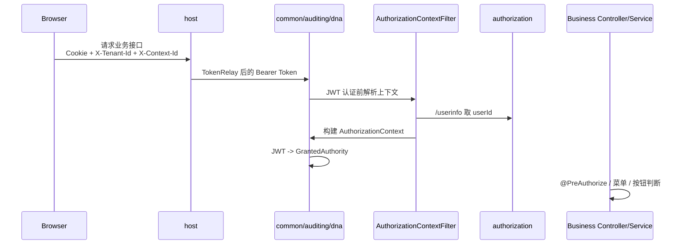

# 授权流程（Authorization Flow）

## 1. 背景与目标

当前仓库的“授权流程”不是单一的登录流程，而是把以下几段链路串了起来：

1. host 的 OAuth2 Client 登录与会话保持。
2. authorization 服务的表单登录 / OIDC 授权。
3. host 到资源服务的 Bearer Token 转发。
4. 资源服务侧的 `AuthorizationContext` 重建。
5. 菜单、按钮、接口权限的最终投影。

本文只描述当前仓库已经落地的主路径，不展开未来规划中的更复杂风控或外部系统编排。

## 2. 参与组件

| 组件 | 角色 |
| --- | --- |
| `simplepoint-service-host` | WebFlux 网关 + OAuth2 Client，承载浏览器会话与统一入口。 |
| `simplepoint-service-authorization` | OAuth2/OIDC 授权服务器，提供授权端点、登录页、`/userinfo`。 |
| `simplepoint-service-common` / `auditing` / `dna` | 资源服务，依赖 JWT + `AuthorizationContext` 完成权限判断。 |
| host 前端壳应用 | 在登录成功后拉取租户、上下文、菜单路由并注册 remote。 |

## 3. 登录主链路

### 3.1 host 先挡在最前面

host 的 `SecurityConfig` 开启了：

- `oauth2Login(...)`
- 自定义登录页 `/login`
- OIDC Client Initiated Logout `/logout`

因此，浏览器访问受保护的 host 路径时，会先被 host 这层拦住，而不是直接落到下游资源服务。

### 3.2 host 登录页只是客户端入口

host 自己的 `/login` 页面非常轻量，当前主要提供一个入口：

```text
/oauth2/authorization/simplepoint-client
```

它的作用是把浏览器送入 OAuth2/OIDC 授权流程。

### 3.3 authorization 服务负责真正的认证

授权请求进入 `authorization` 服务后：

1. `AuthorizationServerConfiguration` 保护授权端点。
2. 对 HTML 请求，未认证时会跳转到授权服务自己的 `/login`。
3. 授权服务登录页提交用户名 / 密码表单。
4. 登录成功后，授权服务回跳到 host 配置好的 redirect URI。

本地 `dev` 配置里，这个回调地址是：

```text
http://127.0.0.1:2555/login/oauth2/code/oidc
```

## 4. 从登录成功到前端壳应用加载

登录成功后，host 会建立自己的登录态，随后：

1. 浏览器回到 host。
2. host 根路径 `/` 会重定向到 `index.html`。
3. host 前端壳应用启动。
4. 前端先确定当前租户，再刷新 `contextId`。
5. 然后才去拉取菜单和 remote 路由。

当前前端的顺序是显式编码的：

1. `useCurrentTenants()`：取当前用户可切换租户列表。
2. `ensureContextId(tenantId, { force: true })`：为当前租户重建上下文 ID。
3. `fetchServiceRoutes()`：请求 `/common/menus/service-routes`。
4. `useRegisterRemotes()`：按返回结果注册远程模块。

## 5. host 到资源服务的授权转发

浏览器发给 host 的请求，通常只带：

- host 会话 cookie
- 前端自动补的 `X-Tenant-Id`
- 前端自动补的 `X-Context-Id`

真正发到资源服务时，host 还会通过网关默认过滤器下发：

```text
TokenRelay
```

也就是说：

- 浏览器侧主要持有的是 host 会话；
- 资源服务侧主要看到的是 Bearer Token；
- Bearer Token 的转发不是前端手写，而是 host 网关配置的一部分。

## 6. 资源服务如何把 Bearer Token 变成权限

资源服务安全链路当前可以概括成：



几个关键点：

1. `AuthorizationContextFilter` 必须先跑。
2. `AuthorizationContextResolver` 会拿 Bearer Token 去 `authorization` 的 `/userinfo` 取 `sub`。
3. `AuthorizationContextServiceImpl` 会把角色、权限、功能、套餐链路统一算进 `AuthorizationContext`。
4. `JwtAuthenticationConverterDelegate` 再把这个上下文变成 Spring Security authorities。

所以当前资源服务的有效 authority，来源是**解析后的授权上下文**，而不是简单读取 JWT scope。

## 7. 菜单、按钮、接口为什么能保持一致

当前系统把三类权限投影绑到了同一条链上：

### 7.1 接口访问

控制器普遍使用：

```java
@PreAuthorize("hasRole('Administrator') or hasAuthority('xxx')")
```

而这些 authority 正是从 `AuthorizationContext.asAuthorities()` 里生成出来的。

### 7.2 菜单显示

host 前端实际加载的是：

```text
/common/menus/service-routes
```

`MenuServiceImpl.routes()` 会读取当前 `AuthorizationContext.permissions`，按菜单 - 功能绑定关系筛出当前用户可以看到的路由树和需要注册的 remote。

### 7.3 `/schema` 按钮显示

`BaseServiceImpl.getButtonDeclarationsSchema(...)` 会基于当前 `AuthorizationContext` 过滤实体上的 `@ButtonDeclarations`，因此页面上能不能看到“新增 / 编辑 / 删除 / 配置”按钮，最终也走的是同一套上下文。

## 8. 登出与失效

host 当前的 `/logout` 配置使用了：

```text
OidcClientInitiatedServerLogoutSuccessHandler
```

这意味着登出时不只是本地会话结束，还会按 OIDC 客户端退出链路回到上游授权服务器。

前端请求层对异常状态的默认处理也已经内置：

- `401`：弹出“登录状态已失效”提示，并可跳回 `/login`
- `403`：提示“无使用权限”
- `5xx`：提示服务暂时不可用

## 9. 直接调资源服务时要注意什么

如果你绕过 host，直接调 `common` / `auditing` / `dna`：

1. 需要自己带 `Authorization: Bearer <token>`
2. 最好同时带 `X-Tenant-Id`
3. 如需稳定缓存和权限刷新，还应带 `X-Context-Id`

否则即使 JWT 本身有效，也可能因为缺少租户 / 上下文信息而拿不到正确的菜单、按钮和 authority。

## 10. 当前实现的几个边界

### 10.1 浏览器本身并不直接管理 Bearer Token

host 浏览器请求默认使用 `credentials: include`。  
也就是说，对前端而言更核心的是会话 cookie；真正把 Bearer Token 带到资源服务，是 host 网关的职责。

### 10.2 `contextId` 是授权链路的一部分，不只是缓存键

当前前端在租户切换后会强制重建 `contextId`，因为它不仅影响缓存命中，也影响权限变更后何时切到新上下文。

### 10.3 授权成功不代表菜单一定有内容

登录只是第一步。  
如果当前租户、角色、功能、菜单绑定关系不对，用户仍然可能登录成功但拿到空菜单或缺少页面入口。

## 11. 推荐阅读顺序

如果你要顺着代码追这条链路，建议按下面顺序：

1. host `SecurityConfig`
2. host `templates/login.html`
3. authorization `AuthorizationServerConfiguration`
4. authorization `templates/login.html`
5. `AuthorizationContextFilter` / `AuthorizationContextResolver`
6. `AuthorizationContextServiceImpl`
7. `MenuServiceImpl.routes()`
8. `BaseServiceImpl.getButtonDeclarationsSchema(...)`
9. 前端 `App.tsx` / `fetchServiceRoutes()` / `useRegisterRemotes()`

## 12. 关联文档

- 授权上下文：`doc/permission/authorization_context.md`
- 权限模型：`doc/permission/permission_model.md`
- 服务拓扑：`doc/architecture/service_topology.md`
- Schema API：`doc/api/schema_api.md`
- API 约定：`doc/api/api_conventions.md`
- 常见问题：`doc/troubleshooting/common_issues.md`
