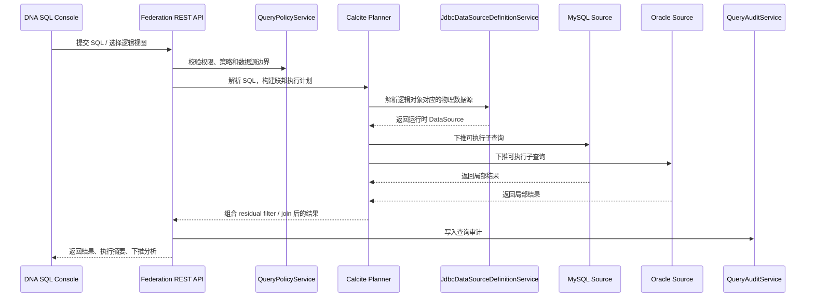

# DNA 联邦查询平台设计

## 1. 背景与目标

当前 DNA 服务已经具备 JDBC 驱动、数据源、方言、物理元数据等数据接入能力，但这些能力主要解决“怎么接入一个数据源”和“怎么管理物理库对象”，还没有把多个异构数据源统一抽象成一个可查询的平台。

本文的目标是把 DNA 演进为**联邦查询平台能力**，让平台可以在 MySQL、Oracle 以及其他 JDBC 数据源之上提供：

1. 统一的数据接入与元数据管理。
2. 面向业务的逻辑建模能力。
3. 基于 Calcite 的跨源只读查询能力。
4. 可观察、可治理、可控权限的平台化查询入口。

本文只讨论平台能力建设，不讨论跨源写入、分布式事务或流式计算。

## 2. 设计前提

当前仓库已经有三类基础能力，可以直接复用：

| 基础能力 | 当前模块 | 作用 |
| --- | --- | --- |
| 动态数据源路由 | `simplepoint-data-cp` | 负责 JDBC 数据源配置、路由、连接包装和运行时缓存。 |
| JDBC 管理能力 | `simplepoint-plugin-dna` | 负责 JDBC 驱动、数据源、方言、物理元数据管理。 |
| SQL 联邦引擎基础 | `simplepoint-data-calcite` | 作为 Calcite 集成入口，承担统一 SQL 解析、规划和执行。 |

因此，后续建设重点不是重新发明数据源管理，而是补上**联邦建模层**和**联邦查询层**。

## 3. 设计原则

### 3.1 平台能力优先

目标不是做一个只服务单个业务的跨库查询接口，而是做成可复用的平台能力，让不同业务以统一方式注册、建模、查询和治理。

### 3.2 只读查询优先

第一阶段只支持只读联邦查询，不支持跨源写入、DDL 透传、跨源事务，也不把 XA/Seata 纳入首期目标。

### 3.3 逻辑模型优先于物理表

平台对外暴露的核心对象应是逻辑目录、逻辑 Schema、逻辑数据集和逻辑视图，而不是直接把底层 MySQL/Oracle 物理表暴露给使用者。

### 3.4 分阶段开放 SQL 能力

首期只开放可控 SQL 子集：

- `SELECT`
- `INNER JOIN` / `LEFT JOIN`
- `WHERE`
- `GROUP BY`
- `ORDER BY`
- `LIMIT` / `FETCH`
- 常见聚合函数

更复杂的厂商方言、窗口函数、写操作和存储过程放到后续阶段。

## 4. 范围与非目标

### 4.1 首期范围

1. 支持以 JDBC 数据源为基础注册联邦查询对象。
2. 支持 MySQL、Oracle 及其他 JDBC 方言接入。
3. 支持基于 Calcite 的跨源只读查询。
4. 支持逻辑视图、查询策略、查询审计。
5. 支持执行计划查看和下推分析。

### 4.2 非目标

以下内容不在首期范围内：

1. 跨源写入与分布式事务。
2. 完整兼容各数据库的全部 SQL 语法。
3. 强一致全局快照查询。
4. 流式计算、批流一体和 CDC 数据同步。
5. 全量数据治理能力，如质量校验、血缘编排、任务调度。

## 5. 菜单与平台能力规划

建议按“接入 -> 建模 -> 查询 -> 治理”组织 DNA 菜单。

### 5.1 一级菜单建议

| 一级菜单 | 二级菜单 | 首期建议 | 说明 |
| --- | --- | --- | --- |
| 数据接入 | 驱动管理 | 保留 | 管理 JDBC 驱动下载、上传、版本和 URL 规则。 |
| 数据接入 | 数据源管理 | 保留 | 管理 JDBC 数据源、连接状态、基础连接属性。 |
| 数据接入 | 物理元数据 | 保留 | 浏览物理库对象、字段、约束和数据预览。 |
| 数据接入 | 方言管理 | 保留，放高级入口 | 管理数据库方言扩展和适配来源。 |
| 联邦建模 | 联邦目录 | 新增 | 管理联邦查询空间，如 `finance`、`risk`。 |
| 联邦建模 | 逻辑 Schema | 新增 | 在联邦目录下组织逻辑命名空间。 |
| 联邦建模 | 逻辑数据集 | 新增 | 把一个或多个物理表映射为平台逻辑表。 |
| 联邦建模 | 逻辑视图 | 新增 | 封装跨源 join、过滤与字段投影。 |
| 联邦建模 | 类型映射规则 | 新增 | 统一 JDBC 类型到平台逻辑类型的映射。 |
| 查询开发 | SQL 控制台 | 新增 | 提供只读 SQL 执行入口。 |
| 查询开发 | 执行计划 | 新增 | 展示逻辑计划、物理计划和执行摘要。 |
| 查询开发 | 下推分析 | 新增 | 标明哪些谓词、投影、排序、限制成功下推。 |
| 查询开发 | 查询模板 | 二期 | 封装常用查询，减少自由 SQL 风险。 |
| 运行治理 | 查询策略 | 新增 | 管理超时、限流、行数上限、可用数据源范围。 |
| 运行治理 | 查询审计 | 新增 | 记录 SQL、计划摘要、耗时、执行人、结果规模。 |
| 运行治理 | 缓存 / 物化视图 | 二期 | 优化高频查询与复杂联邦视图。 |
| 运行治理 | 告警监控 | 二期 | 监控失败率、慢查询、下推退化和资源消耗。 |

### 5.2 首期 MVP 菜单

首期只保留最小可用集合：

1. 驱动管理
2. 数据源管理
3. 物理元数据
4. 联邦目录
5. 逻辑视图
6. SQL 控制台
7. 查询策略
8. 查询审计

## 6. 技术架构

### 6.1 分层设计

| 层次 | 职责 | 主要模块 |
| --- | --- | --- |
| 数据接入层 | 驱动、数据源、物理库元数据管理 | `simplepoint-plugin-dna-core-*`、`simplepoint-data-cp` |
| 联邦元数据层 | 联邦目录、逻辑 Schema、逻辑数据集、策略和审计 | 新增 `simplepoint-plugin-dna-federation-*` |
| 查询引擎层 | SQL 解析、校验、优化、下推和执行 | `simplepoint-data-calcite` |
| 展示与治理层 | 菜单、控制台、执行计划、审计和策略管理 | `apps/simplepoint-dna` |

### 6.2 建议模块拆分

建议新增以下模块：

1. `simplepoint-plugins/simplepoint-plugin-dna/simplepoint-plugin-dna-federation-api`
2. `simplepoint-plugins/simplepoint-plugin-dna/simplepoint-plugin-dna-federation-repository`
3. `simplepoint-plugins/simplepoint-plugin-dna/simplepoint-plugin-dna-federation-service`
4. `simplepoint-plugins/simplepoint-plugin-dna/simplepoint-plugin-dna-federation-rest`

并在前端 `apps/simplepoint-dna/src/views/platform/` 下新增对应页面：

1. `FederationCatalog`
2. `FederationSchema`
3. `FederationDataset`
4. `FederationView`
5. `SqlConsole`
6. `QueryPolicy`
7. `QueryAudit`

## 7. 核心领域对象

| 对象 | 作用 |
| --- | --- |
| `FederationCatalog` | 联邦查询空间，隔离不同业务域。 |
| `FederationSchema` | 联邦目录下的逻辑命名空间。 |
| `FederationDataset` | 平台逻辑数据集，可映射单表或多表结构。 |
| `FederationView` | 基于逻辑数据集或物理表组合得到的逻辑视图。 |
| `FederationDatasetSource` | 逻辑对象与物理数据源、物理表的绑定关系。 |
| `FederationTypeMappingRule` | JDBC 类型到平台逻辑类型的统一映射规则。 |
| `FederationQueryPolicy` | 控制 SQL 类型、超时、限流、行数上限和数据源边界。 |
| `FederationQueryTemplate` | 预定义查询模板，降低自由 SQL 风险。 |
| `FederationQueryAudit` | 查询审计日志，记录执行人、SQL、计划摘要和结果规模。 |

## 8. 查询执行链路

执行链路应固定为：

1. 先解析逻辑对象和数据源边界。
2. 再做 SQL 校验，只允许只读语句。
3. 使用 Calcite 生成逻辑计划和物理计划。
4. 将可推到源库的谓词、投影、分页等尽量下推。
5. 无法下推的表达式保留在平台层做 residual filter / join。
6. 返回结果并记录审计日志。

## 9. 下推与优化策略

平台不追求“把所有 SQL 全部推到底层”，而追求“在保证语义正确的前提下尽可能多下推”。

### 9.1 优先实现的优化能力

1. `Filter` 下推：单表条件、可改写条件、可拆分条件。
2. `Project` 下推：只取实际需要的列。
3. `Limit` / `Fetch` 下推：减少跨网络结果量。
4. 同源 `Join` 下推：多个表来自同一物理库时优先整段下推。
5. 跨源谓词拆分：按数据源拆出可推部分和 residual 部分。
6. 函数改写：把逻辑函数改写为特定方言可执行表达式。
7. `EXPLAIN` / 下推报告：明确说明哪些条件被推送，哪些没有。

### 9.2 跨源查询的基本策略

对于 MySQL + Oracle 这类跨源查询：

1. 先把每个数据源上可独立执行的过滤条件尽可能下推。
2. 仅在平台层做跨源 join、剩余过滤和最终投影。
3. 对大结果集默认启用限制策略，避免全表回传。

### 9.3 需要长期维护的能力矩阵

每类数据源都需要维护自己的能力矩阵，至少包括：

- 支持的比较操作符
- 支持的函数和聚合
- 排序、分页、空值排序语义
- 类型转换规则
- 大小写与标识符引用规则
- 时间、时区和精度差异

## 10. 安全与治理要求

联邦查询默认风险较高，首期必须自带治理能力：

1. 只读账号，不允许平台用高权限账号执行自由 SQL。
2. SQL 白名单校验，只允许 `SELECT`。
3. 行数上限、执行超时和并发限制。
4. 数据源访问范围和联邦目录访问权限控制。
5. 查询审计，记录执行人、来源、耗时、命中数据源和结果规模。
6. 多租户场景下沿用现有租户和上下文链路，不允许绕过上下文直接访问所有数据。

## 11. 分阶段落地路径

### 11.1 Phase 0：设计冻结

目标：

1. 确认联邦平台采用 Calcite 作为查询引擎。
2. 确认菜单结构、核心对象和模块拆分。
3. 明确首期只做只读联邦查询。

输出：

- 本设计文档

### 11.2 Phase 1：联邦元数据骨架

目标：

1. 新增联邦目录、逻辑 Schema、逻辑视图、查询策略、查询审计等实体和接口。
2. 完成 `dna-federation-api/repository/service/rest` 骨架。
3. 在 DNA remote 中挂出对应菜单与空页面。

输出：

- 后端 CRUD 与基础权限点
- 前端基础菜单和占位页

### 11.3 Phase 2：查询引擎 MVP

目标：

1. 将 DNA 中已启用的数据源注册为 Calcite schema。
2. 打通只读 SQL 控制台。
3. 支持 `SELECT`、基础 `JOIN`、`WHERE`、`LIMIT`、`ORDER BY`。
4. 输出 `EXPLAIN` 和基础下推分析。

输出：

- 可运行的联邦查询最小闭环

### 11.4 Phase 3：逻辑建模与视图能力

目标：

1. 支持逻辑数据集和逻辑视图。
2. 支持字段映射、类型归一、别名管理。
3. 让业务侧尽量基于逻辑视图查询，而不是直接写物理表名。

输出：

- 可复用的联邦模型层

### 11.5 Phase 4：治理与优化

目标：

1. 完善查询策略、审计、权限和限流。
2. 补充查询模板、慢查询分析和监控。
3. 针对常用 JDBC 数据源持续增强谓词拆分和函数改写。

输出：

- 平台级治理与优化能力

## 12. 第一批实施顺序建议

后续代码实现建议严格按下面顺序推进：

1. 先做联邦元数据实体、权限点和 REST 骨架。
2. 再做 DNA 菜单与基础页面入口。
3. 再做 Calcite schema 注册与 SQL 控制台。
4. 最后补执行计划、下推分析、策略和审计。

这样可以先把平台边界和对象稳定下来，再逐步接入复杂查询能力，避免一开始就把实现耦合到某一类跨库 SQL。

## 13. 关联文档

- 服务拓扑：`doc/architecture/service_topology.md`
- 项目结构：`doc/architecture/project_structure_diagram.md`
- 授权流程：`doc/design/authorization_flow.md`
- Schema API：`doc/api/schema_api.md`
