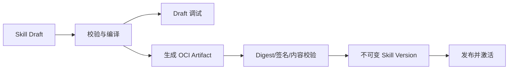
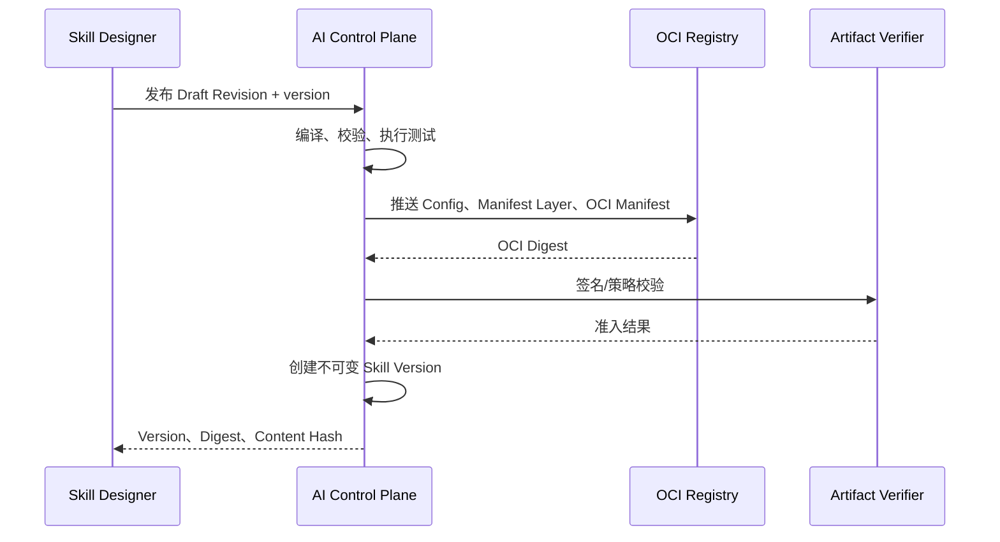

# Skill Workflow 可视化设计、调试与发布改造计划

| 项目 | 内容 |
|---|---|
| 状态 | Phase 2 已完成；Phase 3 LIVE、事件流、画布状态和 MOCK 安全执行主干已完成，测试用例 UI 进行中 |
| 适用范围 | AI 工作台 Skill 定义、Draft、Workflow 设计、调试、执行与 OCI 发布 |
| 最后更新 | 2026-08-06 |
| 关联设计 | `doc/design/ai_mcp_agent_skill_platform.md` |

## 1. 背景

当前平台已经具备声明式 Skill Workflow 执行能力，支持固定 MCP Tool、Prompt、
Resource、条件分支、并行分支、输入输出 Schema、执行审批、预算和持久化步骤检查点。

当前前端仍要求用户手工填写完整 `Skill Manifest JSON`，并手工准备 OCI Artifact
Reference 与 Digest。执行完成后虽然可以查看步骤列表，但缺少设计期校验、画布状态、
变量检查和断点调试。因此现有能力适合平台验证和工程化导入，不适合业务用户完整设计
和调试 Skill。

本计划将现有能力改造成以下完整链路：

```text
可视化 Draft
  -> 服务端校验与编译
  -> Draft 调试执行
  -> 测试与发布检查
  -> OCI Artifact 构建和推送
  -> 创建不可变 Skill Version
  -> 发布并激活
  -> Agent 绑定并调用
```

## 2. 目标

1. 用户可以通过拖拽节点和连接流程设计 Skill Workflow。
2. 所有业务参数默认通过 JSON Schema 表单编辑，不要求用户手写 JSON。
3. 支持 Skill 输入、输出、MCP 能力和步骤之间的可视化数据映射。
4. 支持保存可变 Draft、自动保存、版本恢复、撤销和重做。
5. 支持完整结构校验、能力校验、Schema 校验和引用校验，并能定位到画布节点字段。
6. 支持使用真实 MCP 能力或 Mock 数据调试 Draft。
7. 支持在画布查看执行状态、步骤输入输出、错误、耗时和审批状态。
8. 支持安全断点、继续、取消和重新执行。
9. 支持平台托管的 OCI Artifact 构建、推送、校验和 Skill Version 创建。
10. 保持现有不可变版本、MCP 快照固定、能力令牌、审批和审计安全边界。
11. 已发布 Skill 可以继续被 Agent 作为固定 Skill Version 调用。

## 3. 非目标和边界

1. Skill 仍然是声明式能力包，不允许嵌入脚本、命令、容器或任意代码。
2. Agent 仍不能绕过 Skill 直接调用 MCP Tool。
3. 首版画布不允许循环和回边。
4. 首版不提供无约束任意 DAG；画布必须能无歧义编译成平台的结构化 Skill Workflow。
5. Agent、Skill、Tool 和通用 Agent Workflow 的职责边界保持不变。
6. 大型二进制输出仍进入对象存储或外部系统，不直接写入 Draft 或执行记录。
7. 已发布的 Skill Version 不原地修改。

## 4. 核心架构决策

### 4.1 Draft 与 Version 分离

Skill Draft 是可变设计态资源，Skill Version 是不可变执行和发布资源。



Draft 可以持续保存和修改；每次调试固定一个 Draft Revision 和 Content Hash。正式发布
必须生成 OCI Artifact，再进入现有不可变版本生命周期。

### 4.2 服务端编译器是唯一权威

前端画布不能直接作为执行协议，也不能独立生成未经服务端确认的最终 Manifest。

服务端负责：

- 校验图结构和节点字段；
- 固定 MCP Server、Snapshot、Capability 和 Schema Hash；
- 校验上下游引用；
- 计算执行预算；
- 生成 canonical Manifest；
- 再次调用现有 `SkillWorkflowPlanCompiler` 编译；
- 返回结构化诊断、Manifest 预览和 Content Hash。

前端和后端可以共享 JSON Schema 与 TypeScript 类型生成结果，但不能复制两套业务编译规则。

### 4.3 设计文档与执行 Manifest 分离

`designerJson` 保存节点坐标、视口、折叠状态等设计信息。OCI Artifact 只保存执行所需的
canonical Skill Manifest，不能混入画布坐标。

### 4.4 调试复用正式执行器

Draft 调试必须复用正式的 Schema 校验、Workflow 编译器、Skill Worker、MCP Gateway、
能力令牌、审批和步骤检查点。禁止实现只在浏览器中模拟的另一套执行器。

Draft 调试执行不能被 Agent 引用，不能成为活动版本，并必须在审计中标记
`sourceType=DRAFT` 和 `draftRevisionId`。

### 4.5 OCI 凭据不进入浏览器

平台托管发布由服务端使用受控 Registry 凭据完成。浏览器只提交发布请求和版本信息，
不能直接持有 Registry 用户名、密码或 Token。

## 5. 用户体验设计

### 5.1 页面布局

```text
┌──────────────────────────────────────────────────────────────────┐
│ 返回  Skill 名称  Draft 状态       撤销 重做 校验 调试 发布      │
├─────────────┬────────────────────────────────┬───────────────────┤
│ 节点与能力  │                                │ 属性面板          │
│             │                                │                   │
│ Input       │           工作流画布           │ 基本属性          │
│ MCP Tool    │                                │ 参数映射          │
│ Prompt      │                                │ Schema 表单       │
│ Resource    │                                │ 条件/分支策略     │
│ Condition   │                                │ 输出定义          │
│ Parallel    │                                │                   │
│ Output      │                                │                   │
├─────────────┴────────────────────────────────┴───────────────────┤
│ 调试：执行输入｜节点状态｜变量｜请求响应｜错误｜日志｜Manifest   │
└──────────────────────────────────────────────────────────────────┘
```

### 5.2 技术选型

- 画布：`@xyflow/react`；
- 自动布局：`elkjs`，使用 Layered、正交边和固定端口；
- 普通列表拖拽：复用现有 `@dnd-kit/*`；
- JSON Schema 表单：复用现有 `SForm`、RJSF 和 AJV；
- 高级 Manifest 预览：复用 CodeMirror，只读为默认；
- 服务端状态：复用 React Query；
- 设计器编辑状态：独立 reducer/command store，支持撤销和重做；
- 国际化和权限：复用现有 AI 模块能力。

不将 React Flow 的 `Node/Edge` 类型直接作为领域模型。React Flow 仅作为渲染和交互层，
平台维护独立的 `SkillDesignerDocument`。

### 5.3 节点类型

| 节点 | 作用 | 主要配置 |
|---|---|---|
| Input | 定义 Skill 输入 | JSON Schema、示例值 |
| MCP Tool | 调用固定 MCP Tool | Server、Snapshot、Tool、参数映射 |
| MCP Prompt | 获取固定 Prompt | Server、Snapshot、Prompt、参数映射 |
| MCP Resource | 读取 Resource/Template | Server、Snapshot、URI/模板变量 |
| Condition | 条件分支 | equals、notEquals、isTrue、all、any、not |
| Parallel | 并行执行并汇合 | 分支列表、汇合节点 |
| Output | 生成 Skill 输出 | 输出 Schema、字段映射 |

### 5.4 连接规则

- Input 必须是唯一入口；
- Output 必须是唯一出口；
- 不允许环路、自连接或断开的执行节点；
- 普通步骤只能连接后续步骤；
- Condition 必须提供 `true` 和 `false` 两个出口；
- Parallel 必须包含 2 个以上分支，并有明确汇合；
- 步骤只能引用 Input 或在当前控制流中确定先于它完成的步骤；
- 并行分支之间不能互相引用尚未汇合的数据；
- 不允许在当前后端不支持的位置嵌套控制节点；
- 删除节点时必须检查数据引用，不能静默产生悬空引用。

### 5.5 参数映射

用户不直接输入 `$ref` JSON。每个字段提供：

```text
值来源：固定值 | Skill 输入 | 上游步骤输出
来源节点：input | <stepId>
字段路径：通过源 JSON Schema 选择
```

设计器生成：

```json
{
  "text": {
    "$ref": "input.text"
  }
}
```

源能力没有输出 Schema 时，允许使用路径选择器，但必须标记为弱类型映射，并在调试时
进行运行期校验。

### 5.6 Schema Builder

Input 和 Output 节点提供可视化 Schema Builder：

- 字段名、标题、说明；
- string、number、integer、boolean、object、array；
- required；
- enum；
- default；
- min/max、minLength/maxLength、pattern；
- 嵌套对象与数组项；
- `additionalProperties`；
- 示例数据。

默认不展示 JSON。高级模式只允许查看/编辑 Schema JSON，并在切回可视化模式前执行
完整 Schema 校验。

## 6. Draft 领域模型

建议的前端/接口模型：

```json
{
  "skillId": "skill-id",
  "revision": 12,
  "document": {
    "schemaVersion": "simplepoint.io/designer/v1alpha1",
    "metadata": {
      "name": "github-issue-summary",
      "description": "读取 Issue 并生成摘要"
    },
    "inputSchema": {},
    "outputSchema": {},
    "nodes": [],
    "ports": [],
    "edges": [],
    "budgets": {},
    "approvals": {},
    "tests": [],
    "viewport": {
      "x": 0,
      "y": 0,
      "zoom": 1
    }
  }
}
```

`skillId`、Revision 和编译状态属于 Draft Envelope，不写入 Designer Document；这样同一份
Designer Document 可以用于历史恢复、复制 Draft 和未来的离线导入，而不会携带数据库身份。

建议新增表：

### 6.1 `simpoint_ai_skill_drafts`

```text
id
skill_id
revision
designer_json
compiled_manifest_json
content_hash
validation_status
validation_result_json
updated_by
created_at
updated_at
deleted_at
```

### 6.2 `simpoint_ai_skill_draft_revisions`

```text
id
draft_id
revision
designer_json
compiled_manifest_json
content_hash
created_by
created_at
```

Draft 保存使用 `revision` 或 HTTP ETag 乐观锁。前端采用防抖自动保存，同时保留显式保存
按钮和未保存状态提示。

## 7. 服务端编译与诊断

### 7.1 新增组件

```text
SkillDraftService
SkillDesignerCompiler
SkillDesignerValidator
SkillDesignerManifestAdapter
SkillManifestCanonicalizer
SkillDraftExecutionService
SkillArtifactPublisher
```

### 7.2 编译流程

1. 校验 Designer Document Schema；
2. 校验节点 ID、端口、连接和可达性；
3. 校验无环和结构化分支；
4. 解析并固定 MCP 能力；
5. 校验 Tool Input/Output Schema Hash；
6. 校验参数映射和数据可用性；
7. 编译 Condition 和 Parallel；
8. 计算最坏路径调用次数和执行预算；
9. 生成 canonical Skill Manifest；
10. 调用现有 `SkillWorkflowPlanCompiler` 二次校验；
11. 返回全部诊断、Manifest、Content Hash 和能力绑定摘要。

### 7.3 结构化诊断

```json
{
  "valid": false,
  "diagnostics": [
    {
      "severity": "ERROR",
      "code": "SKILL_REFERENCE_NOT_AVAILABLE",
      "nodeId": "summarize",
      "fieldPath": "arguments.text",
      "jsonPointer": "/nodes/3/config/arguments/text",
      "message": "引用的工作流数据在当前步骤之前不可用"
    }
  ]
}
```

前端点击诊断后必须定位、选中并高亮对应节点和字段。发布必须无 ERROR；WARNING 需要
用户确认。

Phase 1 已实现聚合式 `SkillDesignerValidator`。校验顺序固定为：

1. 文档版本、必填字段、数量上限和元数据；
2. 节点、父子分支、顺序和控制节点嵌套；
3. 规范化 Port 和 Edge Handle、方向及结构化控制流；
4. MCP Tool、Prompt、Resource 固定绑定和节点 alias；
5. 节点属性、Condition、Parallel 分支；
6. 参数 `$ref` 格式、顺序可用性和并行分支隔离；
7. 测试用例、Mock 目标和断言来源；
8. Input/Output JSON Schema。

同一次校验返回所有可独立发现的问题，不因第一处错误终止。诊断按文档顺序稳定返回，
最多 256 条；超限时追加 `SKILL_DESIGNER_DIAGNOSTICS_TRUNCATED`。常用诊断代码包括：

| 类别 | 诊断代码示例 |
|---|---|
| 文档 | `SKILL_DESIGNER_VERSION_UNSUPPORTED`、`SKILL_DESIGNER_FIELD_REQUIRED` |
| 节点 | `SKILL_DESIGNER_NODE_DUPLICATE`、`SKILL_DESIGNER_NODE_ORDER_INVALID` |
| 端口/边 | `SKILL_DESIGNER_PORT_MISSING`、`SKILL_DESIGNER_EDGE_UNEXPECTED` |
| 能力 | `SKILL_DESIGNER_BINDING_ALIAS_DUPLICATE`、`SKILL_DESIGNER_CAPABILITY_UNBOUND` |
| 引用 | `SKILL_DESIGNER_REFERENCE_INVALID`、`SKILL_DESIGNER_REFERENCE_NOT_AVAILABLE` |
| 测试 | `SKILL_DESIGNER_TEST_MOCK_TARGET_INVALID`、`SKILL_DESIGNER_TEST_ASSERTION_SOURCE_INVALID` |
| Schema | `SKILL_DESIGNER_INPUT_SCHEMA_INVALID`、`SKILL_DESIGNER_OUTPUT_SCHEMA_INVALID` |

只有不存在 ERROR 时，文档才会进入 Manifest Adapter 和现有
`SkillWorkflowPlanCompiler`。后者继续作为运行时语义的最终防线；理论上不可达的编译器
异常会返回兜底结构化诊断，而不会以 HTTP 500 泄漏。

## 8. Draft API

建议新增：

```text
GET    /ai/workbench/skills/{skillId}/draft
PUT    /ai/workbench/skills/{skillId}/draft
DELETE /ai/workbench/skills/{skillId}/draft?expectedRevision={revision}
GET    /ai/workbench/skills/{skillId}/draft/revisions
POST   /ai/workbench/skills/{skillId}/draft/revisions/{revision}/restore
POST   /ai/workbench/skills/{skillId}/draft/validate
POST   /ai/workbench/skills/{skillId}/draft/compile
GET    /ai/workbench/skills/{skillId}/versions/{versionId}/designer
POST   /ai/workbench/skills/{skillId}/versions/{versionId}/designer/copy-to-draft
POST   /ai/workbench/skills/{skillId}/draft/debug-executions
POST   /ai/workbench/skills/{skillId}/draft/publish
```

Phase 1 已实现的保存契约：

```json
{
  "expectedRevision": 12,
  "document": {
    "schemaVersion": "simplepoint.io/designer/v1alpha1"
  }
}
```

- 第一次创建必须提交 `expectedRevision=0`，成功后返回 `revision=1`；
- 后续 PUT 必须提交当前 Revision，成功后 Revision 单调加一；
- Revision 不一致返回 HTTP 409 和 `SKILL_DRAFT_REVISION_CONFLICT`；
- 每次成功保存都生成不可变 Draft Revision；
- 恢复历史 Revision 不覆盖历史，而是创建一个新的当前 Revision；
- 保存时立即执行编译；非法设计允许保存，但状态为 `INVALID`，Manifest 和 Content Hash
  为空，并保留结构化诊断；
- Draft 同时使用显式 Revision 与 JPA `@Version` 防止并发覆盖；
- Draft 继承 Skill 作用域，读取和写入继续经过 `AiScopeAccessPolicy`；
- 保存前拒绝 Tool 配置和测试输入中的明文密码、Token、API Key 等凭据；
- Designer Document 最大为 2 MiB。

Phase 1 已实现以下权限：

```text
ai.workbench.skills.drafts.view
ai.workbench.skills.drafts.manage
```

调试执行：

```text
GET    /ai/workbench/skills/{skillId}/draft/debug-executions/{executionId}
GET    /ai/workbench/skills/{skillId}/draft/debug-executions/{executionId}/events
POST   /ai/workbench/skills/{skillId}/draft/debug-executions/{executionId}/pause
POST   /ai/workbench/skills/{skillId}/draft/debug-executions/{executionId}/continue
POST   /ai/workbench/skills/{skillId}/draft/debug-executions/{executionId}/cancel
POST   /ai/workbench/skills/{skillId}/draft/debug-executions/{executionId}/breakpoints
```

MCP 能力选择复用现有 Server、Snapshot 和能力详情 API，不增加可变名称解析。

## 9. 调试设计

### 9.1 调试模式

| 模式 | 行为 |
|---|---|
| Live | 真实调用 MCP Server，执行现有审批、权限和能力令牌规则 |
| Mock | 使用测试用例中固定的模拟返回，不产生 MCP 外部副作用 |

每次调试固定：

- Draft ID 和 Revision；
- Draft Content Hash；
- 编译后的 Manifest Hash；
- MCP Server、Snapshot、Capability 和 Schema Hash；
- 输入 Hash；
- Mock 配置 Hash；
- 发起用户和作用域。

### 9.2 画布状态

| 状态 | 颜色/表现 |
|---|---|
| 未执行 | 灰色 |
| 运行中 | 蓝色动画边框 |
| 成功 | 绿色 |
| 失败 | 红色 |
| 等待审批 | 橙色 |
| 断点暂停 | 紫色 |
| 条件跳过 | 浅灰色虚线 |

节点详情显示：

- 参数模板；
- 解析后的实际输入；
- MCP 请求和响应；
- Structured Content；
- Schema 校验；
- 开始、结束和耗时；
- 尝试次数；
- 错误代码和错误信息；
- Snapshot、Schema Hash 和能力令牌审计指纹。

### 9.3 断点和安全重试

- 断点只在节点执行前的安全检查点暂停；
- 正在进行的外部调用不能强制中断；
- effectful Tool 成功后不能在原执行中直接重放；
- “从失败节点重试”只对明确幂等的步骤开放；
- 非幂等步骤必须创建新执行并提示可能重复产生副作用；
- Mock 模式允许跳过节点并提供符合输出 Schema 的模拟结果。

### 9.4 事件流

第一版可以使用带游标的短轮询，稳定后增加 SSE：

```text
GET /events?afterSequence=123
```

事件必须持久化，不能只保存在进程内，确保浏览器刷新、AI 服务重启或 Worker 切换后仍可
恢复执行视图。

## 10. OCI 托管发布

### 10.1 发布流程



### 10.2 发布模式

1. 托管发布：平台自动打包和推送，适合工作台用户；
2. 外部发布：Git/CI 推送 OCI Artifact，平台按 Reference 和 Digest 导入。

两种模式最终进入同一个 OCI 拉取验证、Manifest canonical equality、签名准入和版本创建
逻辑。

### 10.3 幂等和失败处理

- 发布请求使用 Draft Content Hash + version 作为幂等边界；
- OCI Blob 使用内容寻址，重复推送安全；
- Registry 推送成功但数据库失败时允许重试；
- 创建 Version 成功但激活失败时保留 DRAFT/PUBLISHED 状态供用户处理；
- 发布不能覆盖已有相同语义版本。

## 11. 前端模块规划

建议在 AI 模块新增：

```text
views/workbench/Skills/Designer/
  SkillDesignerPage.tsx
  SkillDesignerToolbar.tsx
  SkillDesignerCanvas.tsx
  SkillDesignerPalette.tsx
  SkillDesignerInspector.tsx
  domain/
    types.ts
    commands.ts
    validation.ts
    manifestAdapter.ts
  nodes/
    InputNode.tsx
    ToolNode.tsx
    PromptNode.tsx
    ResourceNode.tsx
    ConditionNode.tsx
    ParallelNode.tsx
    OutputNode.tsx
  panels/
    SchemaBuilder.tsx
    ValueBindingEditor.tsx
    ConditionEditor.tsx
    CapabilitySelector.tsx
    ValidationPanel.tsx
    ManifestPreview.tsx
  debug/
    DebugConsole.tsx
    DebugInputDialog.tsx
    StepDetails.tsx
    ExecutionEventFeed.tsx
  layout/
    elkLayout.ts
```

画布基础能力后续可以被 Agent Workflow 设计器复用，但 Skill 和 Agent Workflow 的节点
规则、编译器和领域模型必须分离。

## 12. 权限和安全

建议增加或细分权限：

```text
ai.workbench.skills.drafts.view
ai.workbench.skills.drafts.manage
ai.workbench.skills.debug
ai.workbench.skills.publish
ai.workbench.skills.approve
ai.workbench.skills.control
```

安全要求：

- Draft 继承 Skill 的平台/租户作用域；
- 平台 Draft 可以引用平台 MCP 能力；
- 租户 Draft 只能引用共享平台能力或同租户能力；
- 保存 Draft 时不能保存 Secret 明文；
- Live 调试遵守 Tool 审批策略；
- Mock 数据明确标记，不能混入正式执行结果；
- Draft 调试不能被 Agent、Workflow 或外部 MCP Publication 引用；
- 所有设计、校验、调试、发布和恢复操作写入审计日志。

## 13. 兼容与迁移

1. 已存在 Skill Version 不迁移、不修改；
2. 版本详情增加只读画布；
3. “基于此版本创建 Draft”将 Manifest 转换成 Designer Document；
4. 支持的 Manifest 必须满足语义 round-trip：

```text
Manifest -> Designer Document -> canonical Manifest
```

5. 未知字段或未来节点不能静默丢失；应进入只读兼容模式，并保留原始 Manifest；
6. 现有手工 OCI 导入入口保留为“高级/外部发布”；
7. 现有执行历史继续使用原页面展示，逐步升级为只读执行画布。

## 14. 测试策略

### 14.1 单元测试

- Designer Document Schema；
- 节点和连接规则；
- Manifest 双向转换；
- 参数映射；
- Condition 编译；
- Parallel 编译；
- Structured Diagnostics；
- ELK 布局稳定性；
- reducer 撤销和重做。

### 14.2 集成测试

- Draft 保存和乐观锁冲突；
- Draft 编译调用现有 Workflow Compiler；
- MCP Snapshot 固定与 Schema 漂移；
- Draft Live/Mock 执行；
- 审批、暂停、继续和取消；
- Worker 重启后的调试恢复；
- OCI 推送、校验和版本创建幂等性。

### 14.3 端到端验收

1. GitHub Tool：拖拽节点、调试并发布 Skill；
2. Filesystem + Git：顺序执行和数据映射；
3. PostgreSQL：条件分支；
4. Playwright：并行分支；
5. Docker：副作用 Tool 审批；
6. Mock 模式不产生外部调用；
7. 浏览器刷新后恢复调试状态；
8. AI/Worker 重启后继续执行；
9. 发布后的 Skill 可被 Agent 绑定并自主调用；
10. 旧 Manifest 可以生成只读画布并复制为 Draft。

## 15. 分阶段实施计划

### Phase 1：领域契约、Draft 和服务端编译基础

- [x] 定义 `SkillDesignerDocument v1alpha1` JSON Schema；
- [x] 定义节点、端口、连接、属性和测试用例模型；
- [x] 新增 Draft 与 Draft Revision 数据表；
- [x] 新增 Draft CRUD 和乐观锁 API；
- [x] 定义结构化诊断和编译结果 API 契约；
- [x] 实现 `SkillDesignerManifestAdapter`；
- [x] 实现 Designer Document 到 canonical Manifest 编译；
- [x] 接入现有 `SkillWorkflowPlanCompiler`；
- [x] 将字符串异常升级为结构化诊断；
- [x] 完成 Manifest round-trip、编译和 API 测试；
- [x] 更新主设计文档和 API 文档。

验收标准：不依赖前端画布，可以通过 API 保存 Draft、编译为 Manifest，并得到可定位的
全部错误；合法 Manifest 经 round-trip 后语义不变。

### Phase 2：可视化画布和完整属性配置

- [x] 引入 `@xyflow/react` 和 `elkjs`；
- [x] 建立 Skill Designer 路由和三栏页面；
- [x] 实现节点面板、拖放、连线和删除；
- [x] 实现 Input、Tool、Prompt、Resource、Condition、Parallel、Output 节点；
- [x] 实现连接校验和结构化流程约束；
- [x] 实现 ELK 自动布局；
- [x] 实现 Schema Builder；
- [x] 实现 MCP 能力选择器；
- [x] 实现参数映射编辑器；
- [x] 实现自动保存、撤销、重做和历史恢复；
- [x] 实现诊断定位和 Manifest 只读预览；
- [x] 实现旧版本只读画布和复制为 Draft。

验收标准：用户不编辑 JSON 即可完成当前后端支持的全部 Skill Workflow 设计，并通过
服务端编译校验。

### Phase 3：Draft 调试运行

- [x] 新增 Draft Revision 固定执行入口；
- [x] 扩展执行记录以标识 DRAFT/PUBLISHED 来源；
- [x] 实现 Live 和 Mock 调试模式；
- [x] 新增持久化执行事件及游标 API；
- [x] 在画布覆盖节点执行状态；
- [x] 实现步骤输入、输出、错误、耗时和能力信息面板；
- [x] 实现安全断点、继续和取消；
- [x] 实现执行输入 Schema 表单；
- [x] 实现测试用例管理与断言；
- [x] 完成重启恢复、审批和副作用安全测试。

验收标准：Draft 可以在不发布的情况下使用真实或 Mock MCP 能力执行；刷新或重启后调试
状态可恢复；所有外部调用仍经过现有安全链路。

### Phase 4：OCI 一键发布

- [x] 新增托管 Registry 配置和连通性检查；
- [x] 实现 OCI Config、Manifest Layer 和 OCI Manifest 生成；
- [x] 实现服务端 Blob/Manifest 推送；
- [x] 集成现有 Artifact Verifier 和签名策略；
- [x] 实现幂等发布任务和失败恢复；
- [x] 实现版本、变更摘要和激活确认界面；
- [x] 保留外部 OCI 导入模式；
- [x] 展示 Artifact Digest、Content Hash、签名和准入结果；
- [x] 完成发布后 Agent 绑定和执行验证。

验收标准：用户在工作台完成设计、测试后，只输入语义版本即可生成 OCI Artifact、创建
不可变版本并发布，浏览器不接触 Registry 凭据。

### Phase 5：生产化收尾

- [x] 性能和大画布压力测试；
- [x] 无障碍和键盘操作；
- [x] 多语言完整覆盖；
- [x] 权限矩阵和审计检查；
- [x] 安全测试和恶意 Draft 测试；
- [x] 指标、告警和发布任务观测；
- [x] 用户文档、示例和故障排查；
- [x] Filesystem、Git、PostgreSQL、Docker Hub、Playwright 全链路回归；
- [x] GitHub OAuth/PKCE、主体隔离、Secret 注入和 Gateway 代理自动化回归；
- [ ] GitHub 真实 OAuth App 交互式全链路门禁（本机尚未配置 Client ID、Client Secret 和 Redirect URI）。

验收标准：满足生产权限、安全、可靠性、可观测性和运维要求，社区 MCP Skill 可以稳定
完成设计、调试、发布和 Agent 调用。

## 16. 实施顺序和交付纪律

后续严格按 Phase 1 到 Phase 5 实施。每个 Phase 遵循：

1. 先补充或确认契约；
2. 实现最小垂直切片；
3. 增加单元和集成测试；
4. 完成真实环境验证；
5. 更新本文件复选框和状态；
6. 再进入下一阶段。

不得为了快速展示画布而跳过 Draft、服务端编译和结构化诊断，也不得为了方便调试绕过
OCI、MCP Snapshot、权限、审批、能力令牌和审计边界。

第一项实施任务固定为：定义 `SkillDesignerDocument v1alpha1`、结构化诊断契约和
Manifest 双向转换规则，并以契约测试锁定行为。

## 17. 实施记录

### 2026-08-06：Phase 1 首个垂直切片

- 新增 `SkillDesignerDocument`、节点、边、位置和视口契约；
- 新增 `SkillDesignerDiagnostic` 和 `SkillDesignerCompilationResult`；
- 新增 `skill-designer-document-v1alpha1.schema.json`；
- 实现 Skill Manifest 与 Designer Document 双向转换；
- 固定虚拟 Input/Output、父控制节点、分支和顺序语义；
- 校验视觉 Edge 与结构化工作流顺序一致，防止画布和执行语义分叉；
- 服务端编译再次调用现有 JSON Schema Validator 和 Workflow Compiler；
- canonical Manifest 使用稳定 Map 排序并计算 SHA-256 Content Hash；
- 增加完整 Manifest round-trip、非法 Edge、非法嵌套控制节点、序列化和结构化诊断测试；
- Skill Service 完整测试与相关 Checkstyle 已通过。

下一项实施任务：补齐测试用例领域模型，然后新增 Draft/Draft Revision 持久化实体、
Repository、数据库 Schema 和乐观锁存储服务。

### 2026-08-06：Phase 1 第二个垂直切片

- Designer Document 增加规范化 Port、显式 Edge Handle 和测试用例模型；
- 测试用例支持节点 Mock、成功/错误模式和结构化结果断言；
- Manifest 导入自动生成稳定端口，导出时校验端口、Edge 与结构化执行语义一致；
- 新增 `simpoint_ai_skill_drafts` 和 `simpoint_ai_skill_draft_revisions`；
- Draft 保存同时使用显式 Revision 和 JPA `@Version` 乐观锁；
- 每次保存和历史恢复都会产生不可变 Revision；
- 保存时编译并固化 Designer JSON、canonical Manifest、Content Hash 和诊断；
- 无效 Draft 可以继续编辑保存，但不能获得可发布 Manifest；
- Draft 继承 Skill 的 SYSTEM/TENANT 作用域，并在服务层执行读写边界检查；
- 增加 2 MiB 文档限制和明文凭据持久化拦截；
- 新增 Draft 查询、保存、删除、Revision 列表、恢复、校验和编译 API；
- Revision 冲突返回 HTTP 409 结构化错误；
- 新增 Draft 查看/管理权限资源和中英文名称；
- 增加端口、测试模型、保存、恢复、非法图、明文 Secret 和 REST 契约测试。

下一项实施任务：实现聚合式 `SkillDesignerValidator`，把图、端口、测试、Schema、参数
引用和能力绑定错误统一升级为可定位的多条结构化诊断，并补齐 Phase 1 的服务端契约。

### 2026-08-06：Phase 1 第三个垂直切片

- 新增聚合式 `SkillDesignerValidator`，一次返回所有可独立发现的设计错误；
- 诊断固定包含稳定代码、节点 ID、字段路径和 RFC 6901 JSON Pointer；
- 覆盖文档、节点、顺序、父子分支、嵌套控制节点和数量上限；
- 覆盖规范化端口、Edge Handle、端口方向、缺失和额外控制流；
- 覆盖 Tool、Prompt、Resource 绑定字段、重复 alias 和未绑定能力；
- 覆盖节点属性白名单、Condition 语法、Parallel 分支数量及空分支；
- 覆盖 `$ref` 格式、前向引用和 Condition/Parallel 分支间数据隔离；
- 覆盖测试用例 ID、Mock 目标、错误 Mock 和断言来源；
- 覆盖 Input/Output 根 Schema 和现有受控 JSON Schema 子集；
- 最多返回 256 条诊断，超限时明确标记截断；
- `SkillDesignerCompiler` 仅在零 ERROR 时进入 Manifest 和运行时编译；
- Draft 保存、校验和编译 API 自动获得聚合诊断，无需新增接口；
- 增加合法文档、跨类别多错误、字段定位和残缺文档防崩溃测试。

Phase 1 的全部清单和验收标准已经完成。下一项实施任务进入 Phase 2：确认前端模块、路由、
表单和状态管理约束，引入 `@xyflow/react` 与 `elkjs`，建立 Skill Designer 三栏页面和
最小可保存画布。

### 2026-08-06：Phase 2 第一个垂直切片

- AI 前端模块引入 `@xyflow/react` 12 和 `elkjs` 0.11，保持领域文档与画布渲染模型分离；
- 新增 `/ai/workbench/skill-designer?skillId=...` 动态页面，并从 Skill 列表提供可视化设计入口；
- 建立节点面板、工作流画布、属性面板、底部诊断区和顶部 Draft 工具栏；
- 新建 Draft 时自动生成固定 Input、Output、规范化 Port 和结构化顺序 Edge；
- 支持将 MCP Tool 拖入画布、移动、选择、删除，并自动重建当前线性工作流；
- 支持 Input/Output 标量字段的表单式 Schema 编辑，不要求用户手写 JSON；
- 支持逐字段配置 Tool alias、Server ID、Capability Snapshot ID 和 Tool 名称；
- 支持 ELK Layered 自动布局并持久化节点坐标；
- 接入 Draft 查询、创建/更新、显式 Revision、409 冲突处理和保存后服务端聚合校验；
- 诊断结果可以回到对应画布节点，节点卡片同步标记错误状态；
- AI 模块 TypeScript 检查和 Module Federation 构建通过。

本切片没有把“节点面板、拖放、连线和删除”整体标记完成，因为当前 Edge 由后端结构化顺序
约束自动生成，尚未开放用户重排连线；Schema Builder 也只完成 object 根节点下的标量字段，
object、array、约束和示例值仍需继续实现。下一切片优先实现 MCP 能力选择器和参数映射编辑器，
让用户可以从平台已发现的 MCP Snapshot 选择 Tool，而不是手工填写三个 ID。

### 2026-08-06：Phase 2 第二个垂直切片

- 复用现有 MCP Server、能力快照和 Tool 发现 API，不新增 Designer 专用重复接口；
- 属性面板只展示 READY 且启用的 MCP Server，并级联加载其活动能力快照和 Tools；
- 选择 Tool 时自动固定活动 `snapshotId`，重载历史 Draft 时明确提示快照是否已经落后；
- 基于 Tool `inputSchema.properties` 自动生成参数卡片、类型、说明和 required 标识；
- 每个参数支持固定值、Skill Input 字段和上游步骤输出三种来源；
- Skill Input 映射从输入 Schema 的字段路径中选择，上游步骤映射从控制流前序节点中选择；
- 参数映射自动生成受控 `$ref`，用户不需要输入 Arguments JSON；
- string、number、integer、boolean 固定值使用对应表单控件；
- AI 模块 TypeScript 检查和 Module Federation 构建再次通过。

“参数映射编辑器”仍保持未完成状态：当前已覆盖 Tool 顶层标量字段和三类值来源，但复杂
object/array 固定值、上游输出 Schema 路径选择、弱类型提示和字段级兼容性校验仍待补齐。
下一切片扩展完整递归 Schema Builder，同时加入编辑命令历史、撤销/重做和自动保存。

### 2026-08-06：Phase 2 第三个垂直切片

- Draft 编辑后 1.5 秒防抖自动保存，显式保存和保存并校验仍可随时使用；
- 自动保存失败不会无限重试同一编辑版本，继续编辑后才恢复尝试，并在工具栏显示错误；
- 保存请求固定发起时的编辑序号，响应返回前产生的新编辑不会被旧响应覆盖；
- 最多保留 100 个页面内编辑快照，支持工具栏撤销、重做以及 Ctrl/Cmd 快捷键；
- 有未保存内容时注册浏览器离开保护；
- 接入不可变 Draft Revision 列表，并支持以乐观锁把历史快照恢复成一个新 Revision；
- 恢复后清理本地命令历史和旧诊断，重新以服务端返回文档作为基线；
- AI 模块 TypeScript 检查和 Module Federation 构建通过。

下一切片扩展递归 Schema Builder，覆盖 object、array、required、常用约束和示例值，并以同一
Schema 字段树增强 Tool 参数与上游输出字段路径选择。

### 2026-08-06：Phase 2 第四个垂直切片

- Schema Builder 扩展为递归字段树，支持 string、number、integer、boolean、object、array；
- 支持 required、标题、说明、字符串长度、数值范围、数组元素类型和数量约束；
- 可视化嵌套深度限制为 8，服务端仍保留最终 32 层安全上限；
- Input 参数映射按源/目标 Schema 类型过滤不兼容字段，integer 可以安全映射到 number；
- 上游 Tool 声明 outputSchema 时改为字段选择器，未声明时保留路径输入并明确标为弱类型映射；
- Prompt、Resource、Resource Template 全部接入活动 Snapshot 能力选择器；
- Prompt arguments 和 URI Template 变量自动转为参数映射字段；
- Condition 自动生成 True/False 结构分支，提供 `isTrue`、`equals`、`notEquals` 表单配置；
- Parallel 自动生成至少两个合法分支，支持新增、重命名和删除分支；
- Condition/Parallel 的分支默认包含可配置 MCP Tool，删除控制节点会级联删除全部分支节点；
- 前端规范化器按 parent/branch/order 生成端口和 Edge，始终匹配服务端结构化 Workflow；
- AI 模块 TypeScript 检查和 Module Federation 构建通过。

Schema Builder 尚未标记完整，剩余项是 enum、default、examples 的字段式编辑；参数映射还需
覆盖复杂固定 object/array、Output 映射和 Condition 组合表达式。下一切片完成这些属性配置，
并增加 Manifest 只读预览和画布连接/重排交互。

### 2026-08-06：Phase 2 第五个垂直切片

- Output 节点新增按 Output Schema 自动生成的字段式映射编辑器；
- 每个输出字段支持固定值、Skill Input 和上游节点输出三种来源；
- 嵌套 object 字段自动生成嵌套 `workflowOutput`，用户不需要维护 `$ref` JSON；
- string、number、integer、boolean、enum 和标量数组使用对应表单控件；
- Input 和声明了 outputSchema 的 Tool 按源/目标类型过滤不兼容字段；
- 上游能力没有 outputSchema 时允许弱类型字段路径，并在属性面板明确告警；
- Output Schema 删除或重命名字段后自动裁剪陈旧映射，避免生成不可见的残留输出；
- object/array 复杂固定值不开放 JSON 输入，改为引导用户映射结构化 Input 或上游输出；
- 校验通过后可以查看并复制服务端权威编译器生成的 Canonical Manifest；
- AI 模块 TypeScript 检查和 Module Federation 构建通过。

下一切片继续完善参数配置：实现 Tool 参数的递归 object/array 固定值编辑，以及 Condition 的
`all`、`any`、`not` 组合表达式；之后进入画布节点顺序调整和受控连接交互。

### 2026-08-06：Phase 2 第六个垂直切片

- 新增可复用递归 `SchemaValueEditor`，彻底移除复杂固定值的 JSON 输入依赖；
- object 固定值按 properties 递归渲染，支持 required、可选字段清除和嵌套对象；
- array 固定值以可增删元素列表编辑，元素继续按 items Schema 递归渲染；
- string、number、integer、boolean、enum、默认值、长度和数值范围复用相应控件；
- `minItems` 和 object required 字段在切换为固定值时自动生成结构化初始值；
- Tool、Prompt、Resource Template 参数和 Output 固定值统一使用同一编辑器；
- 固定值、Input 引用、上游输出引用三种来源现已覆盖平台当前全部能力节点；
- “参数映射编辑器”清单完成，后续重点转向组合 Condition 和画布顺序交互。

### 2026-08-06：Phase 2 第七个垂直切片

- Condition 属性面板升级为递归表达式树，不再只支持单个简单判断；
- 完整覆盖服务端语法中的 `isTrue`、`equals`、`notEquals`、`all`、`any`、`not`；
- all/any 支持 1 到 16 个子条件的添加、删除和递归组合；
- not 支持继续嵌套任意合法条件，并在前端限制最大 8 层；
- 条件操作数可以选择 Skill Input 或当前分支内确定先执行的节点输出；
- 前序 Tool 有 outputSchema 时使用字段选择器，否则显示弱类型路径告警；
- equals/notEquals 的比较值按引用字段 Schema 使用递归表单编辑，并在更换引用时重建类型正确的默认值；
- True/False 分支节点选择、级联删除和结构化 Edge 行为保持不变。

下一切片进入画布结构交互：支持在同一序列内拖动调整节点执行顺序，并提供受控连接操作，
所有变更仍由前端规范化器生成确定性 order、ports 和 edges，禁止任意 DAG、环路和跨分支连接。

### 2026-08-06：Phase 2 第八个垂直切片

- 顶层序列和每个控制分支都以独立执行序列处理，节点横向拖动按画布 X 坐标生成连续、确定性的 `order`；
- 节点卡片显示所属分支和序号，拖动结束即可看见实际执行顺序，不再依赖观察 Edge 推断；
- 开放 React Flow 连接交互，但不直接保存用户绘制的 Edge，连接操作只会转换为结构化顺序编辑；
- Input 连接把顶层目标置为首节点，普通节点连接把同序列目标置于源节点之后，连接 Output 把顶层源节点置于末尾；
- Condition/Parallel 的输出 Handle 只能指定本控制节点对应分支的入口，不能借此把节点移动到其他分支；
- 自连接、跨分支连接、分支直连 Output、Input 连接分支节点等非法操作会在画布即时提示并拒绝；
- 每次拖动或连线后统一由 `normalizeDocument` 重建 ports 和 edges，视觉连接与服务端可编译语义保持单一事实来源；
- 节点面板、拖放、受控连线和级联删除已经形成完整闭环，对应 Phase 2 清单项完成。

下一切片补齐 Schema Builder 的 enum、default、examples 字段式编辑，然后实现旧版本只读画布与
“复制为 Draft”，完成 Phase 2 剩余清单。

### 2026-08-06：Phase 2 第九个垂直切片

- Schema Builder 增加可折叠的“枚举、默认值与示例”编辑区，仍然不向用户暴露 JSON 文本框；
- string、number、integer、boolean 的 enum 使用对应类型值控件，最多配置 32 个候选值；
- default 和 examples 复用递归 `SchemaValueEditor`，object 按字段、array 按元素继续可视化编辑；
- 根 Input/Output object、嵌套 object、array 字段及 array items 均可维护相应 Schema 注解；
- 枚举候选变化后自动修正已不在候选范围内的 default，关闭注解时删除对应 Schema keyword；
- 默认值初始化会遵守 enum 首值、minimum、负 maximum、minLength 和 minItems，数组也不能删除到 minItems 以下；
- object 字段树重写时保留 enum、default、examples，避免继续编辑嵌套字段导致 Schema 注解丢失；
- Schema Builder 已覆盖平台当前受控类型、递归字段、required、常用边界、enum、default 和 examples，清单项完成。

下一切片实现已发布 Skill Version 的只读 Designer 展示，并允许用户把历史版本复制为一个新的
可编辑 Draft；只读路径必须与 Draft 编辑权限、Revision 乐观锁和服务端 Manifest 适配保持隔离。

### 2026-08-06：Phase 2 第十个垂直切片

- 新增版本 Designer 投影 API，由服务端 `SkillDesignerManifestAdapter` 将 immutable Manifest 转换为规范化只读文档；
- 投影响应同时返回原始 Manifest、兼容状态和不兼容原因，不会因未知 apiVersion、节点或未来字段而静默丢数据；
- 新增 `copy-to-draft` API，复制操作必须提交当前 `expectedRevision`，成功后产生新的 Draft Revision；
- 已有 Draft 在复制前不会删除或原地覆盖，其旧内容保留在 Revision 历史中，可以继续恢复；
- 不兼容版本允许查看原始不可变 Manifest，但明确禁止复制为 Draft，等待相应 Designer Adapter 升级；
- Skill 版本列表和版本详情都增加“查看只读设计图”入口，沿用现有 Designer 路由的 `versionId` 模式；
- 只读画布禁用拖放、移动、连接、删除和属性编辑，右侧以字段树、MCP 固定绑定和分支摘要展示节点属性；
- 用户可在兼容版本画布执行“基于此版本创建 Draft”，409 冲突会刷新 Revision 并要求重新确认；
- Service 覆盖兼容投影、不兼容原文保留和版本复制测试，Controller 覆盖路由绑定与结构化冲突响应；
- Phase 2 全部清单完成，前端类型检查、生产构建、i18n 一致性检查及目标后端测试通过。

下一阶段进入 Phase 3：先定义固定 Draft Revision 的调试执行契约和持久化模型，再复用现有
Skill Runtime 的编译、审批、预算、MCP 调用与步骤检查点能力，实现首个可恢复 Live 调试闭环。

### 2026-08-06：Phase 3 第一个基础切片

- 复核现有 Skill Worker：工作流计划、能力快照、步骤检查点、租约、审批、暂停、预算和 MCP 输入输出已经持久化，Draft 调试继续复用该执行主干；
- 新增 `SkillExecutionSource`，执行来源显式区分 `PUBLISHED` 与 `DRAFT`，不再仅靠 `skillVersionId` 隐式判断；
- 新增 `SkillDebugMode`，为 Draft 执行固定 `LIVE` 或 `MOCK` 外部调用行为；
- 执行记录增加 `draftId`、`draftRevision`、`draftContentHash` 和 `debugMode`，`skillVersionId` 调整为仅发布来源必填；
- 所有现有正式执行在提交时显式写入 `PUBLISHED`，历史数据迁移也统一回填该来源；
- 数据库增加互斥约束：PUBLISHED 只能绑定 Version，DRAFT 只能绑定完整 Draft Revision 指纹与 Debug Mode；
- 目标执行服务测试确认新正式执行仍固定 Version 且不会污染 Draft 字段，AI 服务编译通过；
- 本切片只建立安全持久化边界，尚未勾选“执行记录来源”清单；需要 Draft 启动、查询和 Worker 恢复链路全部使用新字段后再完成该项。

下一切片实现固定 Draft Revision 的调试启动服务与 API。首版先完成 LIVE 闭环；MOCK 模式必须在
Worker 接入持久化 Mock Resolver 后才开放，禁止以 MOCK 名义触发真实 MCP 外部调用。

### 2026-08-07：Phase 3 Draft LIVE 调试纵向闭环

- 新增固定 Draft Revision 的 LIVE 调试启动、分页和详情 API，并增加独立
  `ai.workbench.skills.debug` 权限；
- 启动时重新校验 Revision Content Hash、输入 Schema、预算、审批策略以及固定 MCP Snapshot
  中的 Tool、Prompt 和 Resource 描述，防止把结构校验误当成运行时准入；
- 执行记录固定 Draft ID、Revision、Content Hash 和 Debug Mode，幂等键按来源与 Revision 隔离；
- MCP 步骤把 Server、Snapshot、能力名和描述哈希固化到执行检查点，Worker 重启后不回读可变
  Draft；能力令牌使用稳定 Draft 运行引用，但数据库 `skillVersionId` 保持为空，不冒充发布版本；
- Designer 增加 LIVE 调试入口、Schema 输入表单、执行状态轮询、步骤列表、输出和错误反馈；
- MOCK 请求在持久化 Mock Resolver 完成前由服务端明确拒绝，避免任何真实 MCP 副作用；
- 新增服务、控制器和 Worker 重启认领测试，并通过 Skill 模块测试及前端类型检查。

下一切片实现持久化执行事件与游标 API，并把步骤状态覆盖到画布节点；之后再实现持久化 Mock
Resolver、测试用例执行与断言，最后开放 MOCK 模式。

### 2026-08-07：Phase 3 持久化事件与画布状态切片

- 新增追加式 `simpoint_ai_skill_execution_events` 事件表；事件序号在持有执行行锁的状态迁移中
  分配，并由执行 ID 与序号唯一约束保证单调、无重复；
- 执行创建、审批、认领、暂停、恢复、步骤开始/成功/失败/跳过及全部终态均与业务状态在同一
  事务写入事件，服务重启和 Worker 切换不会丢失已提交状态；
- 事件 Payload 限制为 16 KiB 的安全摘要，不复制完整 MCP 输入、输出或凭据；详细检查点仍由
  原执行步骤表作为单一事实来源；
- 新增 `GET .../events?afterSequence={cursor}&limit={limit}`，使用独占游标、有界分页和
  `hasMore` 连续追赶；兼容既有 `after` 查询参数，但前端统一使用 `afterSequence`；
- Designer 使用增量事件更新画布，运行中节点蓝色呼吸、成功绿色、失败红色、等待审批橙色、
  暂停紫色、跳过灰色虚线，同时继续用步骤详情校正最终状态；
- 新增 Draft 调试历史入口，页面刷新后可以重新打开持久化执行并从序号 0 重放事件；轮询连续
  失败会有界重试并提示用户，不会把已提交成功误报为“提交失败”；
- 中英文运行时 i18n 与 Mock Bundle 同步补齐；事件 Publisher、游标分页和 REST 参数绑定均有
  自动化测试，Skill 模块测试、前端类型检查及生产构建通过。
- Draft MCP Snapshot 解析改为提交时按需获取管理服务，Agent Runtime 仅执行已固定步骤时不再
  强依赖 AI 管理进程中的 MCP Bean；Agent Runtime 独立装配和实际启动均已验证。
- 全仓 `./gradlew test`（472 个任务）、开发控制脚本回归、9 服务健康检查、8080 登录跳转、
  AI readiness 以及事件表/索引落库检查全部通过。

下一切片实现持久化 Mock Resolver：Mock 数据必须固定到 Draft Revision/测试用例，经过输出
Schema 校验并由 Worker 显式选择，未命中的 Mock 必须失败，绝不回退到真实 MCP 调用。

### 2026-08-07：Phase 3 持久化 MOCK 安全执行主干

- Draft 调试请求新增固定 `testCaseId`；MOCK 只允许选择目标 Revision 中存在且启用的测试用例，
  输入固定为用例输入，调用方提交不同输入会被拒绝；
- 执行记录新增 Test Case ID、Mock Config Hash 和不可变配置 JSON，幂等指纹同时包含模式与用例，
  LIVE/MOCK 或不同用例不会错误复用同一执行；
- 提交时要求工作流每个可执行 MCP 节点都有唯一 Mock，缺少任一节点立即失败；Worker 运行时再次
  fail-closed 校验，持久化数据损坏或未命中也绝不回退真实调用；
- MOCK 步骤不签发 MCP 能力令牌、不调用 `AiMcpWorkflowExecutionService`，仍复用正式步骤检查点、
  预算、事件、输出 Schema 和最终状态链路；模拟错误保留用例中的稳定错误码和消息；
- MOCK 不进入 Tool 外部副作用审批，因为它没有外部调用；能力 Snapshot 与 Schema Hash 仍在提交
  时固定，保证用例针对的节点身份不会漂移；
- 自动化测试覆盖配置固定、用例输入、审批隔离、零外部调用、成功输出和 Mock 缺失失败；Skill
  Service 测试、AI/Agent Runtime 装配通过。

下一切片补齐测试用例管理 UI、按能力输出 Schema 编辑 Mock、断言执行与结果面板；这些完成并
通过用户路径测试后，才勾选 Phase 3 的完整“Live 和 Mock 调试模式”清单。

### 2026-08-07：Phase 3 测试用例与 MOCK 调试页面

- Designer 工具栏新增测试用例入口，统一管理用例新增、复制、删除、启停、固定输入和逐节点
  Mock，不再要求用户直接编辑 Designer JSON；
- 新建用例会为当前全部 MCP Tool、Prompt、Resource 节点生成成功 Mock；节点变化后重新保存会
  同步有效节点并清理陈旧目标，后端仍要求每个执行叶子都有结果；
- 成功 Mock 支持任意 JSON，失败 Mock 必须填写稳定错误码；JSON 或表单校验失败时所有输入保留，
  切换用例和关闭抽屉前会确认未保存修改；
- “保存并运行 MOCK”先产生新的不可变 Draft Revision，再走服务端权威校验和固定执行协议；
  调试历史与详情明确显示 LIVE/MOCK、Test Case ID 和 Mock Config Hash；
- 中英文运行时资源与本地 Mock Bundle 同步补齐，前端全量类型检查、生产构建、Skill 回归测试、
  AI 服务重启及运行中联邦资源检查通过。

### 2026-08-07：Phase 3 持久化断言执行闭环

- 用例页面支持针对最终输出或任一 MCP 节点配置 `EQUALS`、`NOT_EQUALS`、`EXISTS`、
  `NOT_EXISTS`、`CONTAINS` 和 `MATCHES`；字段路径支持点号与数组下标，空路径表示整个来源；
- 断言随 Mock 一起复制进执行记录并纳入 Mock Config Hash，运行中不回读可变 Draft；
- Worker 在输出 Schema 校验后求值，断言结果按文档顺序记录 ID、来源、路径、运算符、期望值、
  实际值、通过状态与说明；
- 任一断言失败使用 `SKILL_MOCK_ASSERTION_FAILED` 结束测试，但保留工作流输出、成功步骤与全部
  断言明细，页面可以直接展开对比期望值和实际值；
- `MATCHES` 限制表达式和输入长度，拒绝反向引用、Lookaround、量化分组和过多量词，避免恶意
  测试正则占满 Worker；
- 数据库新增断言通过状态和结果 JSON，来源约束保证 PUBLISHED/LIVE 不得写入 Mock 断言字段，
  MOCK 则要求状态与结果同时为空或同时存在。

下一切片完成全量构建、数据库迁移与真实服务恢复测试，并补充按能力输出 Schema 辅助编辑；全部
验收通过后再更新 Phase 3 总清单。

### 2026-08-08：Phase 3 固定 Snapshot 输出 Schema 辅助 Mock

- Tool 成功 Mock 按绑定的 `serverId + snapshotId + name` 读取不可变能力快照，不使用 Server 当前
  活动描述替代历史 Revision，避免能力升级后测试用例静默漂移；
- 平台受控 JSON Schema 子集自动生成递归表单，覆盖 object、array、string、number、integer、
  boolean、enum、const、default、required 及常用长度、数量和数值边界；
- 表单与 JSON 可无损切换；JSON 无效时拒绝切换并保留原文，按 Schema 生成示例覆盖已有内容前
  必须确认，新增/修改校验失败不会重置测试用例；
- Snapshot 加载失败提供原位重试并保留 JSON；Tool 未声明 outputSchema、复杂 Schema 以及协议未
  定义输出 Schema 的 Prompt/Resource 均明确回退 JSON，不伪造字段结构；
- MOCK 提交后，服务端再次从同一固定 Snapshot 解析 Tool outputSchema；属于平台确定性子集的
  Schema 会在创建执行记录前校验成功 Mock，非法结果不会进入 Worker 队列；
- 复杂第三方 Schema 仍固定 Snapshot 身份和描述哈希，但不会被有限校验器错误拒绝；页面明确
  标识其 JSON 回退状态，最终 Skill 输出 Schema 校验和断言链路保持不变；
- 公共递归 Schema 值编辑器补齐中英文文案和 const 只读展示，服务端资源与本地 Mock Bundle
  保持一致。

下一切片将补齐 Mock 用例批量运行与汇总结果，使多个启用用例可以形成一次可追踪的回归测试集。

### 2026-08-08：Phase 3 持久化 MOCK 批量回归

- 新增批量回归启动、分页历史和详情 API；一次提交固定同一 Draft Revision 中全部启用用例，
  用例顺序与不可变 Designer Document 保持一致；
- 执行记录增加 `testRunId` 和 `testRunOrder`，批次不复制执行结果，而是从子执行动态汇总
  RUNNING、PASSED、FAILED 以及通过/失败数量，刷新和服务重启后仍可恢复；
- 批次 ID 与调用幂等键、Skill、Revision 和作用域绑定；同一 Skill 的提交由行锁串行化，重复请求
  返回原批次，创建任一用例失败会回滚整个批次；
- 数据库约束要求批次 ID 与顺序同时为空或同时存在，并以部分唯一索引禁止同一批次重复顺序；
- 测试用例抽屉增加“运行全部启用用例”、实时进度、最近批次、逐用例状态与详情入口；当前未保存
  用例先在原位校验并保存，失败不清空表单；
- 服务和 Controller 测试覆盖启用项过滤、稳定顺序、持久化关联、失败汇总及路由绑定；Skill 模块
  回归、前端类型检查、i18n 一致性检查和生产构建通过。

下一切片补齐调试步骤详情面板，展示固定能力身份、输入输出、错误、时间与耗时，再实现安全断点、
继续和取消控制。

### 2026-08-08：Phase 3 步骤详情、安全控制与最终验收

- 调试步骤详情增加固定 MCP Server、Snapshot、能力名称、描述 Schema Hash、输入模板、解析后输入、
  MCP 响应、结构化输出、开始/结束时间、耗时、尝试次数、稳定错误码和能力令牌指纹；
- `SKIPPED` 步骤明确展示为“未执行”，不会把没有发生的 Schema 校验误报为成功；
- Draft 调试支持持久化安全断点、显式暂停、继续和取消；断点只在步骤外部调用前命中，继续仅绕过
  当前命中一次，避免恢复后立即重复暂停；
- 取消采用协作式检查点语义：排队或暂停执行立即取消，正在进行的外部调用不被强制中断，在调用返回
  后的首个安全检查点停止，剩余步骤标记为跳过；页面在确认框和等待提示中明确解释该行为；
- Draft 控制路由会先验证执行来源，不能借调试接口操作正式发布执行；断点限制为当前固定 Revision 的
  已知步骤、去重且最多 64 个；
- 自动化测试覆盖断点命中和单次绕过、即时与协作式取消、步骤稳定错误码、详情投影、控制路由、Worker
  重认领、审批边界、Mock 零外部调用和副作用安全链路；
- Skill Service/REST 回归、前端 i18n 检查、TypeScript 检查和生产构建全部通过；
- AI 与 Agent Runtime 已在真实 PostgreSQL 上完成迁移和重启，新增列、来源/取消/断点约束、批次索引
  均已核验；Host、AI、Agent Runtime 健康检查通过，启动日志无新增异常。

Phase 3 全部验收项完成。下一阶段进入 Phase 4：先补齐托管 Registry 的显式配置、连通性检查与
只写凭据边界，再实现从固定 Draft Revision 生成并推送 OCI Artifact 的首个可恢复发布任务。

### 2026-08-08：Phase 4 托管 Registry 配置与连通性切片

- 托管 Registry 必须由服务端环境显式启用并配置 Registry Host 与平台仓库前缀；默认未配置时
  返回可理解状态，不会在用户打开页面时发起无效外部请求；
- 公开状态仅包含 Host、仓库前缀、TLS、认证是否已配置和签名策略，不序列化用户名、密码或
  Bearer Token，浏览器始终不能接触 Registry 凭据；
- 新增服务端连通性检查，支持 Basic 和 Bearer Challenge、受限 Token Host、显式不安全 Registry
  名单、连接/请求超时与禁止重定向；Registry 和 Token 服务都必须通过允许名单；
- 外部 OCI 导入弹窗展示托管发布配置及原位连通性检查，同时明确未配置时仍可使用现有外部导入，
  不把运维配置缺失伪装成用户表单错误；
- 单元测试覆盖未配置零网络访问、认证连通、凭据不泄漏和 Registry Allowlist；REST 测试覆盖
  公开状态、检查路由与结构化错误；
- Skill Service/REST 完整测试与 Checkstyle、前端 i18n 同步、全量类型检查及生产构建全部通过，
  同时清理了 Phase 3 遗留的 Skill 模块静态规范问题。

下一切片实现确定性的 OCI Config、Skill Manifest Layer 和 OCI Manifest 生成器；先以字节级黄金
测试锁定媒体类型、Digest、Size、Annotation 和相同输入可复现性，再把它接入 Registry 推送。

### 2026-08-08：Phase 4 确定性 OCI Artifact 生成切片

- 新增无可执行代码的确定性 OCI Artifact 生成器，输出 Skill Config、唯一 Skill Manifest Layer
  和 OCI Image Manifest 三段字节及各自 SHA-256 Digest；
- Config 严格保持 Verifier 要求的三个字段，Layer/Artifact Media Type 与现有外部导入契约一致，
  避免平台自产物与平台验证器出现双重标准；
- OCI Manifest 记录标准 Title/Version 以及 SimplePoint Content Hash、Draft Revision 注解，不写入
  当前时间等不稳定字段，相同 Manifest、版本和 Revision 可逐字节复现；
- 所有 Descriptor Size 来自实际 UTF-8 字节，三段内容分别受已有服务端大小上限约束；生成结果对
  byte[] 进行构造和读取双向防御性复制，调用方不能在摘要计算后篡改内容；
- 黄金测试锁定 Canonical Manifest/Config/OCI Manifest 完整字节、固定 Content/Config Digest、
  重复生成一致性、大小限制与防御性复制；目标测试和 Checkstyle 通过。

下一切片实现服务端 Blob 存在性检查、标准两阶段 Upload 和 Manifest Tag 推送；所有 Location、认证
Scope、响应 Digest 和目标 Host 都必须校验，失败不得创建 Skill Version。

### 2026-08-08：Phase 4 服务端 OCI 推送协议切片

- 新增 OCI Distribution 推送客户端，先以 HEAD 复用已有 Config/Layer Blob，缺失时执行标准
  `POST uploads/` + `PUT Location?digest=` 两阶段上传，最后才写入语义版本 Manifest Tag；
- 每个 Blob 上传完成后校验 Registry 响应 Digest，Manifest 推送必须返回与本地确定性字节一致的
  `Docker-Content-Digest`，不接受 Registry 静默改写；
- Upload Location 解析支持相对地址和 Registry 状态 Query，但强制同 Scheme、Host、Repository
  Upload Path，拒绝跨 Registry、UserInfo 和 Fragment，防止凭据或内容被引流；
- Basic/Bearer 认证限定到目标 Repository 的 `pull,push` Scope，Token Realm 继续受 TLS/不安全名单
  与 Token Host Allowlist 约束；所有请求禁止自动重定向；
- Registry 响应统一有界读取 64 KiB，避免恶意错误响应或 Token 服务导致内存放大；中断会恢复线程
  标记并返回稳定失败，不吞掉取消信号；
- 测试覆盖缺失 Blob 上传、Content-Type、Tag 最后写入、Digest 校验、重复推送复用 Blob、结果幂等
  以及恶意跨 Host Location 拒绝；目标测试和 Checkstyle 通过。

下一切片把生成、推送、现有 Artifact Verifier 和不可变 Version 创建串成持久化幂等发布任务，并
加入失败阶段、重试次数、租约和恢复调度，任何阶段失败都不得误激活版本。

### 2026-08-08：Phase 4 持久化发布任务与设计器交互切片

- 新增固定 Draft Revision、Content Hash、目标语义版本和激活选择的持久化发布任务；系统与租户
  Scope 分别使用数据库唯一幂等边界，相同键重放只返回原任务，请求内容不一致则明确拒绝；
- Worker 使用 `SKIP LOCKED`、有界租约和递增 Fence Token 认领任务，网络 I/O 不占用数据库事务；
  生成、推送、校验、创建版本和激活均有持久化阶段检查点，进程重启后可复用已推送 Artifact 和
  匹配的不可变版本，不覆盖同名语义版本；
- 平台自产 OCI Artifact 仍通过现有 Artifact Verifier、签名准入策略和 Canonical Manifest equality
  后才创建版本；失败使用有界指数退避，耗尽后进入终态，并允许操作员修复外部原因后重试原任务；
- 损坏的历史固定 Manifest 会被隔离为 `SKILL_PUBLISH_MANIFEST_INVALID`，不会回滚整个认领批次或
  阻塞其他合法任务；Worker Fence 比较对异常空租约安全失败；
- Designer 发布前自动保存并重新执行权威校验，仅要求用户输入语义版本；发布抽屉展示 Registry
  TLS/认证/验签状态、显式连通性检查、Revision、Content Hash、节点/能力/测试数量和相对最新版本
  的变更摘要，并对“发布后激活”给出明确影响说明；
- 页面持续展示排队、生成、推送、校验、创建版本、激活、完成阶段，失败保留错误码与原因并重试
  原任务，成功展示 OCI Reference、Manifest/Config/Content Digest 并可打开不可变只读版本；关闭
  页面不会取消后台任务，表单或请求失败不会清空版本号和激活选择；
- 外部 OCI 导入入口继续保留在 Skill 主页面，作为 CI/Git 推送的高级模式，与托管发布共享同一
  Verifier 和版本生命周期；浏览器不接触 Registry 凭据；
- Skill Service/REST 完整测试与 Checkstyle、前端 i18n 同步/检查、全量 TypeScript、生产构建均
  通过；AI 与 Host 已重启，新发布任务表的 35 个字段、作用域/状态约束、主键、查询索引及两条
  部分唯一幂等索引已在 PostgreSQL 实库核验，Host 根路径 302 到登录页且两服务 readiness 为 200。

下一切片验证发布后的固定 Skill Version 在 Agent 配置、执行提交、Runtime 固定版本解析和结果审计
中的完整闭环；发现缺少的用户入口、错误提示或一致性约束时直接补齐，再完成 Phase 4。

### 2026-08-08：Phase 4 发布后 Agent 绑定闭环

- 修正托管任务的发布/激活语义：无论是否选择立即激活，校验通过的版本都会进入 `PUBLISHED`，
  因此可以被 Agent 固定绑定；`activate=false` 不改变 Skill 当前活动版本；
- 激活操作改为幂等重申，即使进程在“版本已发布、Skill 尚未切换活动版本”之间重启，恢复任务也会
  重新确认 `activeVersionId` 后再成功，不会产生“显示完成但未激活”的半完成状态；
- 发布成功页新增“绑定到 Agent”入口，携带固定 `skillVersionId` 进入 Agent 工作台；页面明确引导
  先选择目标 Agent，创建新不可变 Agent 版本时自动预填 Skill 别名和刚发布版本，取消或版本不可见
  都有原位状态说明，不会创建隐式绑定；
- Agent 创建仍由后端重新验证 Skill Enabled、Scope、`PUBLISHED` 状态和 Content Hash；Agent Runtime
  只把固定 Skill 暴露为模型 Tool，拒绝未绑定能力，并通过持久化 Skill 子执行与 Trace 等待/恢复；
- 测试覆盖仅发布可绑定但不激活、发布后激活、已发布版本重启后重申激活、Agent 固定发布版本与
  Content Hash、合法 Skill 子执行提交以及未绑定能力拒绝；Skill/Agent API、Service、REST 全部测试
  与 Checkstyle、前端中英文同步/检查、TypeScript 和生产构建通过；
- 真实重启发现并修复 Agent Runtime 会误装配托管发布 Processor 的问题：Processor 现与发布开关
  同条件装配，只在 AI 管理服务启用；AI、Agent Runtime、Host 重启后 readiness 均为 200，Host 根
  路径保持 302 到登录页，运行中的 AI 静态资源已包含发布和 Agent 绑定页面。

Phase 4 全部验收项完成。下一阶段进入 Phase 5，先建立可重复的性能/大画布基准与安全恶意 Draft
测试，再按无障碍、多语言、权限审计、可观测性、运维文档和社区 MCP 全链路顺序逐项收口。

### 2026-08-08：Phase 5 生产化、安全和可用性收口

- 服务端为 Designer Document、递归 Schema、属性数量、数组数量和 Draft Body 建立显式上限；Secret
  扫描改为有深度和总节点预算的迭代遍历，覆盖超深、超宽、超大和 Mock Secret 恶意输入；128 节点
  基准在 3 秒门禁内完成，129 节点及以上返回结构化错误而不是拖垮请求线程；
- 大画布使用稳定 Handle 映射和节点卡片记忆化；节点、连线、能力面板、用例列表、撤销/重做和执行
  状态补齐键盘操作、焦点样式、语义标签、`aria-live` 与减少动态效果偏好；
- Designer、历史、只读版本、条件、输出映射、属性检查器和错误状态完成中英文覆盖，后端资源与 Mock
  Bundle 由同步门禁保证一致；
- Draft Revision 记录 SAVE、RESTORE、VERSION_COPY 来源和操作人，发布任务记录提交人；保存、恢复、
  复制、删除、编译、提交、幂等命中、重试和终态均写入不含 Draft/Secret 正文的结构化审计日志；
- 权限矩阵测试逐个验证 Skill Controller Handler 的 `PreAuthorize` 和独立权限，平台管理员与租户权限
  边界保持现有基础服务规则；
- 发布链路增加提交、幂等、认领、租约回收、Fence、阶段、重试、终态和耗时指标，Worker 暴露活动数、
  接收状态和拒绝提交 Gauge；Actuator 仅开放 health、info、metrics，并给出积压、失败率、租约回收、
  Worker 不接收和 P95 耗时告警建议；
- 新增 `doc/ai/skill_designer.md`，覆盖权限、设计、Mock/Live 调试、发布、Agent 绑定、限制、指标、告警、
  社区示例和故障排查，并从文档主页可达；
- 固定来源校验确认 GitHub、Filesystem、Git、PostgreSQL、Docker Hub、Playwright 六个社区镜像 Digest
  与 Profile 契约一致；Runtime Profile Fixture、GitHub OAuth/主体 Secret、Gateway OAuth 代理测试通过；
- Filesystem、Git、PostgreSQL、Docker Hub 和 Playwright 分别完成 Profile 导入、不可变 Revision、协议
  准入、Pool、直接 Tool、Skill、Workflow、Agent、调用账本和清理的真实 Runtime 全链路；确定性模型
  Stub 只替代外部模型质量，不跳过 Agent 工具选择、路由和执行；
- 端到端验收发现并修复三项成熟度缺陷：Profile Pool 改为休眠创建后绑定不可变 Revision 再扩容；
  Pool 删除统一返回空成功响应；Host 增加稳定 `/ai/**` 负载均衡路由，本地启动脚本等待 Consul passing
  实例后才报告就绪。只重启 AI、不重启 Host 的恢复回归返回 200；
- Tool Runtime 对较慢 MCP 进程使用有界准入重试，退出错误包含脱敏状态和 Exit Code；镜像内置无 Shell
  依赖的健康检查，完整 Go 测试通过；Skill、Runtime、MCP、MCP Gateway 模块 Check/Checkstyle、前端
  i18n 同步和 AI TypeScript 检查通过。

Phase 5 的代码、非交互社区服务和 GitHub 自动化契约均已完成。唯一未关闭项是 GitHub 真实 OAuth App
的交互式外部门禁：验收器明确拒绝 PAT 替代，必须由环境提供 OAuth Client ID、Client Secret、Redirect
URI，并由同一平台用户在一次性 URL 完成授权；当前本机未配置这三项，不能伪造通过记录。该外部门禁
保留在最终验收清单，不阻塞后续 Agent 和 Workflow 的本地开发与自动化验证。
