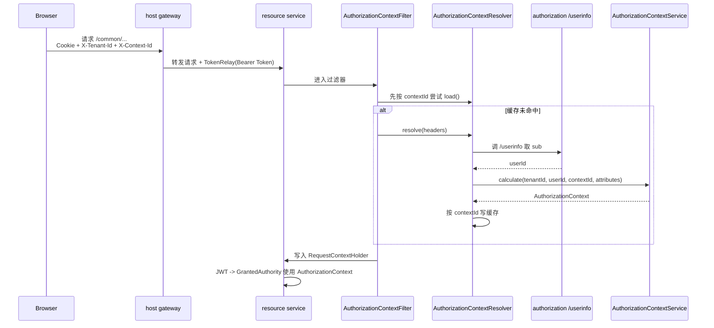

# 授权上下文（Authorization Context）

## 1. 背景与目标

当前仓库的权限判断并不直接依赖 JWT 里原始的 scope/claim，而是依赖一个运行时组装出来的 `AuthorizationContext`。这个对象把当前请求真正需要的权限信息收敛到一起，包括：

1. 当前用户是谁。
2. 当前租户和上下文是谁。
3. 当前请求最终可用的角色、权限标识和扩展属性是什么。

理解它，才能看懂为什么同一个用户在不同租户下看到的菜单、按钮和接口权限会不一样。

## 2. 它解决了什么问题

如果只靠 JWT 自带 claim，当前系统会很难表达下面这些能力：

- 基于当前租户动态切换角色和权限。
- 基于租户套餐、应用、功能链路补充额外能力。
- 让菜单、Schema 按钮、`@PreAuthorize` 使用同一份权限结果。
- 在权限变更后通过 `contextId` 让旧上下文失效。

因此当前实现选择：

1. 资源服务先解析请求头里的租户 / 上下文信息。
2. 再结合 Bearer Token 反查用户信息。
3. 最后调用统一的 `AuthorizationContextService` 计算出当前请求可用的权限集合。

## 3. 核心组成

| 组件 | 位置 | 作用 |
| --- | --- | --- |
| `AuthorizationContext` | `simplepoint-core` | 承载 `contextId`、`userId`、`roles`、`permissions`、`attributes` 等运行时权限结果。 |
| `AuthorizationContextFilter` | `simplepoint-security-oauth2-resource` | 在 JWT 认证前解析请求头，加载或重建授权上下文。 |
| `AuthorizationContextResolver` | `simplepoint-security-core` | 负责缓存读取、`/userinfo` 取 `sub`、调用上下文计算服务。 |
| `AuthorizationContextService` | `simplepoint-security-core` | 统一的上下文计算接口，声明为 `@AmqpRemoteClient(to = "security.authorization-context")`。 |
| `AuthorizationContextServiceImpl` | `simplepoint-plugin-rbac-core-service` | 当前默认实现，负责把用户、角色、权限、功能、套餐链路拼成最终上下文。 |
| `AuthorizationContextHolder` | `simplepoint-core` | 业务层读取当前请求上下文的统一入口。 |
| `TenantService.calculatePermissionContextId(...)` | `simplepoint-plugin-rbac-tenant-service` | 根据租户权限版本计算 `contextId`，用于缓存失效。 |

## 4. 请求进入资源服务时发生了什么

当前资源服务（如 `common`、`auditing`、`dna`）的安全链路大致如下：



这条链路里有两个关键前提：

1. 资源服务真正需要的是 `Authorization`、`X-Tenant-Id`、`X-Context-Id` 三类信息。
2. `AuthorizationContextFilter` 必须跑在 `BearerTokenAuthenticationFilter` 之前，否则 JWT 认证阶段拿不到已经组装好的上下文。

## 5. 请求头约定

### 5.1 `Authorization`

- 资源服务本身是 OAuth2 Resource Server。
- 浏览器通常不是自己显式拼 `Authorization: Bearer ...`，而是先请求 host。
- host 的网关默认过滤器在 Consul 配置里启用了 `TokenRelay`，会把当前登录会话对应的 Bearer Token 转发到下游资源服务。
- 如果你绕过 host 直接调用 `common` / `auditing` / `dna`，那就需要自己提供 Bearer Token。

### 5.2 `X-Tenant-Id`

- 前端共享请求层会自动把当前租户写到 `X-Tenant-Id`。
- `BaseServiceImpl.currentTenantId()` 也是从当前 `AuthorizationContext.attributes["X-Tenant-Id"]` 里取值。
- 没有它时，很多租户作用域下的角色 / 权限 / 菜单结果都会不准确。

### 5.3 `X-Context-Id`

- 前端会通过 `/common/tenants/permission-context-id` 预先获取一个 `contextId`，然后自动附带在请求头里。
- `AuthorizationContextResolver` 先用它做缓存键。
- 有 `contextId` 时，授权上下文可以命中缓存；没有时，仍可能重算，但缓存收益会消失。

### 5.4 `X-User-Id` 与其他 `X-*`

`AuthorizationContextResolver` 在调用 `calculate(...)` 前，会额外整理一个 `attributes`：

1. 先通过 `/userinfo` 取回 `sub`。
2. 把它写成 `X-User-Id`。
3. 再把请求里所有 `X-*` 头一并收集进去。

因此，业务层最终读取到的上下文属性，不只有租户和上下文，还可能包含其他扩展头。

## 6. `AuthorizationContext` 里有哪些字段

当前 `AuthorizationContext` 的核心字段是：

| 字段 | 含义 |
| --- | --- |
| `contextId` | 当前权限上下文 ID，通常由 `tenantId + userId + permissionVersion` 计算得出。 |
| `userId` | 当前用户 ID。 |
| `isAdministrator` | 是否平台级管理员。 |
| `roles` | 当前请求可用的角色列表。 |
| `permissions` | 当前请求可用的权限集合。注意这里既可能包含权限标识，也可能包含功能编码。 |
| `attributes` | 当前请求的扩展属性，如 `X-Tenant-Id`、`X-Context-Id`、`X-User-Id`。 |

它还提供 `asAuthorities()`：

- `isAdministrator=true` 时会补一个 `ROLE_Administrator`
- `permissions` 会直接变成 `GrantedAuthority`
- `roles` 会转成 `ROLE_{role}`

这就是后续 `@PreAuthorize("hasRole(...) or hasAuthority(...)")` 能成立的基础。

## 7. 当前实现如何计算上下文

`AuthorizationContextServiceImpl.calculate(...)` 当前大致做了下面几步：

1. 先按 `userId` 加载 `User`，确认用户存在。
2. 如果当前不是超级管理员，且请求指定了非 `default` 租户，则校验：
   - 该租户是否存在；
   - 当前用户是否属于该租户。
3. 调 `usersService.loadRolesByUserId(tenantId, userId)` 取当前租户可用角色。
4. 按角色 ID 调 `usersService.loadPermissionsInRoleIds(...)` 取权限标识。
5. 如果存在 `FeaturePermissionRelevanceRepository`，再把已有权限继续映射成 `featureCode`。
6. 如果当前用户还是租户所有者，再额外补充：
   - 当前租户套餐链路可达的功能编码；
   - 这些功能继续展开后的权限标识。

所以当前 `AuthorizationContext.permissions` 实际上是一个“混合集”：

- 一部分是传统 `permissionAuthority`
- 一部分是 `featureCode`

菜单过滤时主要消费功能编码，按钮和接口判断主要消费权限标识。

## 8. 上下文放在哪里，业务层怎么取

`AuthorizationContextFilter` 在解析成功后，会把结果写到：

```text
RequestContextHolder.AUTHORIZATION_CONTEXT_KEY
```

随后业务代码通常通过：

```java
AuthorizationContextHolder.getContext()
```

拿到当前请求的上下文。

当前仓库里几个典型使用点：

- `BaseServiceImpl.currentTenantId()`：从上下文属性里读取当前租户。
- `BaseServiceImpl.getButtonDeclarationsSchema(...)`：按上下文权限过滤 Schema 按钮。
- `JwtAuthenticationConverterDelegate`：把上下文里的角色 / 权限转成 Spring Security authorities。
- 各类租户作用域服务：根据上下文判断当前用户是否为管理员或租户所有者。

## 9. `contextId` 为什么能让权限失效

当前前端不是随便生成一个 `contextId`，而是通过：

```text
sha256(resolvedTenantId + ":" + userId + ":" + permissionVersion)
```

来计算。

其中 `permissionVersion` 存在 `Tenant` 上，且下列变化会推动它增长：

- 用户 - 角色关系变更
- 角色 - 权限关系变更
- 租户 - 套餐关系变更
- 套餐 - 应用关系变更
- 应用 - 功能关系变更
- 功能 - 权限关系变更

这意味着：

1. 老的 `contextId` 会对应老缓存。
2. 新的 `contextId` 会强制触发新缓存重建。
3. 菜单、按钮、接口权限会在下一次请求里一起切换到新结果。

## 10. 当前实现的几个边界

### 10.1 没有上下文头时，权限结果可能不完整

当前 `AuthorizationContextFilter` 只有在请求里至少带了 `X-Tenant-Id` 或 `X-Context-Id` 时，才会主动解析上下文。  
如果你直接调用资源服务，又没有带这些头，就算 Bearer Token 本身有效，后续很多 `hasAuthority(...)` 也可能因为上下文未建立而拿不到预期 authority。

### 10.2 缓存键只看 `contextId`

当前缓存键格式是：

```text
simplepoint:security:authorization-context:<contextId>
```

因此：

- 有 `contextId` 时，缓存有效期默认是 2 小时；
- 没有 `contextId` 时，不会形成稳定缓存命中。

### 10.3 权限判断结果不只来自角色

当前实现不是“用户角色 -> 权限”这一条链结束，而是还会把功能编码和租户套餐能力一并并入上下文。  
所以同一个用户在不同租户下看到的菜单、按钮和能力差异，并不一定都能只靠查看角色解释清楚。

## 11. 推荐排查顺序

当你怀疑“权限不对 / 菜单不对 / 按钮不对”时，推荐按下面顺序查：

1. 浏览器请求是否带了 `X-Tenant-Id` 和 `X-Context-Id`
2. host 网关的 TokenRelay 是否生效
3. `authorization` 服务 `/userinfo` 是否可用
4. 当前租户是否正确、当前用户是否属于该租户
5. `contextId` 是否已经因为 `permissionVersion` 变化而刷新
6. 业务接口的 `@PreAuthorize`、菜单功能绑定、Schema 按钮声明是否与预期一致

## 12. 关联文档

- 权限模型：`doc/permission/permission_model.md`
- 授权流程：`doc/design/authorization_flow.md`
- 多租户模型：`doc/architecture/multi_tenant_model.md`
- 本地开发：`doc/deployment/local_development.md`
- 常见问题：`doc/troubleshooting/common_issues.md`
