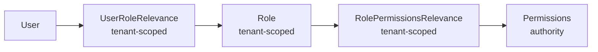
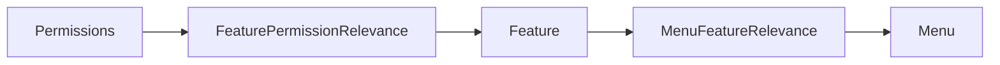

# 权限模型（Permission Model）

## 1. 背景与目标

当前仓库的权限实现并不是单一的“用户 - 角色 - 权限”三层结构，而是把以下几条链路叠加在一起：

1. 租户作用域下的 RBAC。
2. 租户 / 套餐 / 应用 / 功能 的 SaaS 能力开通链路。
3. 菜单、Schema 按钮和接口 `@PreAuthorize` 的运行时权限投影。

因此，理解权限模型时要同时回答三个问题：

1. 权限数据是怎么建模的。
2. 当前请求的 `AuthorizationContext` 是怎么算出来的。
3. 这些权限最终是怎么影响菜单、按钮和接口访问的。

## 2. 权限对象分层

| 层次 | 主要对象 | 作用域 | 说明 |
| --- | --- | --- | --- |
| 身份层 | `User` | 全局 | 登录主体，用户本身不按租户拆表。 |
| RBAC 层 | `Role`、`Permissions`、`UserRoleRelevance`、`RolePermissionsRelevance` | `Role` 和两张关联表按租户生效；`Permissions` 是全局权限字典 | 负责把“某个租户下的用户”映射到权限标识。 |
| SaaS 能力层 | `Tenant`、`Package`、`Application`、`Feature` 及其关联表 | 以租户为最终落点 | 负责把“租户买了什么 / 开通了什么能力”映射为功能与权限。 |
| UI 投影层 | `Menu`、`MenuFeatureRelevance`、实体上的 `@ButtonDeclarations` | 菜单和按钮定义大多是全局元数据 | 负责把权限结果投影成可见菜单、可点击按钮和可加载 remote。 |
| 资源映射层 | `Resource`、`ResourcesPermissionsRelevance` | 全局 | 仓库里保留了资源到权限的映射模型，可用于更细粒度的资源建模。 |

## 3. 基础 RBAC：用户、角色、权限

### 3.1 核心关系



这条链路里的几个关键事实：

- `User` 是全局用户对象；同一个用户可以加入多个租户。
- `Role` 继承租户基类，因此角色本身属于某个租户作用域。
- `UserRoleRelevance` 和 `RolePermissionsRelevance` 也都带租户语义，所以“给谁分配角色”“给角色分配什么权限”都不是全局操作，而是当前租户下的配置。
- `Permissions.authority` 是实际参与判断的核心标识，服务端的 `hasAuthority(...)`、按钮声明和很多菜单能力最终都落到这类字符串上。

### 3.2 默认作用域与租户作用域

当前实现里并不是所有请求都强制绑定业务租户：

- 当请求没有显式租户，或者租户为 `default` 时，服务会把它当成默认作用域处理。
- 当请求带上业务租户时，用户角色与角色权限关系必须属于当前租户，否则服务层会直接拒绝。

这也是为什么用户角色授权、角色权限授权的服务实现里都会先解析“当前租户作用域”，再校验角色是否属于该租户。

### 3.3 当前配置入口

当前 RBAC 基础关系主要通过以下控制器族维护：

- `UsersController`：`/authorized`、`/authorize`、`/unauthorized` 维护用户 - 角色关系。
- `RoleController`：`/authorized`、`/authorize`、`/unauthorized` 维护角色 - 权限关系。

在非 `default` 租户下，这两类操作都不是普通成员即可执行。服务层会检查当前用户是否是系统管理员，或者是否是当前租户所有者。

## 4. SaaS 能力链路：租户、套餐、应用、功能

基础 RBAC 解决的是“谁拥有什么权限”，而 SaaS 链路解决的是“这个租户理论上允许开通哪些能力”。

```mermaid
flowchart LR
  Tenant[Tenant]
  TenantPackage[TenantPackageRelevance]
  Package[Package]
  PackageApplication[PackageApplicationRelevance]
  Application[Application]
  ApplicationFeature[ApplicationFeatureRelevance]
  Feature[Feature]
  FeaturePermission[FeaturePermissionRelevance]
  Permission[Permissions]

  Tenant --> TenantPackage --> Package --> PackageApplication --> Application --> ApplicationFeature --> Feature --> FeaturePermission --> Permission
```



这条链路表示：

1. 租户先绑定套餐。
2. 套餐再绑定应用。
3. 应用再绑定功能。
4. 功能最终绑定权限标识。

因此，`Permission` 在当前系统里既是 RBAC 的终点，也是 SaaS 能力开通的最终落点。

### 4.1 为什么还要有 `Feature`

`Feature` 是菜单和 SaaS 套餐之间的桥：

- 套餐 / 应用层更适合做产品能力配置；
- 菜单层更适合做页面可见性和 remote 暴露控制；
- `Feature` 把这两件事接了起来。

当前实现里，一个功能既可以被应用和套餐链路引用，也可以被菜单引用，还可以继续映射到一组权限标识。

### 4.2 租户所有者的额外能力

`AuthorizationContext` 计算时，当前用户如果是租户所有者，会在普通 RBAC 结果之外再补两类内容：

1. 当前租户套餐链路可达的 `featureCode`。
2. 这些功能继续展开后的 `permissionAuthority`。

这意味着租户所有者不仅能做成员和角色管理，还天然拥有租户已开通套餐所对应的管理能力。

## 5. 菜单、按钮与权限如何接起来

### 5.1 菜单不是直接绑权限，而是先绑功能

当前菜单可见性并不是简单地把 `Menu` 直接绑到某个权限字符串上，而是走下面这条链路：



也就是说：

- 后端先根据当前用户拿到一组 `permissionAuthority`；
- 再把权限映射成 `featureCode`；
- 最后根据菜单 - 功能关系判断哪些菜单应该出现在 `/common/menus/service-routes` 的结果中。

这也是当前 host 壳应用能按租户、按权限动态装配 remote 路由的原因。

### 5.2 Schema 按钮直接使用权限标识

很多实体上的增删改查与业务动作，并不是前端手工硬编码出来的，而是由实体上的 `@ButtonDeclarations` 声明：

- 例如 `Tenant` 会声明 `tenants.create`、`tenants.edit`、`tenants.delete`、`tenants.config.package`。
- `Package` 会声明 `packages.config.application`。
- `Application` 会声明 `applications.config.feature`。

`BaseServiceImpl.schema()` 在返回 `/schema` 时，会把这些按钮声明一起返回，再根据当前 `AuthorizationContext` 过滤掉无权限按钮。前端表单页和表格页拿到这个结果后，才决定显示哪些动作。

### 5.3 菜单隐藏不等于真正放行

当前实现是“双保险”：

- 前端菜单与按钮只负责把无权限入口隐藏掉；
- 真正的访问控制仍然由控制器上的 `@PreAuthorize(...)` 和服务层租户校验负责。

因此，即使前端入口被绕过，只要服务端没有对应权限，接口仍然会拒绝请求。

## 6. 运行时是怎么计算权限的

当前请求进入资源服务后，权限大致按下面顺序计算：

1. 前端在请求头里附带 `X-Tenant-Id` 和 `X-Context-Id`。
2. `AuthorizationContextFilter` / `AuthorizationContextResolver` 解析请求上下文，并按需调用远端 `AuthorizationContextService`。
3. `AuthorizationContextServiceImpl` 先按当前租户加载用户角色，再根据角色 ID 加载权限标识。
4. 如果存在功能权限映射，就把已有权限继续展开为 `featureCode`。
5. 如果当前用户还是租户所有者，就再把当前租户套餐可达的功能和权限一并补进上下文。
6. 最终得到的 `AuthorizationContext.permissions` 会被菜单、Schema 按钮、`hasAuthority(...)`、日志审计等多处共同消费。

## 7. 为什么前端还要维护 `contextId`

前端除了传 `tenantId`，还会额外维护一个 `contextId`。它不是随机值，而是当前权限版本的摘要：

```text
sha256(tenantId + ":" + userId + ":" + permissionVersion)
```

这里的 `permissionVersion` 存在 `Tenant` 上。当前实现里，用户角色变更、角色权限变更、套餐 / 应用 / 功能授权链路变更，都会推动受影响租户的 `permissionVersion` 增长。前端通过 `/common/tenants/permission-context-id` 重新获取 `contextId` 后，就能让后端感知“当前权限上下文已经变了，需要重算”。

这套设计的意义是：

1. 不用在每次请求都强制重建完整权限上下文。
2. 租户切换、权限变更后可以显式失效旧上下文。
3. 菜单、按钮和接口权限能一起跟着刷新。

## 8. 当前实现的几个边界

- `Permissions`、`Feature`、`Menu` 更像全局能力目录；真正的“属于谁”大多通过租户关系表来决定。
- `Resource` 和 `ResourcesPermissionsRelevance` 已经存在于模型里，但当前主路径更常见的是“权限标识 -> 功能 -> 菜单 / 按钮 / 接口”，而不是直接按资源表做判定。
- 租户内的权限配置不是纯前端操作；角色归属、租户成员资格、租户所有者身份都会在服务层再次校验。

## 9. 关联文档

- 多租户模型：`doc/architecture/multi_tenant_model.md`
- 授权上下文：`doc/permission/authorization_context.md`
- Schema 驱动 UI：`doc/architecture/schema_driven_ui.md`
- 服务拓扑：`doc/architecture/service_topology.md`
