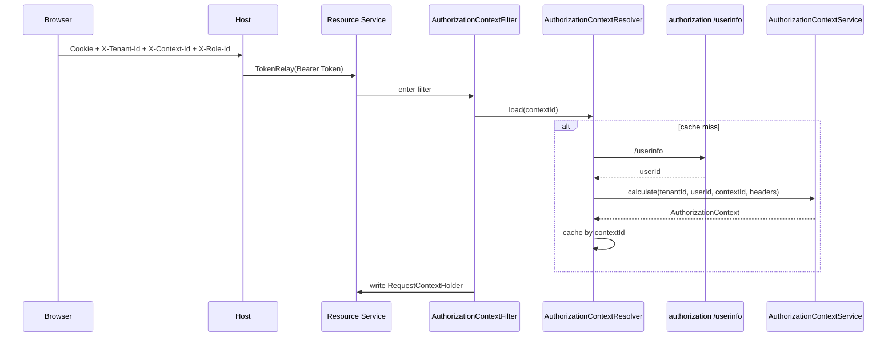

# 授权上下文（Authorization Context）

## 1. 目标

`AuthorizationContext` 是资源服务运行时使用的授权快照。它不直接依赖 JWT 里的原始 claim，而是在请求进入资源服务时，结合用户、租户、角色、资源授权和公开资源计算出当前请求可用的上下文。

核心目标：

1. 在租户、角色切换后得到独立的授权结果。
2. 让导航路由、表格按钮、接口 `@PreAuthorize` 使用同一组资源编码。
3. 通过 `authorizationVersion` 和 `contextId` 让授权变更及时失效。

## 2. 核心字段

| 字段 | 含义 |
| --- | --- |
| `contextId` | 当前授权上下文 ID，通常由 `tenantId + userId + authorizationVersion` 计算。 |
| `userId` | 当前用户 ID。 |
| `isAdministrator` | 是否平台管理员。 |
| `roles` | 当前请求生效的角色标识。 |
| `resources` | 当前请求生效的资源编码集合。 |
| `scopeType` | 当前运行作用域：`PLATFORM`、`TENANT`、`PERSONAL`。 |
| `actorRole` | 当前操作者身份：平台管理员、租户所有者、租户管理员、普通成员等。 |
| `dataScopeType` / `deptIds` | 行级数据范围。 |
| `fieldPermissions` | 字段级访问规则。 |
| `attributes` | 请求扩展属性，如 `X-Tenant-Id`、`X-Context-Id`、`X-Role-Id`。 |

`AuthorizationContext.asAuthorities()` 会把 `resources` 原样转换为 Spring Security authority，同时把 `roles` 转成 `ROLE_*`。

## 3. 请求链路



资源服务需要的关键请求头：

| 请求头 | 说明 |
| --- | --- |
| `Authorization` | Bearer Token，由 host 通过 TokenRelay 转发。 |
| `X-Tenant-Id` | 当前租户。为空时按个人空间或平台作用域处理。 |
| `X-Context-Id` | 授权上下文缓存键。 |
| `X-Role-Id` | 可选；用户拥有多个角色时用于选择当前生效角色。 |

前端通过 `/common/tenants/authorization-context-id` 获取新的 `contextId`。

## 4. 计算规则

`AuthorizationContextServiceImpl.calculate(...)` 的主路径：

1. 加载当前用户。
2. 解析租户；非管理员访问指定租户时校验成员关系。
3. 加载当前租户角色，并合并全局角色。
4. 如果请求带 `X-Role-Id`，只保留用户已拥有的该角色。
5. 调 `UsersService.loadResourcesInRoleIds(...)` 获取角色资源授权。
6. 合并 `ResourceService.findPublicAccessCodes()` 返回的公开资源。
7. 当前用户是租户所有者时，额外合并租户套餐链路可达的资源。
8. 根据角色资源授权上的数据范围、字段范围计算 `dataScopeType` 和 `fieldPermissions`。
9. 写入 `scopeType`、`actorRole`、`authorizationVersion` 和请求属性。

最终的 `resources` 是唯一的授权判定集合。导航、按钮和接口都应使用资源编码，而不是再维护独立的菜单、功能或权限点模型。

## 5. contextId 失效机制

`contextId` 由当前租户、用户和授权版本计算：

```text
sha256(resolvedTenantId + ":" + userId + ":" + authorizationVersion)
```

`authorizationVersion` 存在租户表中。以下变化会刷新受影响租户的授权版本：

- 用户角色变更。
- 角色资源授权变更。
- 租户套餐变更。
- 套餐应用变更。
- 应用资源变更。
- 资源编码或资源可见性变更。

前端在租户、角色或授权配置变化后重新获取 `/common/tenants/authorization-context-id`，即可让旧上下文自然失效。

## 6. 排查顺序

当资源、路由或按钮显示异常时，优先检查：

1. 请求是否带 `Authorization`。
2. 请求是否带正确的 `X-Tenant-Id`、`X-Context-Id`、`X-Role-Id`。
3. `/common/tenants/authorization-context-id` 是否随授权版本变化。
4. `/common/resources/service-routes` 是否返回预期资源路由。
5. 角色是否拥有对应资源编码。
6. 资源是否 `disabled=false`，并且公开资源或套餐资源是否正确注册。

## 7. 关联文档

- 资源授权模型：`doc/resource/resource_model.md`
- 授权流程：`doc/design/authorization_flow.md`
- 多租户模型：`doc/architecture/multi_tenant_model.md`
- Schema 驱动 UI：`doc/architecture/schema_driven_ui.md`
