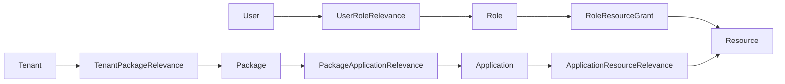

# 资源授权模型（Resource Authorization Model）

## 1. 目标

系统统一使用 `Resource` 表达导航、页面、能力、动作和接口。角色授权、应用授权、路由初始化、插件资源注册都围绕同一个资源模型展开。

这套模型替代分散的菜单、权限点、功能三套授权对象，目标是：

1. 资源编码成为唯一授权判定标识。
2. 前端路由、按钮、接口和插件能力都能挂到资源树。
3. 插件和模块通过声明式资源文件完成首次初始化。
4. 角色、应用、套餐和租户只绑定资源编码，不再绑定多套中间对象。

## 2. 核心对象

| 对象 | 作用 |
| --- | --- |
| `Resource` | 统一资源定义，包含编码、类型、父级、路由、接口、授权和展示元数据。 |
| `ResourceAncestor` | 资源树祖先关系，用于快速查询整棵资源树和路由祖先。 |
| `RoleResourceGrant` | 角色到资源编码的授权关系，可附带数据范围和字段范围。 |
| `ApplicationResourceRelevance` | 应用到资源编码的授权关系。 |
| `TenantPackageRelevance` | 租户购买套餐后，通过套餐应用链路获得应用资源。 |
| `MicroModule` | 微前端 remote 注册信息，资源路由可引用 remote 组件。 |

## 3. 资源类型

| 类型 | 建议用途 |
| --- | --- |
| `GROUP` | 纯分组节点，不直接授权。 |
| `MODULE` | 模块或插件根节点，通常用于资源树分区。 |
| `PAGE` | 可访问页面或导航路由。 |
| `FEATURE` | 产品能力或业务功能，可作为能力聚合节点。 |
| `ACTION` | 按钮、表格动作、页面局部操作。 |
| `API` | 服务端接口或接口组。 |

常用字段：

| 字段 | 说明 |
| --- | --- |
| `code` | 稳定资源编码，也是 `hasAuthority(...)` 使用的字符串。 |
| `parentId` | 父资源 ID。插件声明中由同步逻辑自动写入。 |
| `pluginId` | 声明该资源的模块或插件。 |
| `path` / `component` | 前端路由和组件标识。 |
| `routeKind` | 导航渲染类型：`item`、`submenu`、`group`、`divider`。 |
| `method` / `pattern` | API 资源的 HTTP 方法和路径模式。 |
| `publicAccess` | 是否无需显式授权即可访问。 |
| `requireOrgTenant` | 是否要求组织租户上下文。 |
| `grantable` | 是否允许分配给角色或应用。 |
| `disabled` | 是否停用。停用资源不参与路由和授权。 |

## 4. 授权链路



角色资源授权决定“用户当前拥有哪些资源”。租户套餐链路决定“租户理论上开通了哪些应用资源”。当租户所有者进入租户空间时，套餐资源会合并到上下文中，方便完成租户内初始化和管理。

## 5. 路由和按钮

`/common/resources/service-routes` 返回当前用户可见的资源路由树：

- `PAGE` 和可路由 `FEATURE` 资源用于生成页面路由。
- `ACTION` 资源用于按钮和表格动作过滤。
- `API` 资源用于服务端接口授权。
- `MicroModule` 提供 remote entry，`component` 可指向远程模块组件。

实体上的 `@ButtonDeclarations.authority` 应填写资源编码，例如：

```java
@ButtonDeclaration(key = "edit", authority = "resources.edit")
```

`BaseServiceImpl.schema()` 会根据当前 `AuthorizationContext.resources` 过滤按钮。

导航渲染遵循以下约定，并支持任意深度递归：

- `submenu`：有子节点的可折叠目录，通常对应 `MODULE`。
- `group`：只用于同级菜单的静态视觉分组，通常对应 `GROUP`，不承担目录折叠。
- `item`：可点击菜单项，通常对应有路由的 `PAGE`。
- `divider`：纯视觉分隔符。

`MODULE` 和 `GROUP` 可以不配置 `path`，仍会保留在菜单树中；只有带 `path` 的页面资源才会注册为前端页面路由。

资源级别只控制资源是否可见和可授权，不改变资源树的父子层级或菜单渲染类型。

## 6. 初始化和插件注册

内置模块通过 `src/main/resources/META-INF/simplepoint/resources/*.json` 声明资源。
`ResourceAutoConfiguration` 会扫描 classpath 上所有模块声明，并按声明的 `module` 调用：

```java
resourceService.sync(module, declarations)
```

推荐格式：

```json
{
  "module": "simplepoint-dna",
  "resources": []
}
```

插件通过 `plugin.yaml` 的 `resources` 段声明资源。`PluginResourceContributionHandler` 在插件安装时完成：

1. 校验 remote 名称和资源编码冲突。
2. 注册 `MicroModule`。
3. 转换为 `ResourceDeclaration`。
4. 调 `ResourceService.sync(pluginId, declarations)`。
5. 卸载插件时删除该插件拥有的资源和 remote。

示例：

```yaml
resources:
  - code: analytics.root
    name: Analytics
    type: MODULE
    routeKind: submenu
    children:
      - code: analytics.dashboard
        name: Analytics Dashboard
        type: PAGE
        path: /analytics
        component: analytics/Dashboard
        routeKind: item
        grantable: true
      - code: analytics.refresh
        name: Refresh Analytics
        type: ACTION
        grantable: true
```

## 7. 设计约束

- 新能力必须先声明资源，再把资源编码用于按钮、路由或接口授权。
- 不再新增独立的菜单表、功能表或权限点字典。
- 资源树是授权配置的统一入口；角色和应用都通过资源树分配。
- 数据权限、字段权限不是资源类型，它们是 `RoleResourceGrant` 上的约束范围。
- 角色不是资源。角色是授权主体分组，资源是被授权对象。
